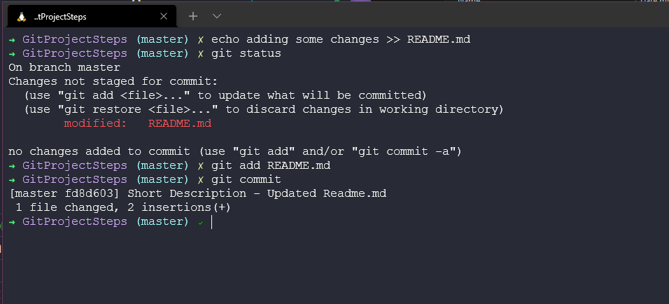
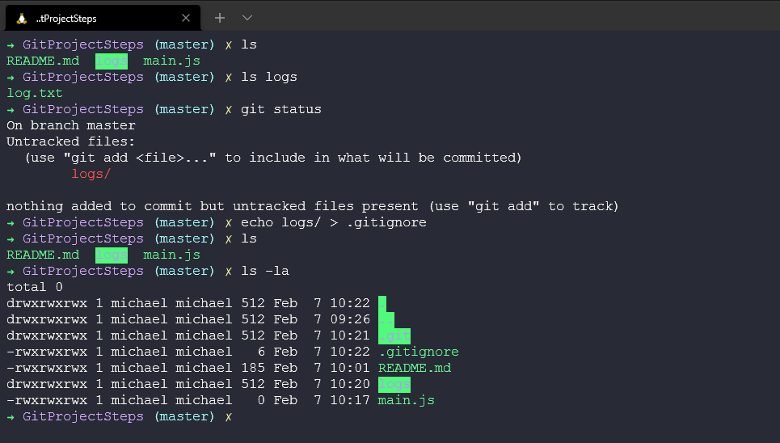
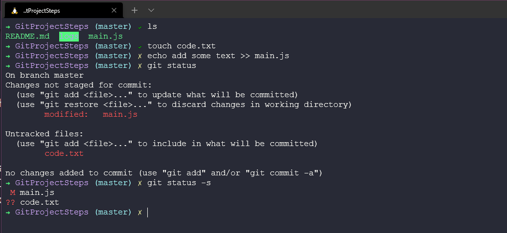

## Puesta en marcha (Staging) y cambios de git

Ya hemos cubierto algunos de los conceptos básicos, pero poner las cosas en un tutorial hace que sea mejor para aprender y entender cómo y por qué lo estamos haciendo de esta manera en concreto. Antes de entrar en cualquier servicio basado en git como GitHub, git tiene superpoderes para aprovechar en local.

Vamos a verlos seleccionando la carpeta del proyecto que creamos al inicio de la sesión de git y veremos algunos de los sencillos y potentes pasos que podemos hacer con git. Creamos una carpeta en nuestra máquina local y la inicializamos con el comando `git init`.

También podemos ver que después de inicializar tenemos una carpeta oculta en nuestro directorio: `.git`.

Aquí es donde se almacenan los detalles del repositorio git así como la información relativa a nuestras ramas y commits. ¡Donde habita toda la magía de git!

### Ficheros Staging

A continuación, empezamos a trabajar en nuestra carpeta vacía. Podemos añadir algo de código fuente de los primeros días de trabajo. Creamos nuestro fichero `readme.md` y comprobamos nuestro `git status`. Veremos el nuevo fichero `readme.md` pero sin confirmar todavía.

Con el comando `git add README.md` podremos ver en `git status` que el fichero está en verde, esto indica que tenemos los cambios preparados para confirmar.

A continuación vamos confirmar esto, que no quede pendiente, haremos nuestro primer commit o, visto de otra manera, la primera instantánea de nuestro proyecto. Esto lo hacemos con el comando `git commit -m "<Mensaje significativo>"` dejando un mensaje esclarecedor y conciso que describa los cambios que se incluyen a la rama. Además, observe que la cruz amarilla cambia ahora a una marca verde. Esto es algo que tengo dentro de mi terminal con el tema que uso, lo vimos en la sección de Linux.

### Confirmando cambios

O como maldecimos algunos en español "comiteando que es gerundio". Lo más probable es que queramos añadir más archivos o incluso cambiar los archivos que tenemos en nuestro directorio. Ya hemos hecho nuestro primer commit, pero ahora vamos a añadir más y más y más.

Podríamos repetir nuestro proceso de antes, crear o editar nuestro archivo con `git add .` para añadir todos los archivos a la zona de preparación y luego `git commit -m "mensaje significativo"` y esto funcionaría sin problemas. Pero para ser capaz de ofrecer un mensaje significativo en el commit de lo que ha cambiado puede que no quieras escribir algo como `git commit -m "Bueno, he cambiado algo de código porque no funcionaba y cuando lo arreglé también añadí algo nuevo al readme.mdpara asegurarme de que todo el mundo conocía la experiencia de usuario y luego hice un té."` Quiero decir que esto funcionaría también aunque probablemente lo haría descriptivo pero la forma preferida aquí es añadir esto con un editor de texto.

Si ejecutamos `git commit` después de ejecutar `git add` se abrirá nuestro editor de texto por defecto que en mi caso es nano. Estos son los pasos que seguí para añadir algunos cambios al archivo, ejecuté `git status` para mostrar lo que está y lo que no está preparado. Luego usé `git add` para agregar el archivo al área de staging, luego ejecuté `git commit` que abrió nano.

Cuando se abra nano puedes añadir tu descripción corta y larga y luego guardar el archivo.

### Mejores prácticas para el commit

Hay un equilibrio entre confirmar empaquetando cambios relacionados y confirmar a menudo. No queremos esperar a terminar un proyecto para nuestro primer commit y cada confirmación debe ser significativa. Tampoco debe estar asociada con tareas no relevantes entre sí. Si tienes una corrección de errores y un error tipográfico la mejor práctica es asegurarse de incluirlos en dos commits distintos. Así puedes abreviar y darle significado al mensaje del commit.

En términos de redacción, el equipo o tú mismo deberíais ceñiros a la misma redacción para cada confirmación. Por ejemplo, recomiendan que los mensajes comiencen con un verbo en infinitivo, como "añadir" o "eliminar". Esto ayuda a mantener la consistencia y a que los mensajes sean más fáciles de leer. En muchos proyectos se decide que sean en inglés. También se agradece la brevedad cuando repasas los logs de git 😅

### Saltarse la zona de preparación

¿Tenemos que preparar siempre nuestros cambios antes de confirmarlos?

La respuesta es sí. Pero no lo veas como un handicap, es la manera de estar 100% seguro de que no vas a errar. Además, la práctica recomendada es evitar utilizar 'git add .' y en su lugar utilizar 'git add <file>' para añadir los cambios del archivo o archivos en concreto para ser más específico y asegurarte de que no estás añadiendo cambios que no quieres. ¿Conoces el dicho "Más vale prevenir que curar"? Pues eso.

También hay una forma de saltarse la zona de preparación y confirmar directamente con el comando `git commit -a -m "<Mensaje significativo>"`. Es útil cuando tienes un cambio pequeño y no quieres tener que pasar por el proceso de preparación y confirmación. Pero cuidadito, si tienes muchos cambios y no los has preparado, esto podría añadirlos todos a la confirmación.

### Eliminación de archivos

Qué pasa con la eliminación de archivos de nuestro proyecto, tal vez tenemos otro archivo en nuestro directorio que hemos confirmado, pero ahora el proyecto ya no lo necesita o utiliza, como una mejor práctica debemos eliminarlo.

Sólo porque eliminamos el archivo del directorio, git todavía es consciente de este archivo y también tenemos que eliminarlo del repositorio. Puedes ver el flujo de trabajo para esto a continuación.

Esto podría ser un poco molesto de recordar o tener que lidiar con ello si tienes un proyecto grande que tiene muchos archivos y carpetas en movimiento. Podemos hacer esto con un comando con `git rm oldcode.ps1`.

### Renombrar o Mover Archivos

Dentro de nuestro sistema operativo podemos renombrar y mover nuestros archivos. Sin duda necesitaremos hacer esto de vez en cuando con nuestros proyectos. Similar a eliminar aunque hay un proceso de dos pasos, cambiamos nuestros archivos en nuestro sistema operativo y luego tenemos que modificar y asegurarnos de que la zona de montaje o que los archivos se añaden correctamente. Los pasos son los siguientes:

Sin embargo, al igual que eliminamos archivos del sistema operativo y luego del repositorio git podemos realizar este renombrado utilizando también un comando git.

### Ignorando Archivos

Podemos tener la necesidad de ignorar los archivos o carpetas dentro de nuestro proyecto que podríamos estar utilizando a nivel local o que sólo sería un desperdicio de espacio si tuviéramos que compartir con el proyecto en general, un buen ejemplo de esto podría ser registros. También creo que el uso de este para los secretos que no quieren ser compartidos en público o entre los equipos.

Podemos ignorar archivos añadiendo carpetas o archivos al archivo `.gitignore` en el directorio de nuestro proyecto.

Podemos abrir el archivo `.gitignore` y ver que tenemos el directorio logs/ presente. Pero también podríamos añadir aquí archivos y carpetas adicionales para ignorar.

A continuación podemos ver `git status` y ver qué ha pasado.

También hay formas en las que podrías necesitar volver atrás e ignorar archivos y carpetas, quizás querías compartir la carpeta de logs pero luego te diste cuenta de que no querías hacerlo. Tendrás que usar `git rm --cached ` para eliminar archivos y carpetas del área de preparación si tienes una carpeta previamente rastreada que ahora quieres ignorar.

### Estado breve

Hemos estado usando mucho `git status` para entender lo que tenemos en nuestra área de preparación y lo que no, es un comando muy completo con muchos detalles. La mayoría de las veces sólo querrás saber qué ha sido modificado o qué hay de nuevo. Podemos usar `git status -s` para un breve estado de este detalle. Yo normalmente establecería un alias en mi sistema para usar `git status -s` en lugar del comando más detallado.

En el post de mañana seguiremos viendo estos breves ejemplos de estos comandos comunes de git.

## Recursos

- [What is Version Control?](https://www.youtube.com/watch?v=Yc8sCSeMhi4)
- [Types of Version Control System](https://www.youtube.com/watch?v=kr62e_n6QuQ)
- [Git Tutorial for Beginners](https://www.youtube.com/watch?v=8JJ101D3knE&t=52s)
- [Git for Professionals Tutorial](https://www.youtube.com/watch?v=Uszj_k0DGsg)
- [Git and GitHub for Beginners - Crash Course](https://www.youtube.com/watch?v=RGOj5yH7evk&t=8s)
- [Complete Git and GitHub Tutorial](https://www.youtube.com/watch?v=apGV9Kg7ics)
- [Git cheatsheet](https://www.atlassian.com/git/tutorials/atlassian-git-cheatsheet)
- [En español] [Comandos Git](https://gitea.vergaracarmona.es/man-linux/comandos-git)
- [En español][Apuntes Curso de Git](https://vergaracarmona.es/wp-content/uploads/2022/10/Curso-git_vergaracarmona.es_.pdf) de [Juan Carlos Rubio](https://www.linkedin.com/in/juan-carlos-rubio-pineda/Curso-git_vergaracarmona-es).
- [En español] En los [apuntes](https://vergaracarmona.es/apuntes/) del traductor:
  - ["Instalar git en ubuntu"](https://vergaracarmona.es/instalar-git-en-ubuntu/)
  - ["Comandos de git"](https://vergaracarmona.es/comandos-de-git/)
  - ["Estrategias de fusión en git: Ship / Show / Ask"](https://vergaracarmona.es/estrategias-bifurcacion-git-ship-show-ask/)
  - ["Resolver conflictos en Git. Merge, Squash, Rebase o Pull"](https://vergaracarmona.es/merge-squash-rebase-pull/)
  - ["Borrar commits de git: reset, rebase y cherry-pick"](https://vergaracarmona.es/reset-rebase-cherry-pick/)
- [Ejemplos README.md para tus proyectos](https://gitea.vergaracarmona.es/manuelver/plantillas-README)

Nos vemos en el [Día 39](day39.md).
