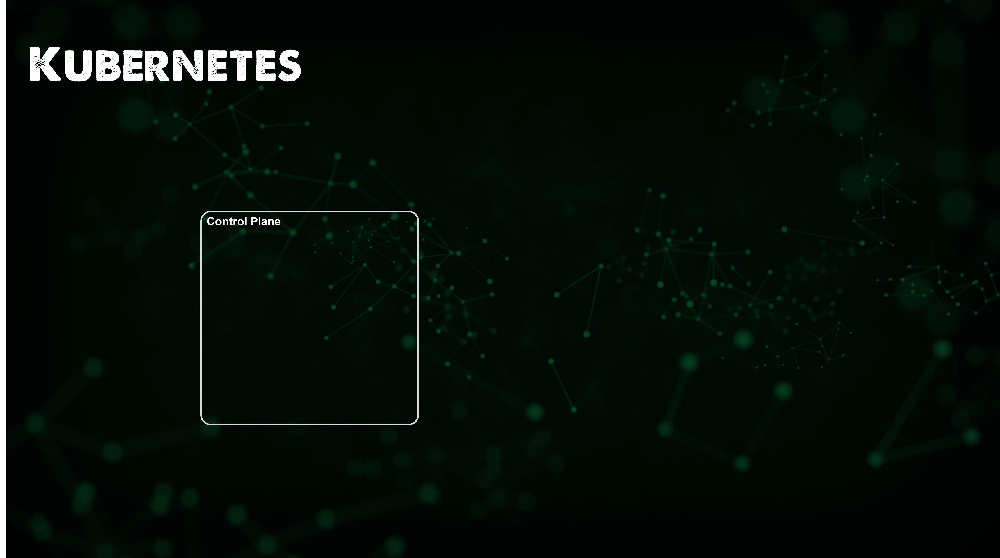
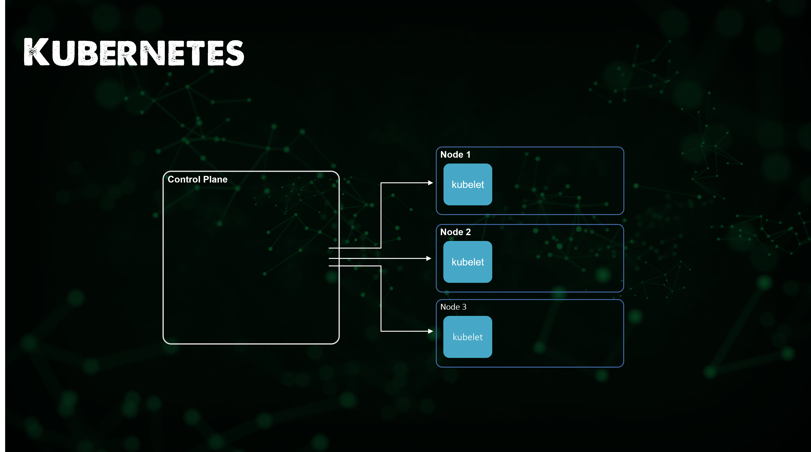
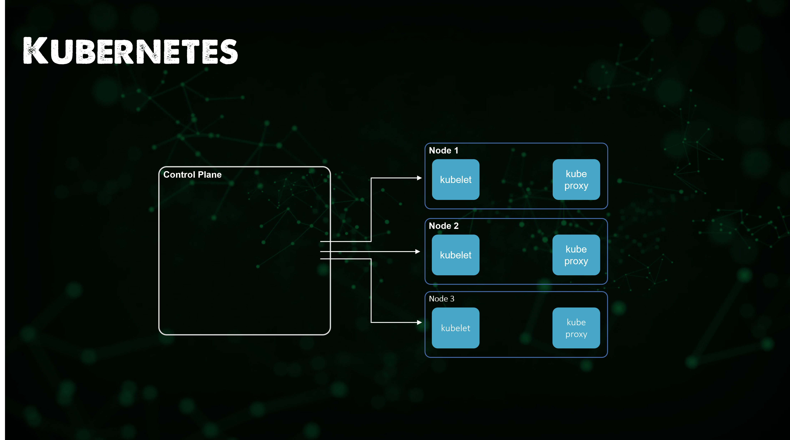
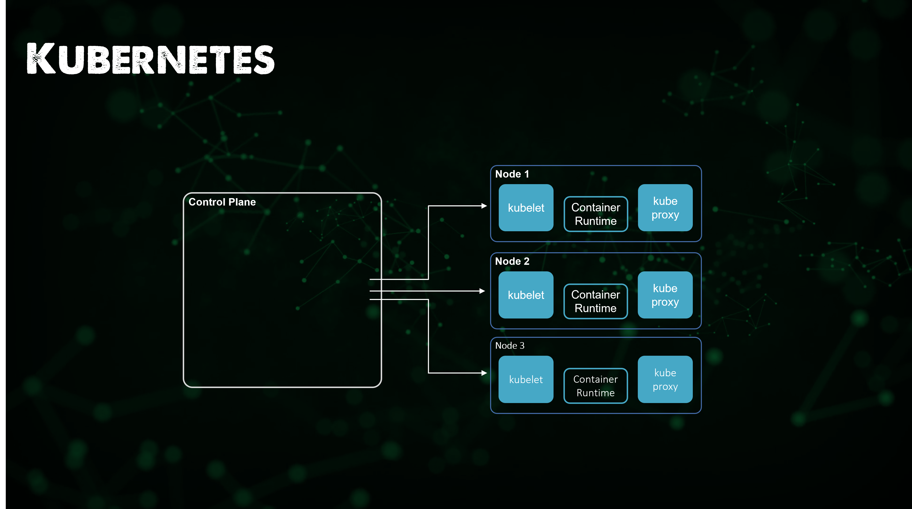
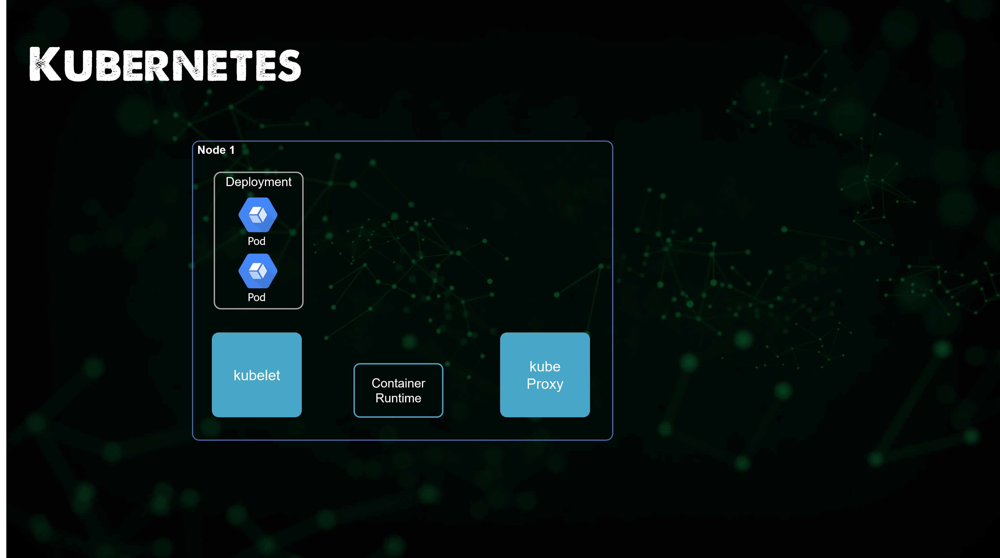
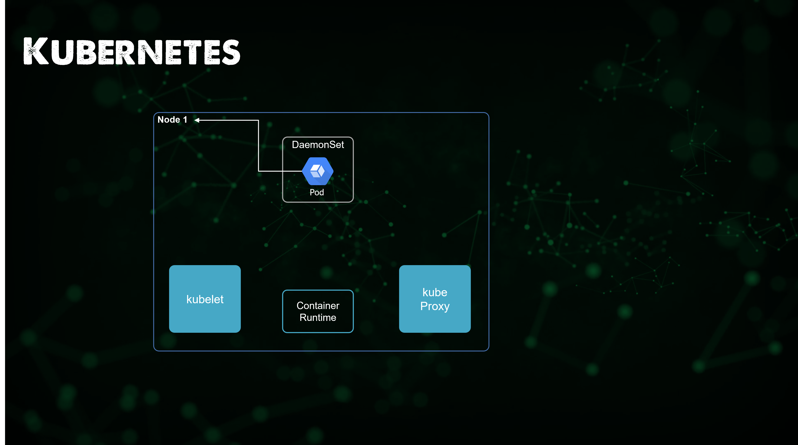
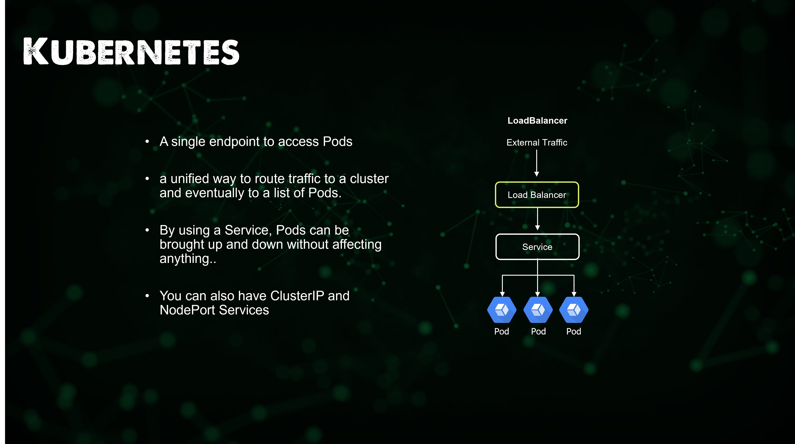

## El panorama: Kubernetes

En la última sección vimos los Contenedores. Los contenedores se quedan cortos cuando se trata de escalar y de orquestación, no pueden por sí solos. Lo mejor que podemos hacer es utilizar docker-compose para reunir varios contenedores. Cuando se trata de Kubernetes, que es un orquestador de contenedores, esto nos da la capacidad de escalar hacia arriba y hacia abajo de manera automatizada o basada en una carga de sus aplicaciones y servicios.

Como plataforma, Kubernetes ofrece la capacidad de orquestar contenedores de acuerdo a sus necesidades y el estado deseado. Vamos a cubrir Kubernetes en esta sección, ya que está creciendo rápidamente como la próxima ola de infraestructura. También me gustaría sugerir que, desde una perspectiva DevOps, Kubernetes es sólo una plataforma de las que tendrás que tener al menos un conocimiento básico. También tendrá que entender el bare metal, la virtualización y muy probablemente también los servicios basados en cloud. Kubernetes es sólo otra opción para ejecutar nuestras aplicaciones y se puede aplicar en estás dos mencionadas.

### ¿Qué es la orquestación de contenedores?

He mencionado Kubernetes y he mencionado orquestación de contenedores, Kubernetes es la tecnología mientras que la orquestación de contenedores es el concepto o el proceso detrás de esta tecnología. Kubernetes no es la única plataforma de orquestación de contenedores, también tenemos  las mencionadas anteriormente docker compose y Docker Swarm, o otras como HashiCorp Nomad. Pero Kubernetes va viento en popa, es la más utilizada, así que nos centraremos en ella.

### ¿Qué es Kubernetes?

Lo primero que debes leer si eres nuevo en Kubernetes es la documentación oficial, es el mejor tutorial para aprender y además la van utilizando con más ejemplos o nuevas implementaciones. Mi experiencia de buceo realmente profundo en Kubernetes fue una curva de aprendizaje empinada. Viniendo de un fondo de virtualización y almacenamiento pensaba en lo desalentador que esto se sentía, pero el camino se hace al andar.

La comunidad, los recursos de aprendizaje gratuitos y la documentación son increíbles, no dejes de empaparte en ella: [Kubernetes.io](https://kubernetes.io/docs/concepts/overview/what-is-kubernetes/)

Ahora al pastel. Kubernetes es una plataforma portátil, extensible y de código abierto para gestionar cargas de trabajo y servicios en contenedores. Facilita tanto la configuración declarativa como la automatización. Cuenta con un ecosistema amplio y de rápido crecimiento. Los servicios, el soporte y las herramientas de Kubernetes están ampliamente disponibles.

Cosas importantes a tener en cuenta de la cita anterior, Kubernetes es de código abierto con una rica historia que se remonta a cuando Google donó el proyecto a la Cloud Native Computing Foundation (CNCF). Ahora está siendo desarrollado por la comunidad de código abierto, así como grandes proveedores empresariales que contribuyen a hacer Kubernetes lo que es hoy.

Antes he mencionado que los contenedores son geniales y, en la sección anterior, hemos hablado de cómo los contenedores y las imágenes de contenedores han cambiado y acelerado la adopción de sistemas nativos de la nube. Pero los contenedores por sí solos no van a darte la experiencia lista para producción que necesitas de tu aplicación. Kubernetes nos proporciona estas soluciones:

- **Descubrimiento de servicios y equilibrio de carga** - Kubernetes puede exponer un contenedor utilizando el nombre DNS o su dirección IP. Si el tráfico a un contenedor es alto, Kubernetes puede equilibrar la carga y distribuir el tráfico de red para que el despliegue sea estable.
- **Orquestación de almacenamiento** - Kubernetes permite montar automáticamente un sistema de almacenamiento de su elección, como almacenamiento local, proveedores de nubes públicas, etc.
- **Rollouts y rollbacks automatizados** - Puedes describir el estado deseado para los contenedores desplegados utilizando Kubernetes, y puedes cambiar el estado actual al estado deseado a un ritmo controlado. Por ejemplo, puedes automatizar Kubernetes para crear nuevos contenedores para su despliegue, eliminar los contenedores existentes y adoptar todos sus recursos al nuevo contenedor.
- **Empaquetado automático de contenedores** - Proporcionas a Kubernetes un clúster de nodos que pueda utilizar para ejecutar tareas en contenedores, indicas cuánta CPU y memoria (RAM) necesitas para cada contenedor y Kubernetes puede acomodar los contenedores en sus nodos para hacer el mejor uso de los recursos.
- **Auto-reparación** - Kubernetes reinicia los contenedores que fallan, reemplaza los contenedores, mata los contenedores que no responden a su chequeo de salud definido por el usuario y no los anuncia a los clientes hasta que estén listos para servir.
- **Gestión de secretos y configuración** - Kubernetes permite almacenar y gestionar información confidencial, como contraseñas, tokens OAuth y claves SSH. Puede desplegar y actualizar secretos y la configuración de la aplicación sin reconstruir sus imágenes de contenedor, y sin exponer secretos en la configuración de su pila.

Kubernetes proporciona un marco para ejecutar sistemas distribuidos de forma resiliente.

La orquestación de contenedores gestiona el despliegue, la colocación y el ciclo de vida de los contenedores.

También tiene muchas otras responsabilidades:

- La gestión de clústeres federa hosts en un objetivo.
- La gestión de la programación distribuye los contenedores entre los nodos a través del programador.
- El descubrimiento de servicios sabe dónde se encuentran los contenedores y distribuye las solicitudes de los clientes entre ellos.
- La replicación garantiza la disponibilidad del número adecuado de nodos y contenedores para la carga de trabajo solicitada.
- La gestión de la salud detecta y reemplaza los contenedores y nodos no saludables.

### Principales componentes de Kubernetes

Kubernetes es un orquestador de contenedores para aprovisionar, gestionar y escalar aplicaciones. Puede utilizarlo para gestionar el ciclo de vida de aplicaciones en contenedores en un clúster de nodos, que es una colección de máquinas de trabajo como VMs o máquinas físicas.

Es posible que sus aplicaciones necesiten muchos otros recursos para ejecutarse, como volúmenes, redes y secretos que pueden ayudarle a conectarse a bases de datos, comunicarse con back-ends con firewalls y proteger claves. Con Kubernetes, puede añadir estos recursos a su aplicación. Los recursos de infraestructura que sus aplicaciones necesitan que se gestionen de forma declarativa.

El paradigma clave de Kubernetes es su modelo declarativo. Usted proporciona el estado que desea y Kubernetes lo hace posible. Si necesita cinco instancias, no inicie cinco instancias separadas por su cuenta. En su lugar, le dice a Kubernetes que necesita cinco instancias, y Kubernetes reconcilia automáticamente el estado. Si algo sale mal con una de sus instancias y falla, Kubernetes aún conoce el estado que usted desea y crea instancias en un nodo disponible.

### Nodo

#### Control Plane

Cada clúster Kubernetes requiere un nodo de Control Plane, los componentes del Control Plane toman decisiones globales sobre el clúster, por ejemplo la programación, así como la detección y respuesta a los eventos del clúster.

#### Worker Node

Un Worker machine que ejecuta cargas de trabajo Kubernetes. Puede ser una máquina física (bare metal) o una máquina virtual (VM). Cada nodo puede alojar uno o más pods. Los nodos Kubernetes son gestionados por un plano de control.

Existen otros tipos de nodos pero no los trataré aquí.

#### kubelet

Un agente que se ejecuta en cada nodo del clúster. Se asegura de que los contenedores se ejecutan en un Pod.

El kubelet toma un conjunto de PodSpecs que se proporcionan a través de diversos mecanismos y se asegura de que los contenedores descritos en los PodSpecs se están ejecutando y en buen estado. El kubelet no gestiona contenedores que no hayan sido creados por Kubernetes.

#### kube-proxy

kube-proxy es un proxy de red que se ejecuta en cada nodo de su clúster, implementando parte del concepto de Servicio Kubernetes.

kube-proxy mantiene reglas de red en los nodos. Estas reglas de red permiten la comunicación de red a sus Pods desde sesiones de red dentro o fuera de su cluster.

kube-proxy utiliza la capa de filtrado de paquetes del sistema operativo si existe y está disponible. De lo contrario, kube-proxy reenvía el tráfico por sí mismo.

#### Container runtime

El container runtime es el software responsable de ejecutar los contenedores.

Kubernetes soporta varios container runtime: Docker, containerd, CRI-O, y cualquier implementación del CRI (Container Runtime Interface) de Kubernetes.

### Cluster

Un cluster es un grupo de nodos, donde un nodo puede ser una máquina física o una máquina virtual. Cada uno de los nodos tendrá el tiempo de ejecución del contenedor (Docker) y también estará ejecutando un servicio kubelet, que es un agente que recibe los comandos del controlador Maestro (veremos más sobre esto más adelante) y un Proxy, que se utiliza para proxy conexiones a los Pods de otro componente (Servicios, que veremos más adelante).

Nuestro control plane, que se puede hacer altamente disponible, contendrá algunos roles únicos en comparación con los nodos Workers, el más importante será el servidor API kube, aquí es donde cualquier comunicación se llevará a cabo para obtener información o enviar información a nuestro clúster Kubernetes.

#### Servidor API Kube

El servidor API de Kubernetes valida y configura los datos para los objetos API que incluyen pods, servicios, controladores de replicación y otros. El servidor API da servicio a las operaciones REST y proporciona el frontend al estado compartido del cluster a través del cual interactúan el resto de componentes.

#### Planificador (Scheduler)

El programador de Kubernetes es un proceso del control plane que asigna Pods a Nodos. El programador determina qué Nodos son válidos para cada Pod en la cola de programación de acuerdo con las restricciones y los recursos disponibles. A continuación, el planificador clasifica cada Nodo válido y vincula el Pod a un Nodo adecuado.

#### Gestor de Controladores

El gestor de controladores de Kubernetes es un demonio que incorpora los bucles de control centrales incluidos en Kubernetes. En aplicaciones de robótica y automatización, un bucle de control es un bucle no terminal que regula el estado del sistema. En Kubernetes, un controlador es un bucle de control que observa el estado compartido del cluster a través del apiserver y realiza cambios intentando mover el estado actual hacia el estado deseado.

#### etcd

Almacén de valores clave consistente y de alta disponibilidad utilizado como almacén de respaldo de Kubernetes para todos los datos del clúster.

#### kubectl

Para gestionar esto desde un punto de vista CLI tenemos kubectl, kubectl interactúa con el servidor API.

La herramienta de línea de comandos de Kubernetes, kubectl, le permite ejecutar comandos contra clústeres Kubernetes. Puede utilizar kubectl para desplegar aplicaciones, inspeccionar y gestionar recursos de clúster y ver registros.

### Pods

Un Pod es un grupo de contenedores que forman una aplicación lógica. Por ejemplo, si tienes una aplicación web que está ejecutando un contenedor NodeJS y también un contenedor MySQL, entonces ambos contenedores pueden estar ubicados en un único Pod, aunque no es lo aconsejable. Un Pod también puede compartir volúmenes de datos comunes y también comparten el mismo espacio de nombres de red. Recuerda que los Pods son efímeros y pueden ser subidos y bajados por el Controlador Maestro. Kubernetes utiliza un medio simple pero eficaz para identificar los Pods a través de los conceptos de Labels (nombre - valor).

Algunas características importantes de los Pods:
- Los Pods son la unidad más pequeña de Kubernetes.
- Los Pods manejan Volúmenes, Secretos y configuración para los contenedores.
- Los Pods son efímeros. Están pensados para reiniciarse automáticamente cuando mueren.
- Los Pods se replican cuando la aplicación se escala horizontalmente mediante el ReplicationSet. Cada Pod ejecutará el mismo código de contenedor.
- Los Pods viven en Nodos Workers.
- Los Pods pueden comunicarse entre sí usando localhost.

### Deployments

Puedes decidir ejecutar Pods pero cuando mueren, mueren. Los Deployments son una forma de ejecutar Pods de forma continua. Los Deployments también le permiten actualizar una aplicación en ejecución sin tiempo de inactividad.

- Un Deployment permitirá que tu pod se ejecute continuamente.
- Los Deployments le permiten actualizar una aplicación en ejecución sin tiempo de inactividad.
- Los Deployments también especifican una estrategia para reiniciar Pods cuando mueren.
- Los Deployments son la forma recomendada de administrar Pods en producción.
- Los Deployments son una abstracción de alto nivel que maneja la creación de Pods y ReplicaSets.
- Los Deployments son declarativos, como todo en Kubernetes, esto significa que describe el estado deseado en su clúster y Kubernetes se encarga de cambiar el estado real para que coincida con el estado deseado.

### ReplicaSets

Como se ha comentado, el Deployment también puede crear el ReplicaSet. Un ReplicaSet es un objeto que define un conjunto de Pods idénticos. Un ReplicaSet garantiza que un número especificado de réplicas de un Pod se estén ejecutando en todo momento. Si hay demasiados Pods, el ReplicaSet eliminará los Pods adicionales. Si hay muy pocos Pods, el ReplicaSet creará más. Los ReplicaSets son la forma recomendada de administrar Pods en producción.

- Un ReplicaSet asegura que su aplicación tiene el número deseado de Pods
- Los ReplicaSets crearán y escalarán Pods basándose en el Deployment
- Los Deployments, ReplicaSets y Pods no son excluyentes, pero pueden ser

### StatefulSets

¿Necesita tu App mantener información sobre su estado? Por ejemplo, una base de datos necesita estado. Los StatefulSets son la forma de ejecutar aplicaciones que necesitan mantener un estado. Los StatefulSets son similares a los Deployments, pero tienen algunas diferencias importantes:

- Los Pods de un StatefulSet no son intercambiables.
- Cada pod tiene un identificador único y persistente que el controlador mantiene por encima de cualquier reprogramación.
- Los Pods de un StatefulSet se crean en orden secuencial, uno a la vez.
- Los Pods de un StatefulSet tienen un nombre DNS estable y predecible. Mantienen el mismo nombre a través de las reprogramaciones.
- Los volúmenes pueden ser persistentes.

### DaemonSets

- Los DaemonSets son para procesos continuos que se ejecutan en todos los nodos. Un Pod por Nodo.
- Cada nuevo nodo añadido al cluster hace que se inicie un pod.
- Útiles para tareas en segundo plano como monitorización y recogida de logs.
- Cada pod tiene un identificador único y persistente que el controlador mantiene por encima de cualquier reprogramación.

### Servicios

Características de los Servicios:
- Un único punto final para acceder a los Pods
- Una forma unificada de dirigir el tráfico a un cluster y eventualmente a una lista de Pods.
- Usando un Servicio, los Pods pueden ser subidos y bajados sin afectar a nada.
- Los Servicios pueden ser expuestos interna o externamente. También pueden ser expuestos en diferentes puertos.

Esto es sólo una visión general rápida y notas sobre los bloques de construcción fundamentales de Kubernetes, podemos tomar este conocimiento y añadir en algunas otras áreas alrededor de almacenamiento y de entrada para mejorar nuestras aplicaciones, pero entonces también tenemos un montón de opciones sobre dónde se ejecuta nuestro clúster Kubernetes. La siguiente sesión se centrará en esas opciones sobre dónde se puede ejecutar un clúster Kubernetes, mientras que también exploraremos algunos detalles sobre el almacenamiento.

## Recursos

- [Kubernetes Documentation](https://kubernetes.io/docs/home/)
- [TechWorld with Nana - Kubernetes Tutorial for Beginners [FULL COURSE in 4 Hours]](https://www.youtube.com/watch?v=X48VuDVv0do)
- [TechWorld with Nana - Kubernetes Crash Course for Absolute Beginners](https://www.youtube.com/watch?v=s_o8dwzRlu4)
- [Kunal Kushwaha - Kubernetes Tutorial for Beginners | What is Kubernetes? Architecture Simplified!](https://www.youtube.com/watch?v=KVBON1lA9N8)

Nos vemos en el [Día 50](day50.md)
