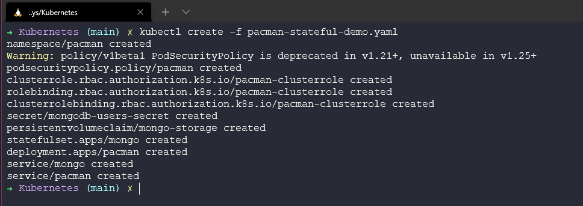
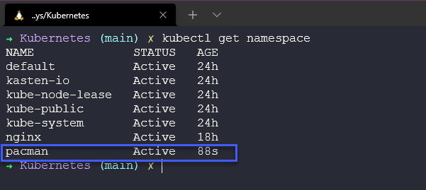
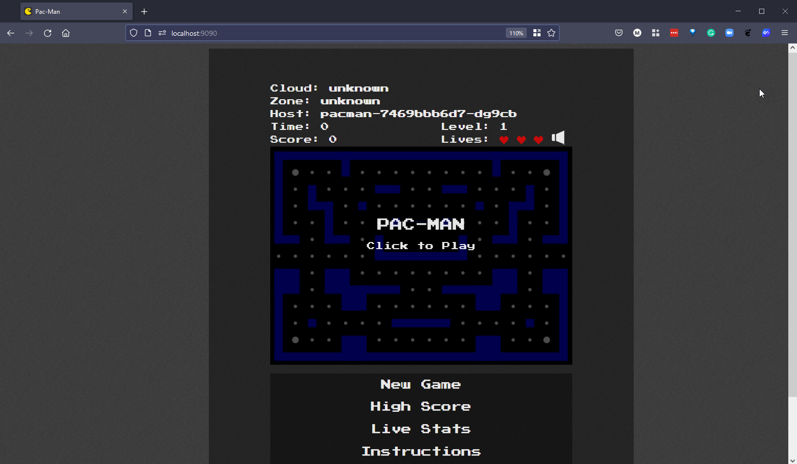
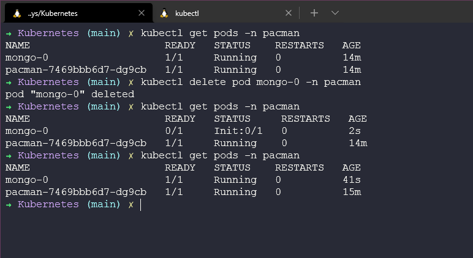
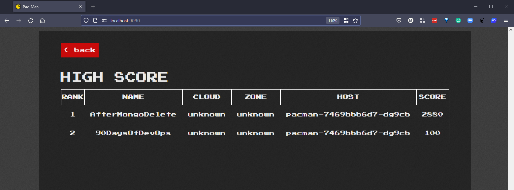
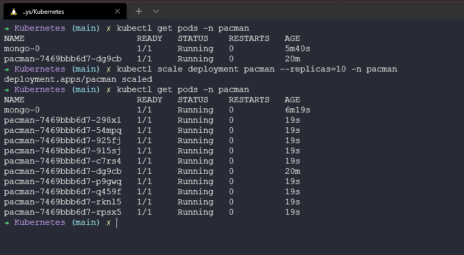
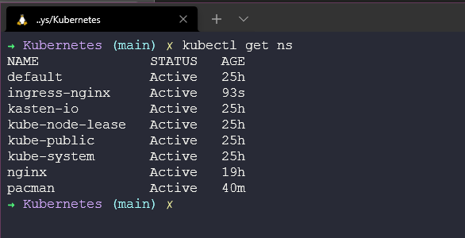

## Estado e Ingress en Kubernetes

En esta sección final de Kubernetes, vamos a echar un vistazo al estado e Ingress.

Todo lo que hemos dicho hasta ahora es acerca de stateless, stateless es realmente donde nuestras aplicaciones no se preocupan por qué red están utilizando y no necesitan ningún almacenamiento permanente. Mientras que las aplicaciones y bases de datos stateful, por ejemplo, para que dicha aplicación funcione correctamente, deberás asegurarte de que los pods puedan alcanzarse entre sí a través de una identidad única que no cambie (nombres de host, IP, etc.). Ejemplos de aplicaciones stateful incluyen clústeres MySQL, Redis, Kafka, MongoDB y otros. Básicamente, a través de cualquier aplicación que almacene datos.

### Aplicación stateful

StatefulSets representan un conjunto de Pods con identidades únicas y persistentes y nombres de host estables que Kubernetes mantiene independientemente de dónde se programen. La información de estado y otros datos resilientes para cualquier Pod dado de StatefulSet se mantienen en almacenamiento de disco persistente asociado con StatefulSet.

### DImplementación frente a StatefulSet

- Replicar aplicaciones stateful es más difícil.
- Replicar nuestros pods en una implementación (aplicación sin estado) es idéntico e intercambiable.
- Crea pods en orden aleatorio con hashes aleatorios
- Un solo servicio que equilibra la carga a cualquier Pod.

Cuando se trata de StatefulSets o aplicaciones stateful, lo anterior es más difícil.

- No se pueden crear ni eliminar al mismo tiempo.
- No se pueden abordar aleatoriamente.
- Los Pods de réplica no son idénticos.

Algo que verás en nuestra demostración en breve es que cada pod tiene su propia identidad. Con una aplicación stateless, verás nombres aleatorios. Por ejemplo, `app-7469bbb6d7-9mhxd`, mientras que una aplicación stateful estaría más alineada con `mongo-0` y luego, cuando se escala, creará un nuevo pod llamado `mongo-1`.

Estos pods se crean a partir de la misma especificación, pero no son intercambiables. Cada pod de StatefulSet tiene un identificador persistente en cualquier reprogramación. Esto es necesario porque cuando requerimos cargas de trabajo stateful como una base de datos donde requerimos escribir y leer en una base de datos, no podemos tener dos pods escribiendo al mismo tiempo sin conciencia ya que esto nos dará inconsistencia de datos. Necesitamos asegurarnos de que solo uno de nuestros pods esté escribiendo en la base de datos en cualquier momento dado, sin embargo, podemos tener múltiples pods leyendo esos datos.

Cada pod en un StatefulSet tendría acceso a su volumen persistente y copia de réplica de la base de datos para leer, esto se actualiza continuamente desde el maestro. También es interesante destacar que cada pod almacenará su estado de pod en este volumen persistente, si luego `mongo-0` muere, cuando se provisione uno nuevo, tomará el estado de pod almacenado en el almacenamiento.

TLDR; StatefulSets vs Deployments

- Nombre predecible del pod = mongo-0
- Nombre de DNS individual fijo
- Identidad del pod: Mantener estado, mantener rol
- Replicar aplicaciones con estado es complejo
   - Hay muchas cosas que debes hacer:
    - Configurar la clonación y la sincronización de datos.
    - Hacer que el almacenamiento compartido remoto esté disponible.
    - Gestión y copia de seguridad

### Volúmenes Persistentes | Reclamaciones | StorageClass

¿Cómo persistir datos en Kubernetes?

Mencionamos anteriormente que cuando tenemos una aplicación con estado, debemos almacenar el estado en algún lugar y aquí es donde surge la necesidad de un volumen. Por defecto, Kubernetes no proporciona persistencia.

Necesitamos una capa de almacenamiento que no dependa del ciclo de vida del pod. Este almacenamiento debe estar disponible y accesible desde todos los nodos de Kubernetes. El almacenamiento también debe estar fuera del clúster de Kubernetes para poder sobrevivir incluso si el clúster de Kubernetes falla.

### Volumen Persistente

- Un recurso del clúster (como CPU y RAM) para almacenar datos.
- Se crea mediante un archivo YAML.
- Necesita almacenamiento físico real (NAS).
- Integración externa en tu clúster de Kubernetes.
- Puedes tener diferentes tipos de almacenamiento disponibles en tu almacenamiento.
- Los PV no tienen espacio de nombres.
- El almacenamiento local está disponible, pero estaría específico de un nodo en el clúster.
- La persistencia de la base de datos debe usar almacenamiento remoto (NAS).

### Persistent Volume Claim

Un volumen persistente por sí solo puede estar disponible, pero a menos que sea reclamado por una aplicación, no se está utilizando.

- Se crea mediante un archivo YAML.
- La reclamación de volumen persistente se utiliza en la configuración del pod (atributo de volúmenes).
- Las PVCs (reclamaciones de volumen persistente) se encuentran en el mismo espacio de nombres que el pod.
- El volumen se monta en el pod.
- Los pods pueden tener múltiples tipos de volumen diferentes (ConfigMap, Secret, PVC).

Otra forma de pensar en los PV y PVCs es que:

Los PV son creados por el administrador de Kubernetes.
Los PVCs son creados por el usuario o el desarrollador de la aplicación.

También tenemos otros dos tipos de volúmenes de los que no entraremos en detalle pero que vale la pena mencionar

### ConfigMaps | Secrets

- Archivo de configuración para tu pod.
- Archivo de certificado para tu pod.

### StorageClass

- Se crea mediante un archivo YAML.
- Provee volúmenes persistentes dinámicamente cuando una PVC lo reclama.
- Cada backend de almacenamiento tiene su proveedor.
- El backend de almacenamiento se define en YAML (mediante el atributo provisioner).
- Abstrae al proveedor de almacenamiento subyacente.
- Define parámetros para ese almacenamiento.

### Walkthrough time

En la sesión de ayer recorrimos la creación de una aplicación sin estado, ahora queremos hacer lo mismo pero utilizando nuestro clúster de minikube para implementar una carga de trabajo con estado.

Un resumen del comando de minikube que estamos utilizando para tener la capacidad y complementos para utilizar la persistencia es `minikube start --addons volumesnapshots,csi-hostpath-driver --apiserver-port=6443 --container-runtime=containerd -p mc-demo --Kubernetes-version=1.21.2`

Este comando utiliza el controlador CSI-hostpath-driver, que es lo que nos proporciona nuestra clase de almacenamiento, algo que mostraré más adelante.

La construcción de la aplicación se ve así:

Puedes encontrar el archivo de configuración YAML de esta aplicación aquí [pacman-stateful-demo.yaml](Kubernetes)

### Configuración de StorageClass

Sin embargo, hay un paso más que debemos realizar antes de comenzar a implementar nuestra aplicación y es asegurarnos de que nuestra clase de almacenamiento (CSI-hostpath-sc) sea la predeterminada. Podemos verificar esto ejecutando el comando `kubectl get storageclass`, pero de forma predeterminada, el clúster de minikube mostrará la clase de almacenamiento estándar como predeterminada, por lo que debemos cambiarla con los siguientes comandos.

Este primer comando hará que nuestra clase de almacenamiento CSI-hostpath-sc sea la predeterminada.

`kubectl patch storageclass csi-hostpath-sc -p '{"metadata": {"annotations":{"storageclass.kubernetes.io/is-default-class":"true"}}}'`

Este comando eliminará la anotación predeterminada de la clase de almacenamiento estándar.

`kubectl patch storageclass standard -p '{"metadata": {"annotations":{"storageclass.kubernetes.io/is-default-class":"false"}}}'`

Comenzamos sin un espacio de nombres de Pacman en nuestro clúster. `kubectl get namespace`

Luego implementaremos nuestro archivo YAML. `kubectl create -f pacman-stateful-demo.yaml`. Puedes ver que con este comando estamos creando varios objetos dentro de nuestro clúster de Kubernetes.

Ahora tenemos nuestro espacio de nombres recién creado.

A continuación, puedes ver en la siguiente imagen y en el comando `kubectl get all -n pacman` que hay varias cosas sucediendo dentro de nuestro espacio de nombres. Tenemos nuestros pods ejecutando nuestra interfaz web NodeJS, tenemos mongo ejecutando nuestra base de datos de backend. Hay servicios tanto para Pacman como para mongo para acceder a esos pods. Tenemos una implementación para Pacman y un conjunto de estado para mongo.

También tenemos nuestro volumen persistente y la solicitud de volumen persistente mediante el comando `kubectl get pv` nos mostrará nuestros volúmenes persistentes sin espacio de nombres y ejecutando `kubectl get pvc -n pacman` nos mostrará nuestras solicitudes de volumen persistente con espacio de nombres.

### Jugando el juego | Quiero decir, accediendo a nuestra aplicación crítica

Debido a que estamos utilizando Minikube, como se mencionó en la aplicación sin estado, tenemos algunos obstáculos para acceder a nuestra aplicación. Sin embargo, si tenemos acceso a un Ingress o a un balanceador de carga dentro de nuestro clúster, el servicio está configurado para obtener automáticamente una dirección IP de ellos para acceder externamente (puedes ver esto arriba en la imagen de todos los componentes en el espacio de nombres de Pacman).

Para esta demostración, vamos a utilizar el método de "port forwarding" para acceder a nuestra aplicación. Abriendo una nueva terminal y ejecutando el siguiente comando `kubectl port-forward svc/pacman 9090:80 -n pacman`, al abrir un navegador ahora tendremos acceso a nuestra aplicación. Si estás ejecutando esto en AWS u otras ubicaciones específicas, también se mostrará la nube y la zona, así como el host que corresponde a tu pod dentro de Kubernetes, nuevamente puedes volver atrás y ver este nombre de pod en nuestras capturas de pantalla anteriores.

Ahora podemos ir y crear una puntuación alta que luego se almacenará en nuestra base de datos.

¡Ok, genial! Tenemos una puntuación alta, pero ¿qué sucede si eliminamos nuestro pod `mongo-0`? ejecutando `kubectl delete pod mongo-0 -n pacman` puedo eliminarlo y si aún estás en la aplicación, verás que la puntuación alta no estará disponible, al menos por unos segundos.

Ahora, si vuelvo a mi juego, puedo crear un nuevo juego y ver mis puntuaciones altas. La única forma en que realmente puedas creerme es si lo intentas tú mismo y compartes tus puntuaciones altas en las redes sociales.

Con la implementación, podemos aumentar la escala utilizando los comandos que vimos en la sesión anterior, pero en particular aquí, especialmente si quieres organizar una gran fiesta de Pacman, puedes escalar esto usando `kubectl scale deployment pacman --replicas=10 -n pacman`

### Explicación de Ingress

Antes de terminar con Kubernetes, también quería mencionar un aspecto importante de Kubernetes: Ingress.

### ¿Qué es Ingress?

Hasta ahora, con nuestros ejemplos, hemos utilizado "port-forward" o hemos utilizado comandos específicos dentro de Minikube para acceder a nuestras aplicaciones, pero esto no funcionará en producción. Queremos una mejor forma de acceder a nuestras aplicaciones a gran escala con múltiples usuarios.

También hemos hablado sobre NodePort como una opción, pero nuevamente, esto debería ser solo para fines de prueba.

Ingress nos proporciona una mejor forma de exponer nuestras aplicaciones, lo cual nos permite definir reglas de enrutamiento dentro de nuestro clúster de Kubernetes.

Con Ingress, crearíamos una solicitud de reenvío hacia el servicio interno de nuestra aplicación.

### ¿Cuándo necesitas Ingress?

Si estás utilizando un proveedor de servicios en la nube que ofrece Kubernetes administrado, es muy probable que tengan su opción de Ingress para tu clúster o te proporcionen su opción de balanceador de carga. No necesitas implementar esto tú mismo, es uno de los beneficios de Kubernetes administrado.

Si estás ejecutando tu propio clúster, entonces deberás configurar un punto de entrada.

### Configurar Ingress en Minikube

En mi clúster en ejecución llamado "mc-demo", puedo ejecutar el siguiente comando para habilitar Ingress en mi clúster.

`minikube --profile='mc-demo' addons enable ingress`

Si verificamos nuestros espacios de nombres ahora, verás que tenemos un nuevo espacio de nombres "ingress-nginx". `kubectl get ns`

Ahora debemos crear nuestra configuración YAML de Ingress para acceder a nuestro servicio Pacman. He agregado este archivo al repositorio [pacman-ingress.yaml](Kubernetes)

Luego, podemos crear esto en nuestro espacio de nombres "ingress" con `kubectl create -f Pacman-ingress.yaml`

Luego, si ejecutamos `kubectl get ingress -n Pacman

Luego se me informa que, debido a que estamos utilizando Minikube en WSL2 en Windows, debemos crear el túnel de Minikube usando `minikube tunnel --profile=mc-demo`

Pero aún no puedo acceder a 192.168.49.2 y jugar a mi juego de Pacman.

Si alguien lo ha logrado o puede hacerlo funcionar en Windows y WSL, agradecería los comentarios. Abriré un problema en el repositorio para esto y volveré a él una vez que tenga tiempo y una solución.

ACTUALIZACIÓN: Siento que este blog ayuda a identificar quizás la causa de que esto no funcione con WSL [Configuring Ingress to run Minikube on WSL2 using Docker runtime](https://hellokube.dev/posts/configure-minikube-ingress-on-wsl2/)

## Recursos

If you have FREE resources that you have used then please feel free to add them here via a PR to the repository and I will be happy to include them.

- [Kubernetes StatefulSet simply explained](https://www.youtube.com/watch?v=pPQKAR1pA9U)
- [Kubernetes Volumes explained](https://www.youtube.com/watch?v=0swOh5C3OVM)
- [Kubernetes Ingress Tutorial for Beginners](https://www.youtube.com/watch?v=80Ew_fsV4rM)
- [Kubernetes Documentation](https://kubernetes.io/docs/home/)
- [TechWorld with Nana - Kubernetes Tutorial for Beginners [FULL COURSE in 4 Hours]](https://www.youtube.com/watch?v=X48VuDVv0do)
- [TechWorld with Nana - Kubernetes Crash Course for Absolute Beginners](https://www.youtube.com/watch?v=s_o8dwzRlu4)
- [Kunal Kushwaha - Kubernetes Tutorial for Beginners | What is Kubernetes? Architecture Simplified!](https://www.youtube.com/watch?v=KVBON1lA9N8)
- [WSL2 - Windows corriendo contenedores Linux??](https://youtu.be/_Hne4gm8plo)

Aquí concluye la sección de Kubernetes, hay mucho contenido adicional que podríamos ver sobre Kubernetes y 7 días nos brinda conocimientos fundamentales, pero hay personas que están pasando por [100DaysOfKubernetes](https://100daysofkubernetes.io/overview.html) donde se puede profundizar más.

A continuación, vamos a echar un vistazo a la Infraestructura como Código y el papel importante que desempeña desde una perspectiva de DevOps.

Nos vemos en el [Día 56](day56.md)
