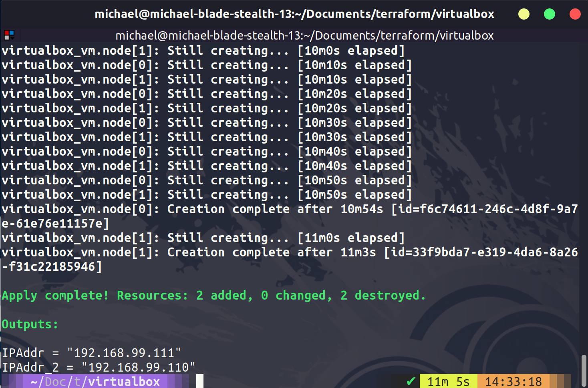
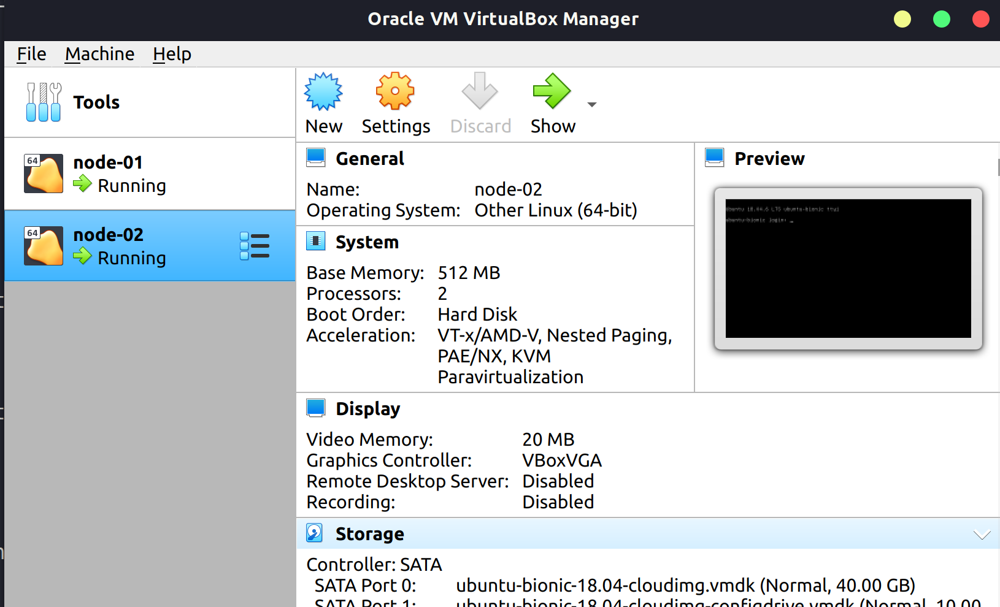
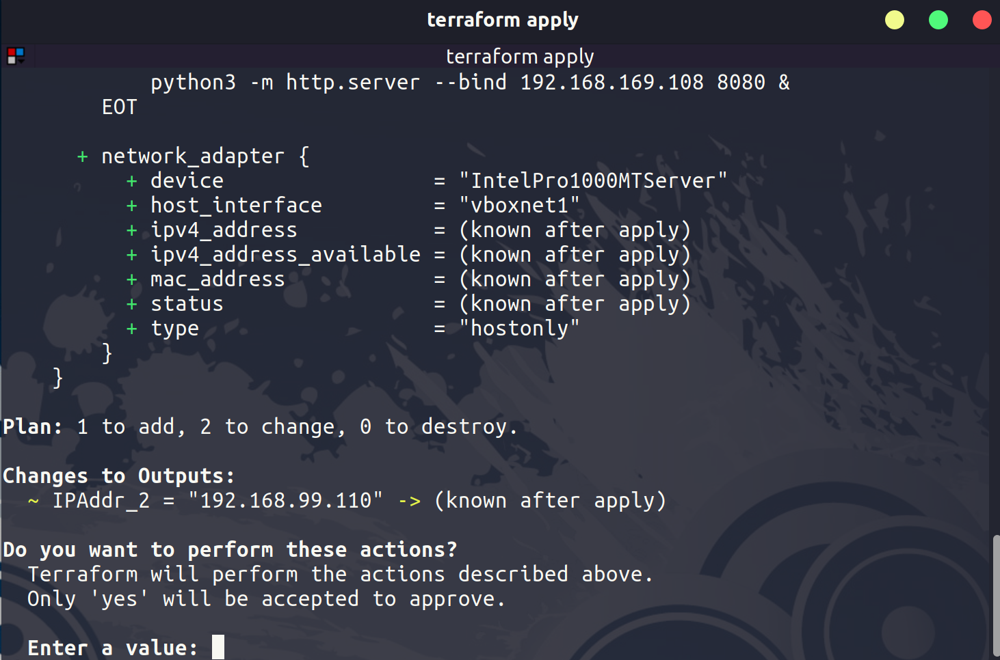
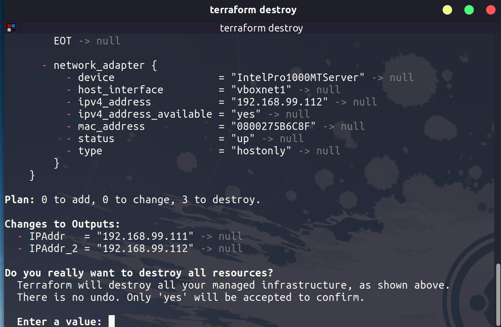

## Crear una VM con Terraform y Variables

En esta sesión, vamos a crear una o dos VMs utilizando Terraform dentro de VirtualBox. Esto no es lo habitual, ya que VirtualBox es una opción de virtualización de estaciones de trabajo y este no sería un caso de uso típico para Terraform, pero actualmente estoy a 36,000 pies de altura y, aunque he implementado recursos de la nube pública a esta altitud en las nubes, es mucho más rápido hacerlo localmente en mi computadora portátil.

Solo con fines de demostración, pero el concepto es el mismo: vamos a tener nuestro código de configuración de estado deseado y luego lo ejecutaremos con el proveedor de VirtualBox. En el pasado, hemos utilizado Vagrant aquí y ya he cubierto las diferencias entre Vagrant y Terraform al principio de la sección.
Crear una máquina virtual en VirtualBox

## Lo primero que vamos a hacer es crear una nueva carpeta llamada VirtualBox. Luego podemos crear un archivo VirtualBox.tf y ahí es donde definiremos nuestros recursos. El siguiente código, que se encuentra en la carpeta VirtualBox como VirtualBox.tf, creará 2 VMs en VirtualBox.

Puedes encontrar más información sobre el proveedor de VirtualBox de la comunidad aquí[here](https://registry.terraform.io/providers/terra-farm/virtualbox/latest/docs/resources/vm)

```terraform
terraform {
  required_providers {
    virtualbox = {
      source = "terra-farm/virtualbox"
      version = "0.2.2-alpha.1"
    }
  }
}

# Actualmente no hay opciones de configuración para el propio proveedor.

resource "virtualbox_vm" "node" {
  count     = 2
  name      = format("node-%02d", count.index + 1)
  image     = "https://app.vagrantup.com/ubuntu/boxes/bionic64/versions/20180903.0.0/providers/virtualbox.box"
  cpus      = 2
  memory    = "512 mib"

  network_adapter {
    type           = "hostonly"
    host_interface = "vboxnet1"
  }
}

output "IPAddr" {
  value = element(virtualbox_vm.node.*.network_adapter.0.ipv4_address, 1)
}

output "IPAddr_2" {
  value = element(virtualbox_vm.node.*.network_adapter.0.ipv4_address, 2)
}

```

Ahora que hemos definido nuestro código, podemos ejecutar `terraform init` en nuestra carpeta para descargar el proveedor de VirtualBox.


También necesitarás tener VirtualBox instalado en tu sistema. A continuación, podemos ejecutar terraform plan para ver qué creará nuestro código. Luego, ejecutamos `terraform apply`. La siguiente imagen muestra el proceso completo.



En VirtualBox, ahora verás tus 2 máquinas virtuales.



### Cambiar la configuración

Agreguemos otro nodo a nuestra implementación. Simplemente podemos cambiar la línea de conteo para indicar nuestro nuevo número deseado de nodos. Cuando ejecutemos `terraform apply`, se verá algo como lo siguiente.



Una vez que se complete, en VirtualBox verás que ahora tenemos 3 nodos en funcionamiento.


Cuando hayamos terminado, podemos limpiar esto utilizando `terraform destroy` y nuestras máquinas serán eliminadas.



### Variables y Salidas

Mencionamos las salidas cuando ejecutamos nuestro ejemplo de "hola mundo" en la última sesión. Pero aquí podemos entrar en más detalle.

Pero hay muchas otras variables que podemos utilizar aquí, también hay algunas formas diferentes en las que podemos definir variables.

- Podemos ingresar manualmente nuestras variables con el comando `terraform plan` o `terraform apply`.
- Podemos definirlas en el archivo .tf dentro del bloque correspondiente.
- Podemos utilizar variables de entorno en nuestro sistema utilizando el formato `TF_VAR_NOMBRE`.
- Mi preferencia es usar un archivo terraform.tfvars en la carpeta de nuestro proyecto.
- Existe la opción de utilizar un archivo \*auto.tfvars.
- También podemos definir las variables al ejecutar `terraform plan` o `terraform apply` con las opciones `-var` o `-var-file`.

Comenzando desde abajo y avanzando hacia arriba, así se define el orden en el que se definen las variables.

También hemos mencionado que el archivo de estado contendrá información confidencial. Podemos definir nuestra información confidencial como una variable y especificar que es confidencial.

```
variable "some resource"  {
    description = "something important"
    type: string
    sensitive = true

}
```

## Recursos

He enumerado muchos recursos a continuación y creo que este tema ha sido cubierto tantas veces, si tienes recursos adicionales, asegúrate de enviar una solicitud de extracción (PR) con tus recursos y estaré encantado de revisarlos y agregarlos a la lista.

- [What is Infrastructure as Code? Difference of Infrastructure as Code Tools](https://www.youtube.com/watch?v=POPP2WTJ8es)
- [Terraform Tutorial | Terraform Course Overview 2021](https://www.youtube.com/watch?v=m3cKkYXl-8o)
- [Terraform explained in 15 mins | Terraform Tutorial for Beginners](https://www.youtube.com/watch?v=l5k1ai_GBDE)
- [Terraform Course - From BEGINNER to PRO!](https://www.youtube.com/watch?v=7xngnjfIlK4&list=WL&index=141&t=16s)
- [HashiCorp Terraform Associate Certification Course](https://www.youtube.com/watch?v=V4waklkBC38&list=WL&index=55&t=111s)
- [Terraform Full Course for Beginners](https://www.youtube.com/watch?v=EJ3N-hhiWv0&list=WL&index=39&t=27s)
- [KodeKloud - Terraform for DevOps Beginners + Labs: Complete Step by Step Guide!](https://www.youtube.com/watch?v=YcJ9IeukJL8&list=WL&index=16&t=11s)
- [Terraform Simple Projects](https://terraform.joshuajebaraj.com/)
- [Terraform Tutorial - The Best Project Ideas](https://www.youtube.com/watch?v=oA-pPa0vfks)
- [Awesome Terraform](https://github.com/shuaibiyy/awesome-terraform)
- [Herramientas para Terraform](https://vergaracarmona.es/herramientas-para-terraform/)

Nos vemos en el [Día 60](day60.md)
