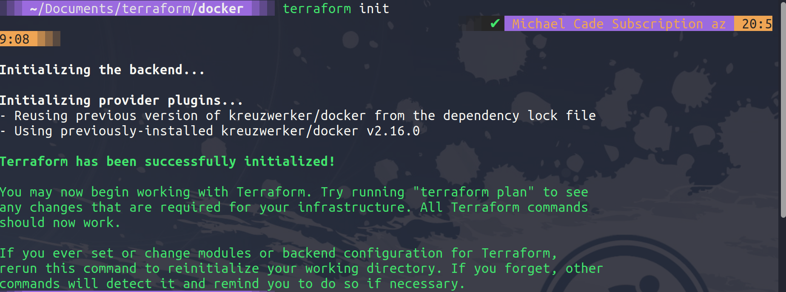

## Contenedores de Docker, provisionadores y módulos

En el [Dí 59](day59.md) provisionamos una máquina virtual utilizando Terraform en nuestro entorno local de VirtualBox GRATIS. En esta sección, vamos a implementar un contenedor de Docker con alguna configuración en nuestro entorno local de Docker.

### Demostración de Docker

Primero, vamos a utilizar el bloque de código a continuación. El resultado de esto es que queremos desplegar una aplicación web simple en Docker y publicarla para que esté disponible en nuestra red. Vamos a utilizar nginx y lo haremos disponible externamente en nuestro portátil a través de localhost y el puerto 8000. Estamos utilizando un proveedor de Docker de la comunidad y también puedes ver la imagen de Docker que estamos utilizando en nuestra configuración.

```terraform
terraform {
  required_providers {
    docker = {
      source  = "kreuzwerker/docker"
      version = "2.16.0"
    }
  }
}

provider "docker" {}

resource "docker_image" "nginx" {
  name         = "nginx:latest"
  keep_locally = false
}

resource "docker_container" "nginx" {
  image = docker_image.nginx.latest
  name  = "tutorial"
  ports {
    internal = 80
    external = 8000
  }
}
```

La primera tarea es utilizar el comando `terraform init` para descargar el proveedor en nuestra máquina local.


Luego ejecutamos `terraform apply` seguido de `docker ps` y puedes ver que tenemos un contenedor en ejecución.


Si abrimos un navegador y navegamos a `http://localhost:8000/`, verás que tenemos acceso a nuestro contenedor NGINX.


Puedes encontrar más información sobre [Docker Provider](https://registry.terraform.io/providers/kreuzwerker/docker/latest/docs/resources/container)

Lo anterior es una demostración muy sencilla de lo que se puede hacer con Terraform y Docker, y cómo podemos administrarlo ahora bajo el estado de Terraform. Cubrimos docker-compose en la sección de contenedores y hay un poco de superposición en cierto sentido entre esto, la infraestructura como código y luego Kubernetes.

Para mostrar esto y cómo Terraform puede manejar un poco más de complejidad, vamos a tomar el archivo docker-compose de WordPress y MySQL que creamos con docker-compose y lo vamos a poner en Terraform. Puedes encontrar el [docker-wordpress.tf](2022/Days/IaC/Docker-WordPress/docker-WordPress.tf)

```terraform
terraform {
  required_providers {
    docker = {
      source  = "kreuzwerker/docker"
      version = "2.16.0"
    }
  }
}

provider "docker" {}

variable wordpress_port {
  default = "8080"
}

resource "docker_volume" "db_data" {
  name = "db_data"
}

resource "docker_network" "wordpress_net" {
  name = "wordpress_net"
}

resource "docker_container" "db" {
  name  = "db"
  image = "mysql:5.7"
  restart = "always"
  network_mode = "wordpress_net"
  env = [
     "MYSQL_ROOT_PASSWORD=wordpress",
     "MYSQL_PASSWORD=wordpress",
     "MYSQL_USER=wordpress",
     "MYSQL_DATABASE=wordpress"
  ]
  mounts {
    type = "volume"
    target = "/var/lib/mysql"
    source = "db_data"
    }
}

resource "docker_container" "wordpress" {
  name  = "wordpress"
  image = "wordpress:latest"
  restart = "always"
  network_mode = "wordpress_net"
  env = [
    "WORDPRESS_DB_HOST=db:3306",
    "WORDPRESS_DB_USER=wordpress",
    "WORDPRESS_DB_NAME=wordpress",
    "WORDPRESS_DB_PASSWORD=wordpress"
  ]
  ports {
    internal = "80"
    external = "${var.wordpress_port}"
  }
}
```

Nuevamente, colocamos esto en una nueva carpeta y luego ejecutamos el comando `terraform init` para descargar los provisionadores requeridos.



Luego ejecutamos el comando `terraform apply` y luego echamos un vistazo a la salida de `docker ps` y deberíamos ver nuestros contenedores recién creados.


También podemos navegar a nuestra interfaz de WordPress. Al igual que cuando pasamos por este proceso con docker-compose en la sección de contenedores, ahora podemos realizar la configuración y nuestras publicaciones de WordPress estarían en nuestra base de datos de MySQL.


Ahora que hemos cubierto los contenedores y Kubernetes en detalle, probablemente sepamos que esto está bien para pruebas, pero si vamos a ejecutar un sitio web, no lo haríamos solo con contenedores y consideraríamos utilizar Kubernetes para lograr esto. A continuación, vamos a echar un vistazo a cómo utilizar Terraform con Kubernetes.

### Provisionadores

Los provisionadores están ahí para que, si algo no puede ser declarativo, tengamos una forma de enviar esto a nuestra implementación.

Si no tienes otra alternativa y agregar esta complejidad a tu código es el camino a seguir, puedes hacerlo ejecutando algo similar al siguiente bloque de código.

```
resource "docker_container" "db" {
  # ...

  provisioner "local-exec" {
    command = "echo The server's IP address is ${self.private_ip}"
  }
}

```

El provisionador `remote-exec` invoca un script en un recurso remoto después de que se crea. Esto podría usarse para algo específico del sistema operativo o podría usarse para envolver en una herramienta de gestión de configuración. Aunque debes tener en cuenta que algunos de estos ya están cubiertos en sus propios provisionadores.

[Más detalles de provisionadores](https://www.terraform.io/language/resources/provisioners/syntax)

- file
- local-exec
- remote-exec
- vendor
  - ansible
  - chef
  - puppet

### Módulos

Los módulos son contenedores para múltiples recursos que se utilizan juntos. Un módulo consiste en una colección de archivos .tf en el mismo directorio.

Los módulos son una buena forma de separar tus recursos de infraestructura, así como de poder utilizar módulos de terceros que ya han sido creados para no tener que reinventar la rueda.

Por ejemplo, si queremos utilizar el mismo proyecto para crear algunas VM, VPC, grupos de seguridad y también un clúster de Kubernetes, probablemente querríamos dividir nuestros recursos en módulos para definir mejor nuestros recursos y dónde se agrupan.

Otra ventaja de los módulos es que puedes tomar estos módulos y usarlos en otros proyectos o compartirlos públicamente para ayudar a la comunidad.

Estamos dividiendo nuestra infraestructura en componentes, y esos componentes se conocen aquí como módulos.

## Recursos

He enumerado muchos recursos a continuación y creo que este tema ha sido cubierto muchas veces, así que si tienes recursos adicionales, asegúrate de enviar una solicitud de extracción (PR) con tus recursos y estaré encantado de revisarlos y agregarlos a la lista.

- [What is Infrastructure as Code? Difference of Infrastructure as Code Tools](https://www.youtube.com/watch?v=POPP2WTJ8es)
- [Terraform Tutorial | Terraform Course Overview 2021](https://www.youtube.com/watch?v=m3cKkYXl-8o)
- [Terraform explained in 15 mins | Terraform Tutorial for Beginners](https://www.youtube.com/watch?v=l5k1ai_GBDE)
- [Terraform Course - From BEGINNER to PRO!](https://www.youtube.com/watch?v=7xngnjfIlK4&list=WL&index=141&t=16s)
- [HashiCorp Terraform Associate Certification Course](https://www.youtube.com/watch?v=V4waklkBC38&list=WL&index=55&t=111s)
- [Terraform Full Course for Beginners](https://www.youtube.com/watch?v=EJ3N-hhiWv0&list=WL&index=39&t=27s)
- [KodeKloud - Terraform for DevOps Beginners + Labs: Complete Step by Step Guide!](https://www.youtube.com/watch?v=YcJ9IeukJL8&list=WL&index=16&t=11s)
- [Terraform Simple Projects](https://terraform.joshuajebaraj.com/)
- [Terraform Tutorial - The Best Project Ideas](https://www.youtube.com/watch?v=oA-pPa0vfks)
- [Awesome Terraform](https://github.com/shuaibiyy/awesome-terraform)
- [Herramientas para Terraform](https://vergaracarmona.es/herramientas-para-terraform/)

Nos vemos en el [Día 61](day61.md)
