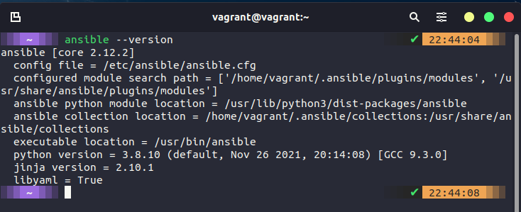
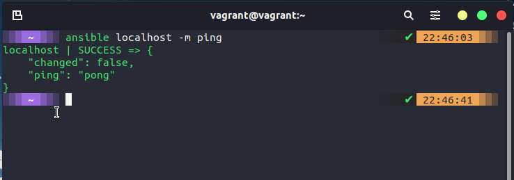
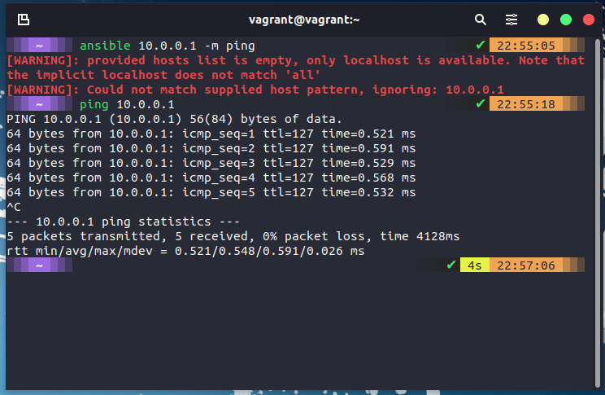
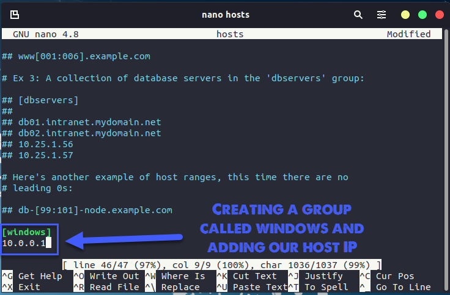
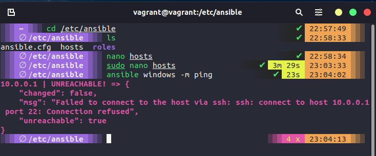
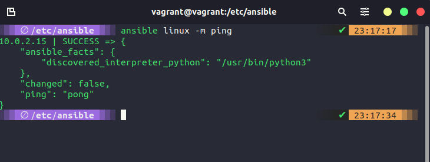

## Ansible: Introducción

Ayer cubrimos un poco sobre qué es Ansible en la sesión de la imagen general puedes verla en en el [día 63](day63.md), pero ahora vamos a comenzar con un poco más de información sobre eso. En primer lugar, Ansible proviene de RedHat. En segundo lugar, es sin agente, se conecta a través de SSH y ejecuta comandos. En tercer lugar, es multiplataforma (Linux y macOS, WSL2) y de código abierto (también existe una opción empresarial de pago). Ansible aplica configuraciones en comparación con otros modelos.

### Instalación de Ansible

Como puedes imaginar, RedHat y el equipo de Ansible han hecho un trabajo fantástico documentando Ansible. Esto comienza generalmente con los pasos de instalación, que puedes encontrar [aquí](https://docs.ansible.com/ansible/latest/installation_guide/intro_installation.html). Recuerda que dijimos que Ansible es una herramienta de automatización sin agente y que la herramienta se implementa en un sistema denominado "Nodo de Control". Desde este nodo de control, se administran máquinas y otros dispositivos (posiblemente de red) a través de SSH.

En la documentación vinculada anteriormente, se menciona que el sistema operativo Windows no puede utilizarse como nodo de control.

Para mi nodo de control y al menos para esta demostración, voy a utilizar la máquina virtual de Linux que creamos en la [sección de Linux](day20.md) como mi nodo de control.

Este sistema ejecutaba Ubuntu y los pasos de instalación simplemente requieren los siguientes comandos.

```Shell
sudo apt update
sudo apt install software-properties-common
sudo add-apt-repository --yes --update ppa:ansible/ansible
sudo apt install ansible
```

Ahora deberíamos tener Ansible instalado en nuestro nodo de control. Puedes verificar esto ejecutando `ansible --version` y deberías ver algo similar a esto a continuación.



Antes de comenzar a controlar otros nodos en nuestro entorno, también podemos verificar la funcionalidad de Ansible ejecutando un comando contra nuestra máquina local. `ansible localhost -m ping` utilizará un [Ansible Module](https://docs.ansible.com/ansible/2.9/user_guide/modules_intro.html) , que es una forma rápida de realizar una tarea única en muchos sistemas diferentes. No es muy divertido con solo el host local, pero imagina que quisieras obtener algo o asegurarte de que todos tus sistemas estén funcionando y tienes más de 1000 servidores y dispositivos.



Un caso de uso real para un módulo podría ser algo como ansible webservers --m service -a "name=httpd state=started". Esto nos dirá si todos nuestros servidores web tienen el servicio httpd en ejecución. He pasado por alto el término "webservers" utilizado en ese comando.

### hosts

De la misma manera en que usé "localhost" anteriormente para ejecutar un módulo simple de ping en el sistema, no puedo especificar otra máquina en mi red. Por ejemplo, en el entorno que estoy usando, mi host de Windows donde se ejecuta VirtualBox tiene un adaptador de red con la dirección IP `10.0.0.1`, como se muestra a continuación, puedo hacer ping a esa dirección, pero no puedo usar Ansible para realizar esa tarea.



Para especificar nuestros hosts o los nodos que queremos automatizar con estas tareas, necesitamos definirlos. Podemos hacerlo navegando hasta el directorio `/etc/ansible` en tu sistema.


El archivo que queremos editar es el archivo "hosts". Con un editor de texto, podemos abrirlo y definir nuestros hosts. El archivo hosts contiene muchas instrucciones útiles sobre cómo usar y modificar el archivo. Queremos desplazarnos hasta la parte inferior y crear un nuevo grupo llamado "windows" y agregar nuestra dirección IP `10.0.0.1` para ese host. Guarda el archivo.



Sin embargo, recuerda que necesitarás tener SSH disponible para permitir que Ansible se conecte a tu sistema. Como se puede ver a continuación, cuando ejecuto `ansible windows -m ping`, obtenemos un mensaje "unreachable" porque no se pudo establecer la conexión a través de SSH.



También he comenzado a agregar algunos hosts adicionales a nuestro inventario, que es otro nombre para este archivo, ya que aquí es donde vas a definir todos tus dispositivos, que podrían ser dispositivos de red, switches y enrutadores, por ejemplo, y se agruparían aquí. En nuestro archivo hosts, también he agregado mis credenciales para acceder al grupo de sistemas Linux.


Ahora, si ejecutamos `ansible Linux -m ping`, obtendremos un éxito, como se muestra a continuación.



Luego, tenemos los requisitos de los nodos, que son los sistemas de destino en los que deseas automatizar la configuración. No estamos instalando nada de Ansible en estos sistemas (es decir, es posible que estemos instalando software, pero no necesitamos un cliente de Ansible). Ansible establecerá una conexión a través de SSH y enviará archivos a través de SFTP (si así lo deseas y tienes SSH configurado, también podrías usar SCP en lugar de SFTP).

### Comandos de Ansible

Viste que pudimos ejecutar ansible Linux -m ping en nuestra máquina Linux y obtener una respuesta. Básicamente, con Ansible, podemos ejecutar muchos comandos ad-hoc. Pero puedes ejecutarlos en un grupo de sistemas y obtener esa información de vuelta. [Comandos ad-hoc](https://docs.ansible.com/ansible/latest/user_guide/intro_adhoc.html)

Si te encuentras repitiendo comandos o, peor aún, tienes que iniciar sesión en sistemas individuales para ejecutar estos comandos, Ansible puede ayudarte en ese sentido. Por ejemplo, el simple comando a continuación nos daría la salida de todos los detalles del sistema operativo para todos los sistemas que agreguemos a nuestro grupo de Linux. 
`ansible linux -a "cat /etc/os-release"`

Otros casos de uso podrían ser reiniciar sistemas, copiar archivos y administrar paquetes y usuarios. También puedes combinar comandos ad-hoc con módulos de Ansible.

Los comandos ad-hoc utilizan un modelo declarativo, calculan y ejecutan las acciones necesarias para alcanzar un estado final especificado. Logran una forma de idempotencia mediante la comprobación del estado actual antes de comenzar y no haciendo nada a menos que el estado actual sea diferente al estado final especificado.

## Recursos

- [What is Ansible](https://www.youtube.com/watch?v=1id6ERvfozo)
- [Ansible 101 - Episode 1 - Introduction to Ansible](https://www.youtube.com/watch?v=goclfp6a2IQ)
- [NetworkChuck - You need to learn Ansible right now!](https://www.youtube.com/watch?v=5hycyr-8EKs&t=955s)
- [Chef vs Puppet vs Ansible vs Saltstack](https://vergaracarmona.es/chef-vs-puppet-vs-ansible-vs-saltstack/)

Nos vemos en el [Día 65](day65.md)
