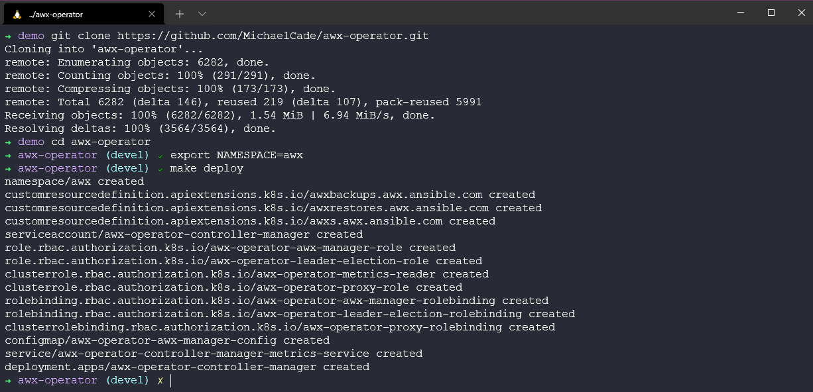
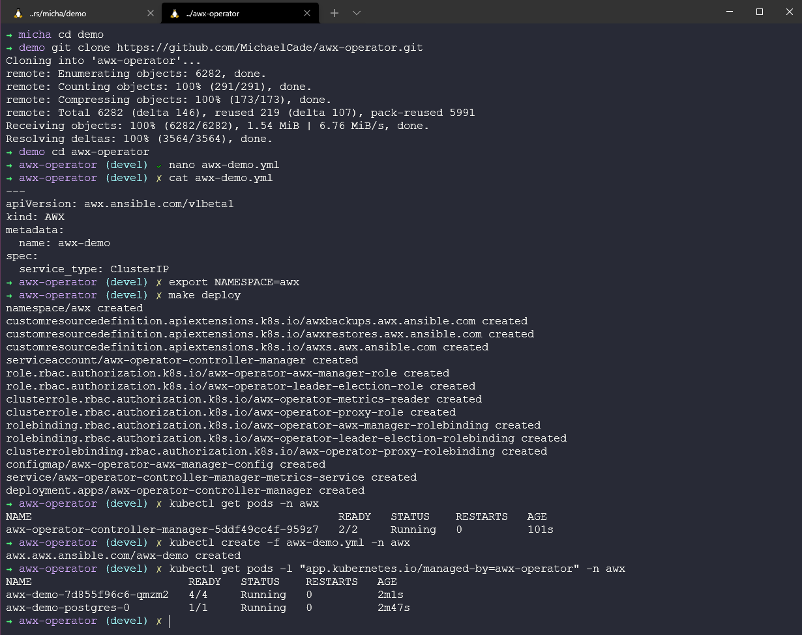
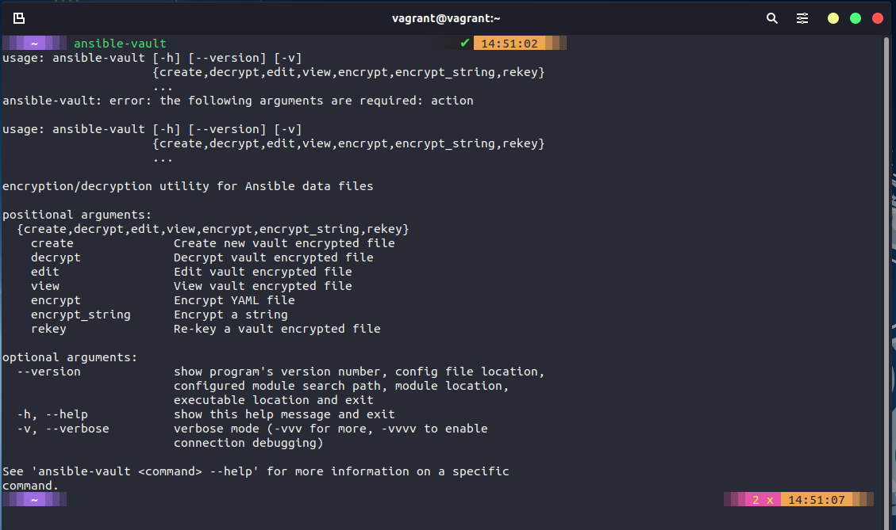

## Todo lo demás de Ansible: Automation Controller (Tower), AWX, Vault

Completando la sección sobre la Gestión de la Configuración, quería echar un vistazo a otras áreas con las que podrías encontrarte al tratar con Ansible.

Hay muchos productos que forman parte de la plataforma de automatización de Ansible.

Red Hat Ansible Automation Platform es una base para construir y operar la automatización en toda una organización. La plataforma incluye todas las herramientas necesarias para implementar la automatización a nivel empresarial.


Intentaré cubrir algunos de estos en esta publicación. Pero para obtener más información, el sitio web oficial de Ansible de Red Hat tendrá mucha más información. [Ansible.com](https://www.ansible.com/?hsLang=en-us)

### Ansible Automation Controller | AWX

He agrupado estos dos juntos porque el Automation Controller y AWX son muy similares en lo que ofrecen.

El proyecto AWX, o AWX en resumen, es un proyecto comunitario de código abierto, patrocinado por Red Hat, que te permite controlar mejor tus proyectos de Ansible en tus entornos. AWX es el proyecto upstream del componente controlador de automatización.

Si estás buscando una solución empresarial, entonces estarás buscando el Automation Controller, o es posible que hayas escuchado previamente sobre esto como Ansible Tower. El Automation Controller de Ansible es el plano de control de la Plataforma de Automatización de Ansible.

Tanto AWX como el Automation Controller ofrecen las siguientes características por encima de todo lo que hemos cubierto en esta sección hasta ahora:

- Interfaz de usuario
- Control de acceso basado en roles
- Flujos de trabajo
- Integración de CI/CD

El Automation Controller es la oferta empresarial por la que pagas por tu soporte.

Vamos a ver cómo implementar AWX en nuestro entorno de Kubernetes minikube.

### Implementando Ansible AWX

AWX no necesita ser implementado en un clúster de Kubernetes, la página de [github](https://github.com/ansible/awx) de AWX de Ansible te dará esos detalles. Sin embargo, a partir de la versión 18.0, el Operador AWX es la forma preferida de instalar AWX.

En primer lugar, necesitamos un clúster minikube. Podemos hacer esto si has seguido los pasos de la sección de Kubernetes, creando un nuevo clúster minikube con el comando `minikube start --cpus=4 --memory=6g --addons=ingress`.


El [Operador Ansible AWX ](https://github.com/ansible/awx-operator) oficial se puede encontrar aquí. Como se indica en las instrucciones de instalación, debes clonar este repositorio y luego seguir los pasos de implementación.

Hice un fork del repositorio anterior y luego ejecuté `git clone https://github.com/MichaelCade/awx-operator.git`. Mi consejo es que hagas lo mismo y no uses mi repositorio, ya que podría realizar cambios o es posible que no esté disponible.

En el repositorio clonado, encontrarás un archivo llamado awx-demo.yml, debemos cambiar `NodePort` por `ClusterIP`, como se muestra a continuación:

```Yaml
---
apiVersion: awx.ansible.com/v1beta1
kind: AWX
metadata:
  name: awx-demo
spec:
  service_type: ClusterIP
```

El siguiente paso es definir nuestro espacio de nombres (namespace) donde implementaremos el operador AWX, utilizando el comando `export NAMESPACE=awx`, seguido de `make deploy` para iniciar la implementación.



Al verificar, tendremos nuestro nuevo espacio de nombres y nuestro pod `awx-operator-controller` en ejecución en nuestro espacio de nombres. `kubectl get pods -n awx`


Dentro del repositorio clonado, encontrarás un archivo llamado `awx-demo.yml`, ahora queremos implementarlo en nuestro clúster de Kubernetes y en nuestro namespaces `kubectl create -f awx-demo.yml -n awx`


Puedes seguir el progreso con `kubectl get pods -n awx -w`, lo cual te dará una vista visual de lo que está sucediendo.

Cuando todo esté en funcionamiento, deberías tener algo que se parezca a la imagen que se muestra a continuación.



Ahora deberíamos poder acceder a nuestra implementación de AWX después de ejecutar en una nueva terminal `minikube service awx-demo-service --url -n $NAMESPACE` para exponerlo a través del ingress de minikube.


Luego, si abrimos un navegador en esa dirección, [] veremos que se nos solicita un nombre de usuario y una contraseña.


El nombre de usuario por defecto es admin, para obtener la contraseña, podemos ejecutar el siguiente comando: `kubectl get secret awx-demo-admin-password -o jsonpath="{.data.password}" -n awx | base64 --decode`


Esto te proporciona una interfaz de usuario para administrar tus playbooks y tareas de gestión de la configuración en una ubicación centralizada. También te permite trabajar en equipo, a diferencia de lo que hemos estado haciendo hasta ahora, donde hemos estado ejecutando desde una única estación de control de Ansible.

Esta es otra de esas áreas donde probablemente podrías pasar más tiempo explorando las capacidades de esta herramienta.

Quiero mencionar un gran recurso de Jeff Geerling, que ofrece más detalles sobre el uso de Ansible AWX.  [Ansible 101 - Episode 10 - Ansible Tower and AWX](https://www.youtube.com/watch?v=iKmY4jEiy_A&t=752s)

En este video, también se detalla las diferencias entre el Automation Controller (anteriormente Ansible Tower) y Ansible AWX (gratuito y de código abierto).

### Ansible Vault

`ansible-vault` nos permite cifrar y descifrar archivos de datos de Ansible. A lo largo de esta sección, hemos omitido y colocado parte de nuestra información confidencial en texto plano.

Dentro del binario de Ansible se encuentra `ansible-vault`, que nos permite ocultar esta información confidencial.



La gestión de secretos se ha convertido progresivamente en otra área en la que se debería haber dedicado más tiempo, junto con herramientas como HashiCorp Vault o el AWS Key Management Service. Marcaré esto como un área para profundizar.

Voy a enlazar un gran recurso y demostración de Jeff Geerling nuevamente: [Ansible 101 - Episode 6 - Ansible Vault and Roles](https://www.youtube.com/watch?v=JFweg2dUvqM)

### Ansible Galaxy (Documentación)

Ya hemos utilizado ansible-galaxy para crear algunos de nuestros roles y estructura de archivos para nuestro proyecto de demostración. Pero también tenemos la [Ansible Galaxy documentation](https://galaxy.ansible.com/docs/)

"Galaxy es un centro para encontrar y compartir contenido de Ansible".

### Pruebas de Ansible

- [Ansible Molecule](https://molecule.readthedocs.io/en/latest/) - El proyecto Molecule está diseñado para ayudar en el desarrollo y prueba de roles de Ansible.

- [Ansible Lint](https://ansible-lint.readthedocs.io/en/latest/) - Herramienta de línea de comandos para verificar la sintaxis y estilo de los playbooks, roles y colecciones de Ansible.

### Otros recursos

- [Ansible Documentation](https://docs.ansible.com/ansible/latest/index.html)

## Recursos

- [What is Ansible](https://www.youtube.com/watch?v=1id6ERvfozo)
- [Ansible 101 - Episode 1 - Introduction to Ansible](https://www.youtube.com/watch?v=goclfp6a2IQ)
- [NetworkChuck - You need to learn Ansible right now!](https://www.youtube.com/watch?v=5hycyr-8EKs&t=955s)
- [Your complete guide to Ansible](https://www.youtube.com/playlist?list=PLnFWJCugpwfzTlIJ-JtuATD2MBBD7_m3u)
- [Chef vs Puppet vs Ansible vs Saltstack](https://vergaracarmona.es/chef-vs-puppet-vs-ansible-vs-saltstack/)

La lista de reproducción final mencionada anteriormente es de donde proviene gran parte del código e ideas de esta sección, es un recurso excelente y una guía en formato de video.

Este post concluye nuestro análisis de la gestión de la configuración. A continuación, nos adentraremos en los pipelines de CI/CD y algunas de las herramientas y procesos que podríamos ver y utilizar para lograr este flujo de trabajo en el desarrollo y lanzamiento de nuestras aplicaciones.

Nos vemos en el [Día 70](day70.md)
