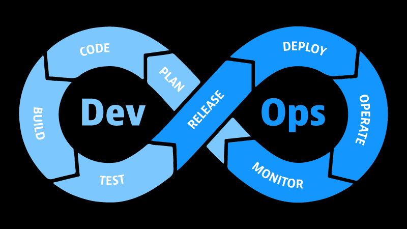
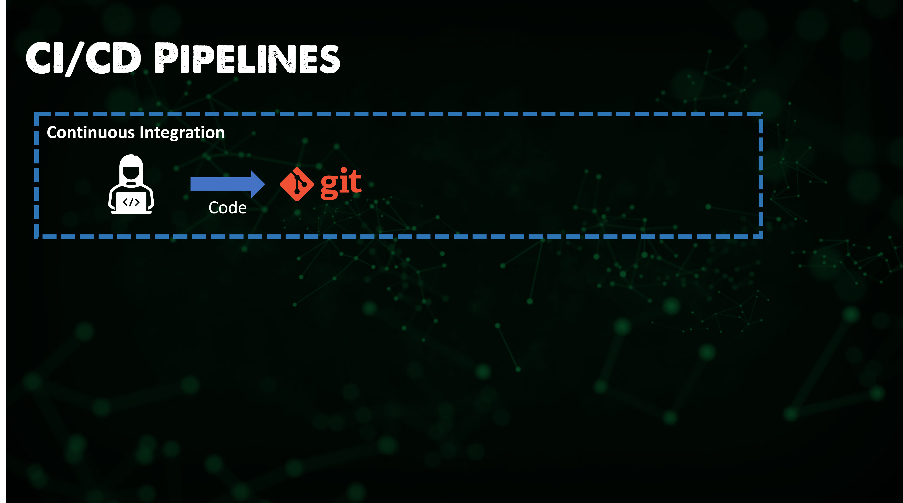

## El panorama general: Pipelines de CI/CD

La implementación de un pipeline de CI/CD (Integración Continua/Implementación Continua) es el pilar del entorno moderno de DevOps.

Este puentea la brecha entre el desarrollo y las operaciones al automatizar la construcción, prueba e implementación de aplicaciones.

Ya hemos cubierto gran parte de este mantra continuo en la sección introductoria del desafío. Pero para reiterar:

La Integración Continua (CI) es una práctica de desarrollo de software más moderna en la que se realizan cambios incrementales de código con mayor frecuencia y confiabilidad. Los pasos automatizados de construcción y prueba desencadenados por la Integración Continua garantizan que los cambios de código que se fusionan en el repositorio sean confiables.

Ese código/aplicación se entrega rápidamente y sin problemas como parte del proceso de Implementación Continua.

### ¿Por qué es importante la CI/CD?

- Entregar software de forma rápida y eficiente.
- Facilitar un proceso efectivo para llevar las aplicaciones al mercado lo más rápido posible.
- Un flujo continuo de correcciones de errores y nuevas funciones sin tener que esperar meses o años para las versiones.

La capacidad de que los desarrolladores realicen cambios pequeños y significativos de manera regular significa que obtenemos correcciones más rápidas y más características rápidamente.

### Vale, ¿qué significa esto?

En el [Día 5](day05.md) cubrimos gran parte de la teoría detrás de DevOps y, como se mencionó anteriormente, el pipeline de CI/CD es el pilar del entorno moderno de DevOps.

Quiero reiterar algunos de los puntos clave en esta imagen ahora que hemos avanzado un poco más en nuestro viaje de aprendizaje de los fundamentos de DevOps.

Nos referimos al ciclo de vida del desarrollo de software (SDLC).

Los pasos generalmente se describen en un bucle infinito, ya que es un ciclo que se repite continuamente.

Los pasos en el ciclo son: los desarrolladores escriben el **código**, luego se **construye** o se compila todo junto, luego se **prueba** en busca de errores, luego se **implementa** en producción donde se utiliza (**Operación**) por los usuarios finales o clientes, luego **monitoreamos** y recopilamos comentarios y, finalmente, **planificamos** mejoras en función de esos comentarios **enjuague y repita**.

### Profundicemos un poco más en CI/CD

### CI

La CI es una práctica de desarrollo que requiere que los desarrolladores integren el código en un repositorio compartido varias veces al día.

Cuando el código se escribe y se envía a un repositorio como GitHub o GitLab, es cuando comienza la magia.

El código es verificado mediante una construcción automatizada que permite a los equipos o al propietario del proyecto detectar cualquier problema temprano.

A partir de ahí, el código se analiza y se somete a una serie de pruebas automatizadas. Aquí tienes tres ejemplos:

- Las pruebas unitarias prueban las unidades individuales del código fuente.
- Las pruebas de validación se aseguran de que el software cumpla con el uso previsto.
- Las pruebas de formato verifican la sintaxis y otros errores de formato.

Estas pruebas se crean como parte de un flujo de trabajo y se ejecutan cada vez que se realiza un push a la rama principal, por lo que prácticamente todos los equipos de desarrollo importantes tienen algún tipo de flujo de trabajo de CI/CD. Recuerda que en un equipo de desarrollo, el nuevo código puede provenir de equipos de todo el mundo en diferentes momentos del día, de desarrolladores que trabajan en diferentes proyectos. Es más eficiente construir un flujo de trabajo automatizado de pruebas que asegure que todos estén en la misma página antes de que se acepte el código. A un humano le llevaría mucho más tiempo hacer esto cada vez.

Una vez que tenemos nuestras pruebas completas y son exitosas, podemos compilarlas y enviarlas a nuestro repositorio. Por ejemplo, estoy utilizando Docker Hub, pero esto podría ser en cualquier lugar que luego se aproveche para la parte de CD del pipeline.

Por lo tanto, este proceso depende mucho del proceso de desarrollo de software. Creamos nuestra aplicación, agregamos, corregimos errores, etc., y luego actualizamos nuestro control de origen y versionamos eso al mismo tiempo que realizamos pruebas.

Pasemos a la siguiente fase, el elemento de CD que cada vez más vemos en cualquier software comercial. Yo argumentaría que veremos una tendencia en la que, si obtenemos nuestro software de un proveedor como Oracle o Microsoft, lo consumiremos desde un repositorio similar a Docker Hub y luego usaremos nuestros pipelines de CD para implementarlo en nuestros entornos.

### CD

Ahora tenemos nuestra versión probada de nuestro código y estamos listos para implementarla en el mundo real, como digo, el proveedor de software pasará por esta etapa, pero creo firmemente que así es como todos implementaremos el software comercial que necesitamos en el futuro.

Ahora es el momento de lanzar nuestro código en un entorno. Esto incluirá la producción, pero también es probable que incluya otros entornos, como el entorno de preparación.

Nuestro siguiente paso, al menos en el día 1 de la versión 1 de la implementación del software, es asegurarnos de que estamos obteniendo la base de código correcta para el entorno correcto. Esto podría implicar obtener elementos del repositorio de software (DockerHub), pero es más probable que también obtengamos configuraciones adicionales de otro repositorio de código, como la configuración de la aplicación, por ejemplo. En el diagrama a continuación, obtenemos la última versión del software desde DockerHub y luego lo implementamos en nuestros entornos, mientras posiblemente recogemos la configuración de un repositorio Git. Nuestra herramienta de CD realiza esto y envía todo a nuestro entorno.

Es muy probable que esto no se haga al mismo tiempo. Es decir, iríamos a un entorno de preparación, lo ejecutaríamos con nuestra configuración para asegurarnos de que todo está correcto, y esto podría ser un paso manual para realizar pruebas o podría ser nuevamente automatizado (vamos a decir automatizado) antes de permitir que este código se implemente en producción.

Después de esto, cuando se lance la versión 2 de la aplicación, repetiremos los pasos. Esta vez nos aseguraremos de que nuestra aplicación + configuración se implemente en el entorno de preparación para asegurarnos de que todo esté en orden y luego lo implementaremos en producción.

### ¿Por qué utilizar CI/CD?

Creo que hemos cubierto los beneficios varias veces, pero es porque automatiza tareas que de otra manera tendrían que realizarse manualmente. Encuentra pequeños problemas antes de que se filtren en el código principal. Probablemente puedas imaginar que si envías código incorrecto a tus clientes, tendrás problemas.

También ayuda a prevenir lo que llamamos deuda técnica, que es la idea de que, dado que los repositorios de código principales se están construyendo constantemente con el tiempo, una solución rápida tomada el primer día se convierte en una solución mucho más costosa años después, porque esa solución temporal estaría profundamente entrelazada e incorporada en todos los repositorios de código y lógica.

### Herramientas

Como en otras secciones, vamos a trabajar con algunas herramientas que logran el proceso de pipeline de CI/CD.

Es importante tener en cuenta que no todas las herramientas realizan tanto CI como CD. Vamos a echar un vistazo a ArgoCD, que es excelente en el elemento de CD para implementar nuestro software en un clúster de Kubernetes. Pero algo como Jenkins puede funcionar en diferentes plataformas.

Planeo explorar lo siguiente:

- Jenkins
- ArgoCD
- GitHub Actions

## Recursos

- [Jenkins is the way to build, test, deploy](https://youtu.be/_MXtbjwsz3A)
- [Introduction to Jenkins](https://www.edx.org/course/introduction-to-jenkins)
- [Jenkins.io](https://www.jenkins.io/)
- [ArgoCD](https://argo-cd.readthedocs.io/en/stable/)
- [ArgoCD Tutorial for Beginners](https://www.youtube.com/watch?v=MeU5_k9ssrs)
- [What is Jenkins?](https://www.youtube.com/watch?v=LFDrDnKPOTg)
- [Complete Jenkins Tutorial](https://www.youtube.com/watch?v=nCKxl7Q_20I&t=3s)
- [GitHub Actions](https://www.youtube.com/watch?v=R8_veQiYBjI)
- [GitHub Actions CI/CD](https://www.youtube.com/watch?v=mFFXuXjVgkU)

Nos vemos en el [Día 71](day71.md)
