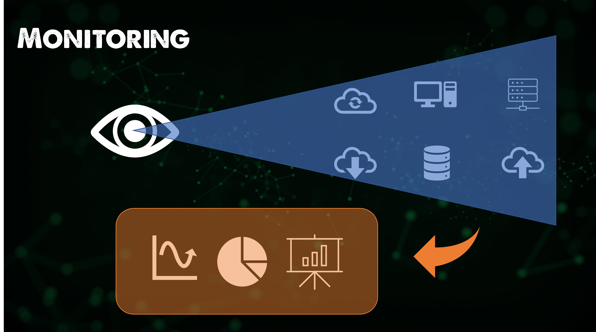
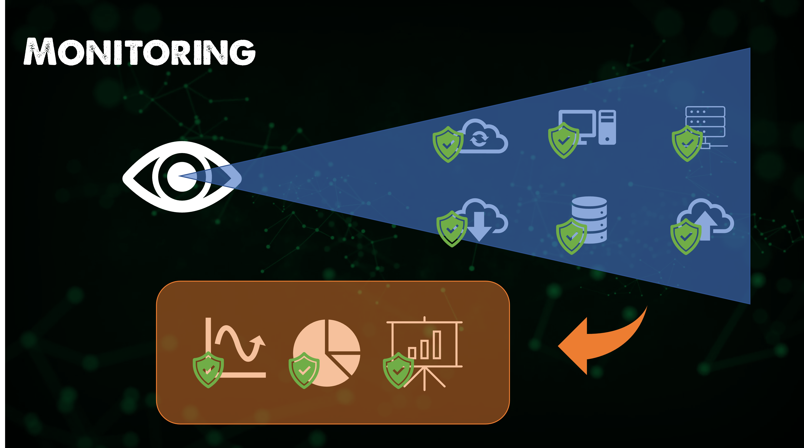

## El panorama general: Monitoreo

En esta sección hablaremos sobre el monitoreo, ¿qué es y por qué lo necesitamos?

### ¿Qué es el monitoreo?

El monitoreo es el proceso de vigilar de cerca toda la infraestructura.

### ¿Y por qué lo necesitamos?

Supongamos que estamos administrando mil servidores, que incluyen una variedad de servidores especializados como servidores de aplicaciones, servidores de bases de datos y servidores web. También podríamos complicar esto aún más con servicios adicionales y diferentes plataformas, incluidas ofertas de nube pública y Kubernetes.

Somos responsables de asegurarnos de que todos los servicios, aplicaciones y recursos en los servidores estén funcionando como deberían.

¿Cómo lo hacemos? Hay tres formas:

- Iniciar sesión manualmente en todos nuestros servidores y verificar todos los datos sobre los procesos de servicio y los recursos.
- Escribir un script que inicie sesión en los servidores por nosotros y verifique los datos.

Ambas opciones requerirían una cantidad considerable de trabajo de nuestra parte.

La tercera opción es más fácil: podríamos utilizar una solución de monitoreo disponible en el mercado.

Nagios y Zabbix son posibles soluciones que están fácilmente disponibles y nos permiten ampliar nuestra infraestructura de monitoreo para incluir tantos servidores como deseemos.

### Nagios

Nagios es una herramienta de monitoreo de infraestructura creada por una empresa que lleva el mismo nombre. La versión de código abierto de esta herramienta se llama Nagios Core, mientras que la versión comercial se llama Nagios XI. Sitio [web de Nagios](ttps://www.nagios.org/)

Esta herramienta nos permite monitorear nuestros servidores y ver si se están utilizando de manera adecuada o si hay tareas o fallas que deben abordarse.

Básicamente, el monitoreo nos permite lograr estos dos objetivos: verificar el estado de nuestros servidores y servicios, y determinar la salud de nuestra infraestructura. También nos brinda una vista panorámica completa de la infraestructura para ver si nuestros servidores están funcionando, si las aplicaciones están funcionando correctamente y si los servidores web son accesibles o no.

Nos dirá, por ejemplo, que nuestro disco ha aumentado un 10 por ciento en las últimas 10 semanas en un servidor en particular, que se agotará por completo en los próximos cuatro o cinco días y que pronto fallaremos si no respondemos. Nos alertará cuando nuestro disco o servidor esté en un estado crítico para que podamos tomar las medidas adecuadas y evitar posibles interrupciones.

En este caso, podemos liberar algo de espacio en el disco y asegurarnos de que nuestros servidores no fallen y que nuestros usuarios no se vean afectados.

La pregunta difícil para la mayoría de los ingenieros de monitoreo es ¿qué debemos monitorear? y, alternativamente, ¿qué no debemos?

Cada sistema tiene varios recursos, ¿en cuáles debemos vigilar de cerca y en cuáles podemos hacer la vista gorda? Por ejemplo, ¿es necesario monitorear el uso de la CPU? La respuesta es sí, obviamente. Sin embargo, sigue siendo una decisión que debe tomarse. ¿Es necesario monitorear el número de puertos abiertos en el sistema? Puede que sí o puede que no, dependiendo de la situación. Si es un servidor de propósito general, probablemente no sea necesario, pero si es un servidor web, probablemente sí lo sea.

### Monitoreo Continuo

El monitoreo no es algo nuevo, e incluso el monitoreo continuo ha sido un ideal que muchas empresas han adoptado durante muchos años.

Hay tres áreas clave de enfoque en lo que respecta al monitoreo:

- Monitoreo de la infraestructura
- Monitoreo de aplicaciones
- Monitoreo de redes

Lo importante es tener en cuenta que hay muchas herramientas disponibles. Hemos mencionado dos sistemas y herramientas genéricas en esta sesión, pero hay muchas más. El verdadero beneficio de una solución de monitoreo se produce cuando has invertido tiempo en asegurarte de responder a la pregunta de ¿qué debemos monitorear y qué no?

Podemos activar una solución de monitoreo en cualquiera de nuestras plataformas y comenzará a recopilar información, pero si esa información es simplemente demasiada, tendrás dificultades para aprovechar esa solución. Debes dedicar tiempo a configurarla correctamente.

En la próxima sesión, nos pondremos manos a la obra con una herramienta de monitoreo y veremos qué podemos comenzar a monitorear.

## Recursos

- [The Importance of Monitoring in DevOps](https://www.devopsonline.co.uk/the-importance-of-monitoring-in-devops/)
- [Understanding Continuous Monitoring in DevOps?](https://medium.com/devopscurry/understanding-continuous-monitoring-in-devops-f6695b004e3b)
- [DevOps Monitoring Tools](https://www.youtube.com/watch?v=Zu53QQuYqJ0)
- [Top 5 - DevOps Monitoring Tools](https://www.youtube.com/watch?v=4t71iv_9t_4)
- [How Prometheus Monitoring works](https://www.youtube.com/watch?v=h4Sl21AKiDg)
- [Introduction to Prometheus monitoring](https://www.youtube.com/watch?v=5o37CGlNLr8)

Nos vemos en el [Día 78](day78.md)
