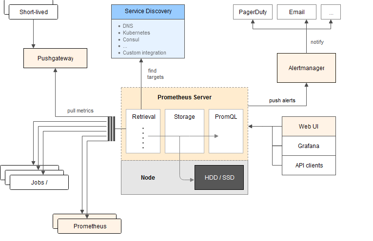
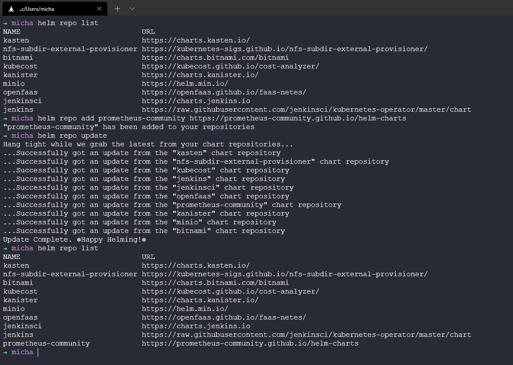
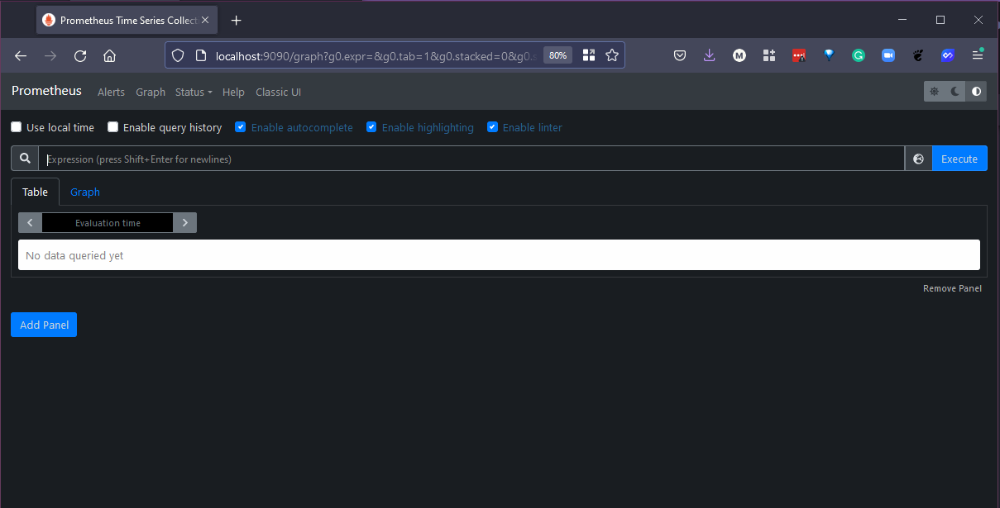

## Herramientas prácticas de monitoreo

En la sesión anterior, hablé sobre el panorama general del monitoreo y eché un vistazo a Nagios. Hubo dos razones para hacer esto. La primera fue que he escuchado mucho sobre este software a lo largo de los años, así que quería conocer un poco más sobre sus capacidades.

Hoy voy a hablar sobre Prometheus. He visto cada vez más el uso de Prometheus en el panorama de la nube nativa, pero también se puede utilizar para monitorear recursos físicos fuera de Kubernetes y similares.

### Prometheus: Monitorea casi todo

En primer lugar, Prometheus es de código abierto y puede ayudarte a monitorear contenedores, sistemas basados en microservicios, así como servicios físicos, virtuales y otros. Hay una gran comunidad detrás de Prometheus.

Prometheus cuenta con una amplia variedad de [integraciones y exportadores](https://prometheus.io/docs/instrumenting/exporters/). La clave es exportar las métricas existentes como métricas de Prometheus. Además, también es compatible con múltiples lenguajes de programación.

Enfoque pull: Si estás hablando con miles de microservicios o sistemas y servicios, generalmente verás un método de empuje (push) donde el servicio envía la información al sistema de monitoreo. Esto plantea algunos desafíos, como la saturación de la red, un alto uso de la CPU y un único punto de falla. En cambio, el enfoque pull nos brinda una experiencia mucho mejor, donde Prometheus recupera los datos desde el punto de conexión de métricas de cada servicio.

Una vez más, vemos que se utiliza YAML para la configuración de Prometheus.



Más adelante, verás cómo se ve esto cuando se implementa en Kubernetes. En particular, tenemos el **PushGateway** que recopila nuestras métricas de nuestros trabajos/exportadores.

Tenemos el **AlertManager** que envía alertas y es donde podemos integrar servicios externos como correo electrónico, Slack y otras herramientas.

Luego tenemos el servidor de Prometheus, que se encarga de obtener las métricas mediante el enfoque pull desde el PushGateway y envía las alertas push al AlertManager. El servidor de Prometheus también almacena los datos en un disco local, aunque se pueden utilizar soluciones de almacenamiento remoto.

También contamos con PromQL, que es el lenguaje utilizado para interactuar con las métricas. Esto se puede ver posteriormente en la interfaz web de Prometheus, pero también se utilizará más adelante en esta sección en herramientas de visualización de datos como Grafana.

### Formas de implementar Prometheus

Existen varias formas de instalar Prometheus. Puedes consultar la sección de [descargas](https://prometheus.io/download/) en el sitio web de Prometheus. También hay imágenes de Docker disponibles.

`docker run --name prometheus -d -p 127.0.0.1:9090:9090 prom/prometheus`

Pero nos centraremos en implementarlo en Kubernetes, que también ofrece algunas opciones.

- Crear archivos de configuración YAML.
- Usar un operador (encargado de todos los componentes de Prometheus).
- Usar un chart de Helm para implementar el operador.

### Implementación en Kubernetes

Utilizaremos nuestro clúster de minikube nuevamente para esta instalación rápida y sencilla. Como en puntos anteriores con minikube, usaremos Helm para implementar el chart de Helm de Prometheus.

`helm repo add prometheus-community https://prometheus-community.github.io/helm-charts`



Como se puede ver en la imagen anterior, también hemos ejecutado helm repo update. Ahora estamos listos para implementar Prometheus en nuestro entorno de minikube utilizando el comando `helm install stable prometheus-community/prometheus`.


Después de un par de minutos, verás aparecer varios nuevos pods. Para esta demostración, los he implementado en el espacio de nombres predeterminado, pero normalmente los ubicaría en su propio espacio de nombres.


Una vez que todos los pods estén en ejecución, también podemos ver todos los aspectos implementados de Prometheus.


Para acceder a la interfaz de usuario del servidor de Prometheus, podemos utilizar el siguiente comando para realizar un reenvío de puerto.

```Shell
export POD_NAME=$(kubectl get pods --namespace default -l "app=prometheus,component=server" -o jsonpath="{.items[0].metadata.name}")
  kubectl --namespace default port-forward $POD_NAME 9090
```

Cuando abrimos nuestro navegador en `http://localhost:9090` por primera vez, vemos una pantalla en blanco.



Debido a que lo hemos implementado en nuestro clúster de Kubernetes, automáticamente capturaremos métricas de la API de Kubernetes. Podemos utilizar PromQL para asegurarnos de que al menos estemos capturando métricas como `container_cpu_usage_seconds_total`.


En resumen, aprender PromQL y ponerlo en práctica es muy similar a lo que mencioné anteriormente. Obtener métricas es genial, al igual que el monitoreo, pero debes saber qué estás monitoreando, por qué lo estás haciendo y qué no estás monitoreando y por qué no lo estás haciendo.

Quiero retomar el tema de Prometheus más adelante, pero por ahora creo que debemos pensar en la gestión de registros y la visualización de datos para volver a hablar de Prometheus más adelante.

## Recursos

- [The Importance of Monitoring in DevOps](https://www.devopsonline.co.uk/the-importance-of-monitoring-in-devops/)
- [Understanding Continuous Monitoring in DevOps?](https://medium.com/devopscurry/understanding-continuous-monitoring-in-devops-f6695b004e3b)
- [DevOps Monitoring Tools](https://www.youtube.com/watch?v=Zu53QQuYqJ0)
- [Top 5 - DevOps Monitoring Tools](https://www.youtube.com/watch?v=4t71iv_9t_4)
- [How Prometheus Monitoring works](https://www.youtube.com/watch?v=h4Sl21AKiDg)
- [Introduction to Prometheus monitoring](https://www.youtube.com/watch?v=5o37CGlNLr8)
- [Promql cheat sheet with examples](https://www.containiq.com/post/promql-cheat-sheet-with-examples)

Nos vemos en el [Día 79](day79.md)
