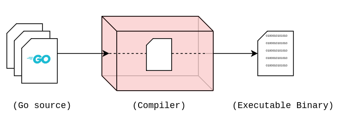

## Hello World kodunun açıklamasını yapalım

### Go Nasıl Çalışır?

[Gun 8](day08.md) bölümünde, Go'nun bilgisayara nasıl kurulacağını ve ardından ilk Go uygulamamızı nasıl oluşturacağımızı görmüştük.

Bu bölümde, kodun daha derinlemesine incelenmesine ve Go dilinin bazı konularının daha iyi anlaşılmasına bakacağız.

### Derleme(Compiling) Nedir?

Hello World kodunun [5 satırını gormek icin](Go/hello.go) önce derlemenin ne olduğunu biraz anlamamız gerekiyor.

Python, Java, Go ve C++ gibi günlük olarak kullandığımız programlama dilleri, yüksek seviyeli dillerdir. Bu, insanlar tarafından okunabilir olmaları anlamına gelir. Bir makinenin bir programı çalıştırmaya çalıştığında, makinenin anlayabileceği bir formata sahip olmalıdır. Bu nedenle, insanlar tarafından okunabilir olan kodumuzu makine tarafından okunabilir bir hale (Makine kodu) çevirmemiz gerekmektedir. Bu eyleme **derleme** denir.

Eğer bahsettiğimiz konudan emin değilseniz, Day 8 bölümünde yaptıklarımızı tekrar gözden geçirmeniz daha iyi olur. Basit bir Hello World'u `main.go` dosyasında oluşturduk ve daha sonra `go build main.go` komutuyla yürütülebilir dosyamızı derledik.

### Paketler Nelerdir?

Bir paket, birlikte derlenen aynı dizindeki kaynak dosyalarının bir koleksiyonudur. İlgilendiğimiz durumda, aynı dizindeki bir grup .go dosyasıdır. Day 8 bölümünde gördüğümüz Hello klasörünü [Gun 8](day08.md) hatırlıyor musunuz? Daha karmaşık Go programları yaparken, programınızı oluşturan farklı .go dosyalarını içeren folder1, folder2 ve folder3 gibi klasörlerinizin olduğunu fark edebilirsiniz.

Paketleri, başkalarının kodunu yeniden kullanabilmek için kullanırız, her şeyi sıfırdan yazmak zorunda değiliz. Belki de programımızın bir parçası olarak bir hesap makinesi istiyoruz, muhtemelen kullanabileceğiniz mevcut bir Go paketi bulabilirsiniz ve matematiksel işlemleri içeren fonksiyonları kodunuza aktarabilir, böylece çok zaman kazanabilirsiniz. Kod paylaşımının ve Açık Kaynaklılığın güzelliği burada ortaya çıkar.

Go, kodunuzu paketlere organize etmenizi ve böylece kodun yeniden kullanılabilirliğini ve bakımını kolaylaştırmanızı teşvik eder.

### Hello #90DaysOfDevOps satır satır

Şimdi Hello #90DaysOfDevOps dosyamızdaki main.go dosyasına her satırı inceleyerek bakalım.

İlk satırda `package main` ifadesini görüyorsunuz. Bu, bu dosyanın main adında bir pakete ait olduğunu gösterir. Tüm .go dosyalarının bir pakete ait olması gerekmektedir ve ayrıca ilk satırda `package <ne-olursa-olsun>` şeklinde bir ifade bulunması gerekmektedir.

Bir paketin adı istediğiniz gibi olabilir. Ancak, bu durumda başlangıç noktası olarak kullanılacak olan bu paketi `main` olarak adlandırmalıyız, bu bir kuraldır.

Kodumuzu derlemek ve çalıştırmak istediğimiz her zaman, makineye başlangıç noktasını belirtmemiz gerekmektedir. Bunu, main adında bir fonksiyon yazarak yaparız. Makine, programın giriş noktasını bulmak için main adında bir fonksiyon arayacaktır.

Bir fonksiyon, belirli bir görevi gerçekleştirebilen bir kod bloğudur ve tüm programda kullanılabilir.

func kullanarak herhangi bir isimle bir `fonksiyon` tanımlayabilirsiniz, ancak bu durumda, kodun başladığı noktayı temsil ettiği için ona `main` adını vermemiz gerekmektedir.

Şimdi, kodumuzun 3. satırına, yani import ifadesine bakalım. Bu, başka bir paketi ana programımıza dahil etmek istediğimizi gösterir. fmt, Go tarafından sağlanan bir standart pakettir ve `Println()` işlevini içerir. Bu paketi içe aktardığımız için, 6. satırda kullanabiliriz. Programınıza dahil edebileceğiniz ve kodunuzda yeniden kullanabileceğiniz birçok standart paket vardır, böylece sıfırdan yazma zahmetinden kurtulabilirsiniz. [Go Standard Library](https://pkg.go.dev/std)

Burada bulunan `Println()` ifadesi, başarıyla yürütülen yürütülebilir dosyanın terminalde standart çıktıyı yazdırmanın bir yoludur. Parantez içindeki iletiyi istediğiniz gibi değiştirebilirsiniz.

### TLDR

- **1. satır** = Bu dosya, `main` adında bir pakete ait olacak ve içinde programın giriş noktasını içerdiği için main olarak adlandırılması gerekmektedir.
- **3. satır** = `Println()` işlevini kullanabilmek için fmt paketini içe aktarmamız gerekmektedir ve bunu 6. satırda kullanabiliriz.
- **5. satır** = Gerçek giriş noktası, `main` fonksiyonudur.
- **6. satır** = Bu, "Hello #90DaysOfDevOps" ifadesini terminalimize yazdırmamızı sağlar. 

## Kaynaklar

- [StackOverflow 2021 Developer Survey](https://insights.stackoverflow.com/survey/2021)
- [Why we are choosing Golang to learn](https://www.youtube.com/watch?v=7pLqIIAqZD4&t=9s)
- [Jake Wright - Learn Go in 12 minutes](https://www.youtube.com/watch?v=C8LgvuEBraI&t=312s)
- [Techworld with Nana - Golang full course - 3 hours 24 mins](https://www.youtube.com/watch?v=yyUHQIec83I)
- [**NOT FREE** Nigel Poulton Pluralsight - Go Fundamentals - 3 hours 26 mins](https://www.pluralsight.com/courses/go-fundamentals)
- [FreeCodeCamp - Learn Go Programming - Golang Tutorial for Beginners](https://www.youtube.com/watch?v=YS4e4q9oBaU&t=1025s)
- [Hitesh Choudhary - Complete playlist](https://www.youtube.com/playlist?list=PLRAV69dS1uWSR89FRQGZ6q9BR2b44Tr9N)

Gorusmek Uzere [Gun 10](day10.md).
