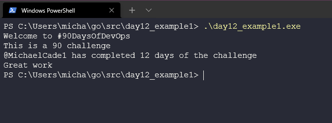

## Kullanıcıdan girdi almak için işaretçilerle ve tamamlanmış bir programla devam edeceğiz.

Dün ([Gun 11](day11.md)) kendi içinde yer alan ilk Go programımızı oluşturduk ve kullanıcıdan giriş almak için değişkenleri kodumuzun içine yerleştirdik ve değerlerini verdik. Şimdi, kullanıcıdan giriş alarak son mesajın değişkenine değer vereceğiz.

Ne heyecan verici!

## Kullanıcının Girişini Almak

Bunu yapmadan önce, kullanıcı girişini almadan önce deneme için değişkenlerimizi dolaşan uygulamamıza bir göz atalım.

Dün kodumuzu şu şekilde tamamlamıştık: [day11_example4.go](Go/day11_example4.go).

Manuel olarak `challenge, daystotal ve dayscomplete` değişkenlerimizi tanımladık.

Şimdi, `TwitterName` adında yeni bir değişken ekleyeceğiz. Kodun nasıl olduğunu [day12_example1.go](Go/day12_example1.go) dosyasında görebilirsin ve bu kodu çalıştırırsak çıktımız şu şekildedir.



12.gününde olduğumuzda bu `dayscomplete` değerini her gün değiştirmemiz ve kodumuzu her gün derlememiz gerekecektir, eğer sabit bir değer olarak yazılırsa, bu pek cazip gelmeyebilir.

Bu yüzden, kullanıcının Twitter adını ve tamamlanan gün sayısını girerek değerleri programımızda elde etmek istiyoruz. Bunun için `fmt` paketinin başka bir giriş fonksiyonunu kullanabiliriz.

 `fmt` paketi hakkında özetleyecek olursak, biçimlendirilmiş giriş/çıkış (I/O) için farklı işlevler:

- Mesajları yazdırma
- Kullanıcıdan girişi almak
- Bir dosyaya yazmak

Bir değişkenin değerini programda atanması yerine, kullanıcıdan giriş olarak almak istiyoruz.

```go
fmt.Scan(&TwitterName)
```

Değişkenin önünde `&` işaretini de kullandığımıza dikkat edin. Bu, bir işaretçi olarak adlandırılır ve bunu bir sonraki bölümde göreceğiz.

[day12_example2.go](Go/day12_example2.go) dosyasındaki kodda, kullanıcıdan `TwitterName` ve `DaysCompleted` değişkenlerinde belirtilen bilgileri girmesini istiyoruz.

Şimdi programımızı çalıştıralım ve her iki değişkenin girişini aldığımızı göreceksiniz.


VHarika, kullanıcıdan bir giriş aldık ve aldığımız değerlerle bir mesajı yazdırdık. Ancak, meydan okumamızın kaç gün kaldığını programımızın söylemesini nasıl sağlarız?

Bunun için, `remainingDays` adında bir değişken oluşturacağız ve buna "90" integer değerini atayacağız. Ardından, "tamamlanan günler" girişini aldığımızda kalan günleri yazdırmak için bu değeri değiştirmemiz gerekiyor, yani bir çıkarma işlemi yapmamız gerekiyor.

```go
remainingDays = remainingDays - DaysCompleted
```


Tamamlanan programın görünümünü day12_example3.go dosyasında görebilirsiniz.

Şimdi bu programı çalıştırırsanız, kullanıcının girişi ve `remainingDays` değişkeninin değeri temel alınarak basit bir hesaplama yapıldığını görebilirsiniz.


## İşaretçi Nedir? (Özel Değişkenler)

Bir işaretçi, başka bir değişkenin bellek adresine işaret eden (özel) bir değişkendir.

Daha detaylı bir açıklamayı [geeksforgeeks](https://www.geeksforgeeks.org/pointers-in-golang/) adresinde bulabilirsin.

Şimdi, kodumuzu basitleştirelim ve bir yazdırma komutumuzun önüne `&` işaretini ekleyerek, işaretçinin bellek adresini elde edelim. Örnek kodu [day12_example4.go](Go/day12_example4.go) dosyasında bulabilirsin.

Bu kodu çalıştırarak sonucu gözlemleyelim.


## Kaynaklar

- [StackOverflow 2021 Developer Survey](https://insights.stackoverflow.com/survey/2021)
- [Why we are choosing Golang to learn](https://www.youtube.com/watch?v=7pLqIIAqZD4&t=9s)
- [Jake Wright - Learn Go in 12 minutes](https://www.youtube.com/watch?v=C8LgvuEBraI&t=312s)
- [Techworld with Nana - Golang full course - 3 hours 24 mins](https://www.youtube.com/watch?v=yyUHQIec83I)
- [**NOT FREE** Nigel Poulton Pluralsight - Go Fundamentals - 3 hours 26 mins](https://www.pluralsight.com/courses/go-fundamentals)
- [FreeCodeCamp - Learn Go Programming - Golang Tutorial for Beginners](https://www.youtube.com/watch?v=YS4e4q9oBaU&t=1025s)
- [Hitesh Choudhary - Complete playlist](https://www.youtube.com/playlist?list=PLRAV69dS1uWSR89FRQGZ6q9BR2b44Tr9N)

Gorusmek Uzere [Gun 13](day13.md).
