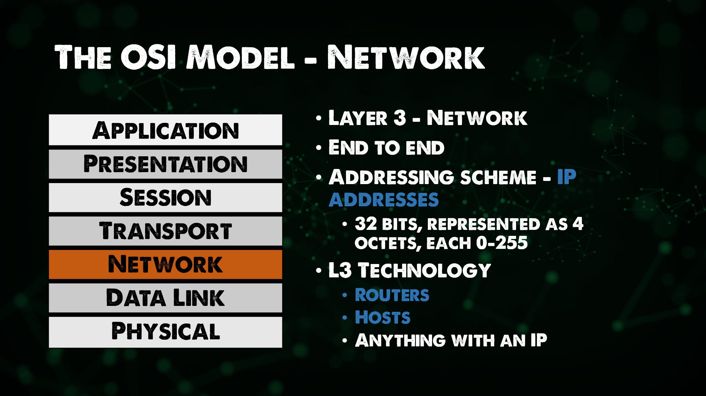
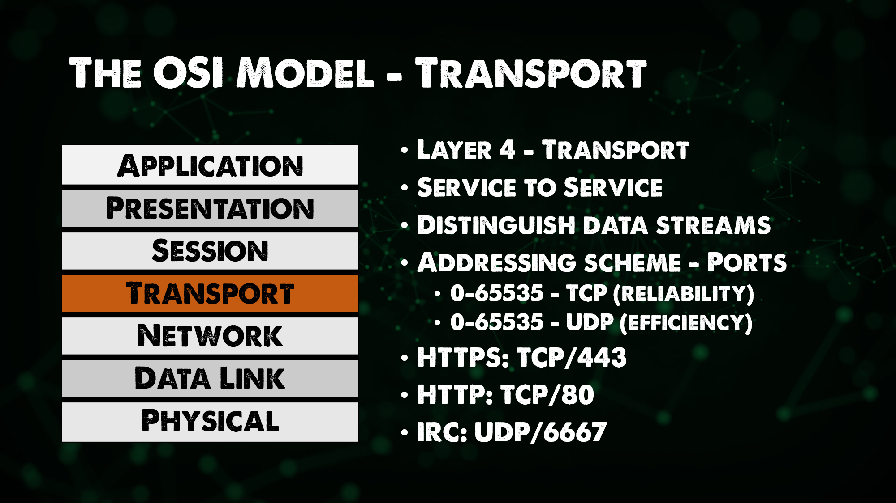
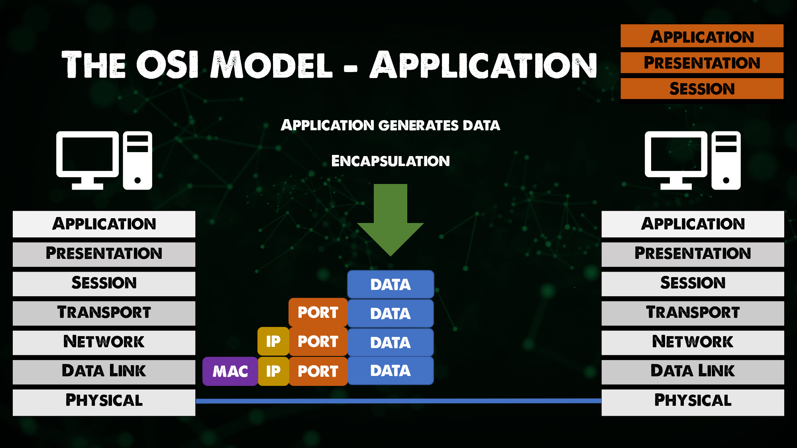
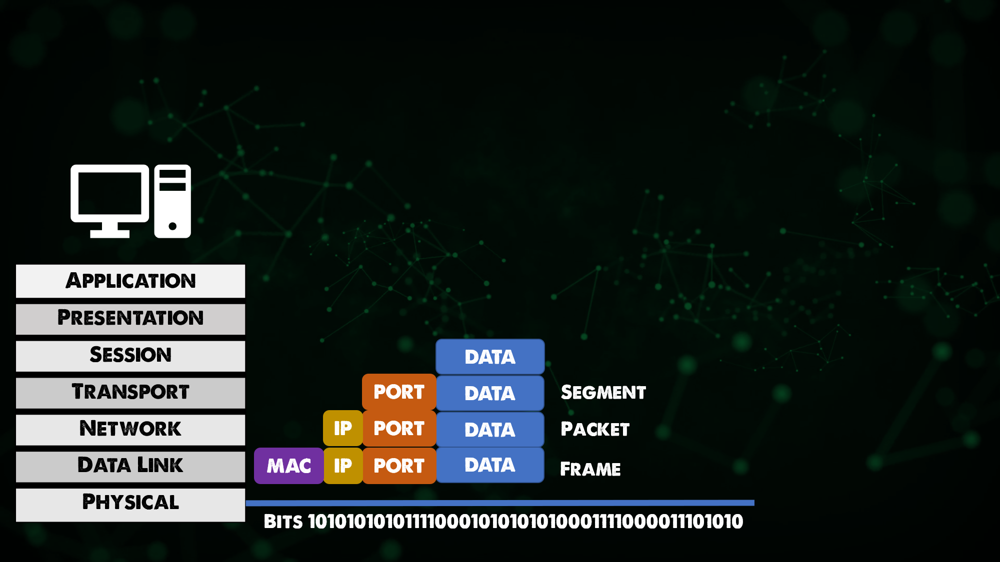

Aşağıdaki içerik büyük ölçüde Uygulamalı Networking'in [Networking Fundamentals Serisi](https://www.youtube.com/playlist?list=PLIFyRwBY_4bRLmKfP1KnZA6rZbRHtxmXi)nden alınmıştır. Eğer bu içeriği video formatında tercih edersen, şu iki videoya göz atabilirsin:

* [The OSI Model: A Practical Perspective - Layers 1 / 2 / 3](https://www.youtube.com/watch?v=LkolbURrtTs&list=PLIFyRwBY_4bRLmKfP1KnZA6rZbRHtxmXi&index=3)
* [The OSI Model: A Practical Perspective - Layers 4 / 5+](https://www.youtube.com/watch?v=0aGqGKrRE0g&list=PLIFyRwBY_4bRLmKfP1KnZA6rZbRHtxmXi&index=4)

## OSI Modeli - 7 Katman

Ağlarla ilgili genel amaç, iki ana bilgisayar arasında veri paylaşımını mümkün kılmaktır. Ağ bağlantısı öncesi, bir ana bilgisayardan diğerine veri taşımak için bir şeyleri birleştirmemiz, ilk ana bilgisayara bir şeyler bağlamamız, ardından onu diğer ana bilgisayara götürüp orada da bağlamamız gerekiyordu. Ağ bağlantısı sayesinde, veri paylaşımı otomatik hale gelir ve bu bağlantı üzerinden kablolu veya kablosuz ağlar aracılığıyla gerçekleştirilebilir. Ancak, bu işlemi gerçekleştirebilmek için bu ana bilgisayarların ortak bir dizi kurala uyması gerekmektedir.

Bu, herhangi bir dilin kurallarından farklı değildir. İngilizce, iki İngilizce konuşmacının takip etmesi gereken belirli kurallara sahiptir. İspanyolca kendi kurallarına sahiptir. Fransızca kendi kurallarına sahiptir ve network çalışması da kendi kurallarına sahiptir.

Şu anda en yaygın olarak kullanılan network kuralları yedi farklı katmana ayrılır ve bu katmanlar OSI modeli olarak bilinir. Diğer modeller olsa da, bu en yaygın olanıdır ve bir standart oluşturmuştur.

### OSI Modeline Giriş

OSI (Açık Sistemler Arabirim Modeli) modeli, bir network sisteminin işlevlerini tanımlamak için kullanılan bir çerçevedir. OSI modeli, bilgisayar işlevlerini, farklı ürünler ve yazılımlar arasında etkileşimliğe olanak sağlamak için evrensel bir dizi kurallar ve gereksinimlerle karakterize eder. OSI referans modelinde, bir bilgisayar sistemi arasındaki iletişim, yedi farklı soyutlama katmanına ayrılır:

- **Fiziksel Katman (Physical Layer)**
- **Veri Bağlantı Katmanı (Data Link Layer)**
- **Ağ Katmanı (Network Layer)**
- **Taşıma Katmanı (Transport Layer)**
- **Oturum Katmanı (Session Layer)**
- **Sunum Katmanı (Presentation Layer)**
- **Uygulama Katmanı (Application Layer)**.

Bu katmanlara biraz daha yakından bakalım.

### Fiziksel Katman (Physical Layer)

OSI modelindeki 1. katman olan fiziksel katman, verilerin bir ana bilgisayardan diğerine iletilmesini sağlama amacını taşır. Bu katmanda veriler, fiziksel kablolar gibi fiziksel ortam aracılığıyla veya kablosuz ortamlar gibi kablosuz bağlantılar aracılığıyla taşınabilir. Bu katmana ait diğer donanımlar arasında hub'lar ve tekrarlayıcılar da bulunur, bunlar verileri bir ana bilgisayardan diğerine iletmek için kullanılır.

### Veri Bağlantı Katmanı

2.katman olan veri bağlantı katmanı, verilerin düğümden düğüme aktarılmasını sağlar ve veriler paketlere yerleştirilir. Ayrıca, fiziksel katmanda meydana gelebilecek hataların düzeltilmesi için bir hata düzeltme seviyesi bulunur. Bu katmanda, MAC adreslerini ilk kez tanıtır veya görürüz.

[Gun 21](day21.md) içerisinde tanımladığımız switch'ler çoğunlukla bu katmanda çalışır.

### Ag Katmanı

3. katman olan ağ katmanı, uçtan uca iletişimi hedefler. Bu katmanda IP adreslerini de gördüğümüzü hatırlayabilirsiniz. [Gun 21](day21.md)

Router'lar ve ana bilgisayarlar (host'lar) 3. katmanda yer alır. Router, birden fazla ağ arasında yönlendirme yapabilme yeteneğine sahiptir. IP'ye sahip olan herhangi bir cihaz, 3. katmana ait kabul edilebilir.

Eeki, neden 2. ve 3. katmanlarda adresleme şemalarına ihtiyaç duyuyoruz? (MAC Adresleri vs. IP Adresleri)

Bir ana bilgisayardan diğerine veri aktarımını düşündüğümüzde, her bir ana bilgisayarın bir IP adresi vardır, ancak aralarında birçok switch ve router bulunmaktadır. Her bir cihazın 2. katman MAC adresi vardır.

katman MAC adresi sadece ana bilgisayardan switch'e/router'a gidecektir, zıplamalar üzerinde odaklanırken, 3. katman IP adresleri veri paketi ana bilgisayara kadar gelene kadar paketle birlikte kalır. (Uçtan uca)
IP Adresleri - 3. Katman = Uçtan uca iletişim sağlar.

MAC Adresleri - 2. Katman = Zıplama üzerinden iletişim sağlar.

Göreceğimiz bir ağ protokolü, ancak bugün değil, ARP (Adres Çözümleme Protokolü), 3. ve 2. katman adreslerimizi bağlar.

> IP Adresleri - 3. Katman = Uçtan uca iletişim sağlar.

> MAC Adresleri - 2. Katman = Zıplama üzerinden iletişim sağlar.

Göreceğimiz bir ağ protokolü, ancak bugün değil, ARP (Adres Çözümleme Protokolü), 3. ve 2. katman adreslerimizi bağlar.

### Tasıma Katmanı

4.katman olan taşıma katmanı, Hizmetten Hizmete teslimat için orada bulunur ve veri akışlarını ayırt etmek için kullanılır. 3. katman ve 2. katmanın adresleme şemalarına sahip olduğu gibi, 4. katmanda portlar bulunur.

### Oturum, Sunum, Uygulama Katmanları

5., 6. ve 7. katmanlar arasındaki ayrım biraz belirsiz olabilir veya belirsiz hale gelmiş olabilir.

Daha güncel bir anlayış için [TCP IP Model](https://www.geeksforgeeks.org/tcp-ip-model/)e başvurmak faydalı olabilir. 

OSI modelini kullanarak hostların birbirleriyle iletişim kurduğu durumu anlamaya çalışalım. İlk host, başka bir ana bilgisayara gönderilmek üzere tasarlanmış verileri üretecek bir uygulamaya sahiptir.

Kaynak host, kapsülleme sürecinden geçecektir. Bu veriler önce 4. katmana iletilir.

katman, bu verilere hizmetten hizmete teslimat hedefini kolaylaştıracak bir başlık ekler. Bu başlık, TCP veya UDP portunu içerir. Ayrıca kaynak ve hedef noktasını da içerir. Bu, segment olarak bilinir (veri ve nokta).

Bu segment, OSI yığını boyunca 3. kattan, yani ağ katmanından geçer ve ağ katmanı bu verilere başka bir başlık ekler. Bu başlık, ağ katmanının uçtan uca teslimat hedefini kolaylaştırır, yani bu başlıkta bir kaynak IP adresi ve bir hedef IP adresi bulunur. Başlık ve veriler ayrıca bir paket olarak da adlandırılabilir.

3.katman bu paketi alır ve 2. katmana geçirir. 2. katman, 2. katmanın zıplama üzerinden teslimat hedefini yerine getirmek için bu verilere başka bir başlık ekler. Bu başlık, kaynak ve hedef MAC adresini içerir. Bu, 2. katman başlığı ve verileri olduğunda bir çerçeve olarak adlandırılır.

Bu çerçeve daha sonra sıfır ve birlerle temsil edilir ve fiziksel kabloya veya kablosuz bağlantıya gönderilir.

Harika, değil mi?

Verileri gönderen uygulama, verilerin gönderildiği yere gönderildiğinden, alım işlemi bu sürecin tersine döndürülerek alıcı ana bilgisayarda yığına geri döndürülür. Yani, veriler fiziksel katmana ulaşır, ardından veri bağlantı katmanına, ağ katmanına, taşıma katmanına ve oturum katmanına kadar ilerler.

## Kaynaklar

* [Networking Fundamentals](https://www.youtube.com/playlist?list=PLIFyRwBY_4bRLmKfP1KnZA6rZbRHtxmXi)
- [Computer Networking full course](https://www.youtube.com/watch?v=IPvYjXCsTg8)

Gorusmek Uzere [Día 23](day23.md).
