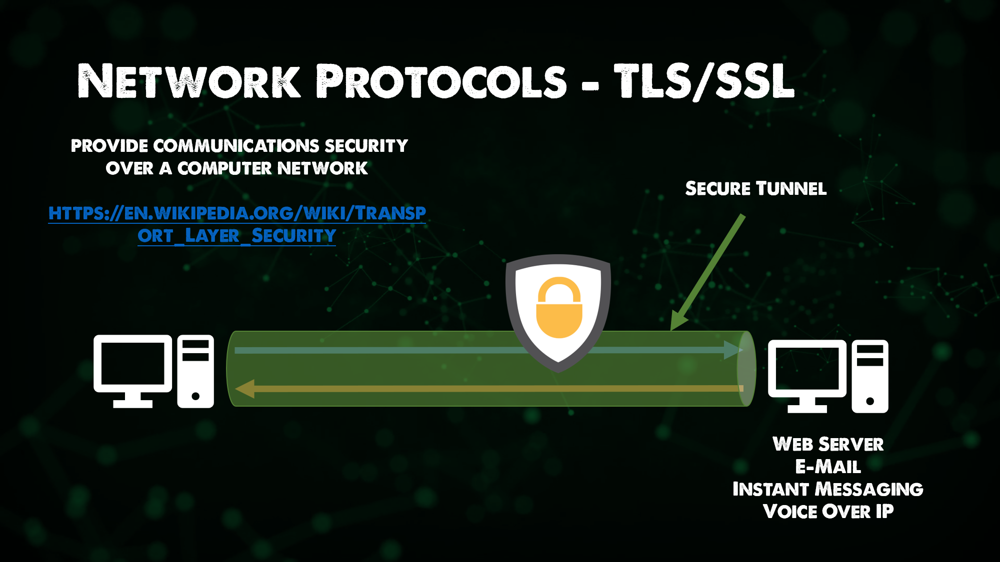
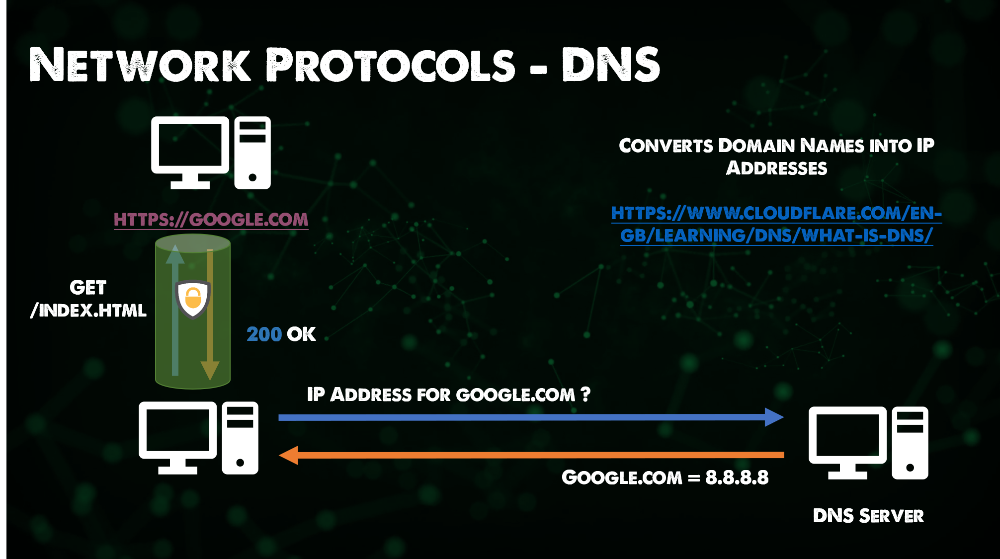

Aşağıdaki içerik büyük ölçüde Uygulamalı Networking [Networking Temelleri Serisi](https://www.youtube.com/playlist?list=PLIFyRwBY_4bRLmKfP1KnZA6rZbRHtxmXi) kaynağından alınmıştır. Eğer bu içeriği video formatında tercih edersen, bu videoya göz atabilirsin:

* [Network Protokolleri - ARP, FTP, SMTP, HTTP, SSL, TLS, HTTPS, DNS, DHCP](https://www.youtube.com/watch?v=E5bSumTAHZE&list=PLIFyRwBY_4bRLmKfP1KnZA6rZbRHtxmXi&index=12)

## Network(Ag) Protokolleri

Network(Ağ) standartlarını oluşturan kurallar ve mesajlar kümesidir.

- ARP - Address Resolution Protocol (Adres Çözümleme Protokolü)

ARP hakkında daha ayrıntılı bilgi edinmek istersen [RFC 826](https://datatracker.ietf.org/doc/html/rfc826) internet standardını okuyabilirsin.

Temel olarak, IP adreslerini fiziksel makine adresleri olan, aynı zamanda MAC adresleri olarak bilinen, bir Layer 2 ağ üzerinde eşleştiren bir protokoldür.

- FTP - Dosya Transfer Protokolü (File Transfer Protocol)

Kaynak noktasından hedef noktasına dosya transferine olanak sağlar. Genellikle bu işlem kimlik doğrulamalıdır, ancak yapılandırılırsa anonim erişim de kullanılabilir. Artık FTPS (FTP üzerinden SSL/TLS bağlantısı) daha yaygın olarak kullanılmaktadır, bu da daha fazla güvenlik için istemciden FTP sunucularına SSL/TLS bağlantısı sağlar. Bu protokol OSI Modeli'nin Uygulama katmanında bulunur.

- SMTP - Basit Posta Transfer Protokolü (Simple Mail Transfer Protocol)

E-posta iletilerinin iletilmesi için kullanılır, e-posta sunucuları, e-posta mesajlarını göndermek ve almak için SMTP'yi kullanır. Microsoft 365 ile bile aynı amacı için SMTP protokolü hala kullanılmaktadır.

- HTTP - Hiper Metin Transfer Protokolü (Hyper Text Transfer Protocol)

HTTP, İnternet'in ve içerik gezinmenin temelidir. Bize favori web sitelerimize kolayca erişim sağlar. HTTP hala yaygın bir şekilde kullanılmaktadır, ancak favori sitelerinizin çoğunda HTTPS kullanılması daha yaygın veya kullanılması gerekmektedir.

- SSL - Güvenli Yuvalar Katmanı (Secure Sockets Layer) | TLS - Taşıma Katmanı Güvenliği (Transport Layer Security)

TLS, SSL'nin yerini almıştır. TLS, bir ağ üzerinde iletişime güvenlik sağlayan bir **Kriptografik Protokol**'dür. E-posta, anlık mesajlaşma ve diğer uygulamalarda kullanılabileceği gibi, HTTPS'i güvence altına almak için daha yaygın olarak kullanılır. Önceki açıklamada her katmanın başlık ve verilerinin adlandırılması belirtildi, bu da buna dahildir.

- HTTPS - SSL/TLS ile güvence altına alınmış HTTP

HTTP'nin bir uzantısı olup ağ üzerinde güvenli iletişim sağlamak için kullanılır. HTTPS, yukarıda belirtildiği gibi TLS ile şifrelenir. Amaç, ana bilgisayarlar arasında veri alışverişinde kimlik doğrulama, gizlilik ve bütünlük sağlamaktır.

- DNS - Domain Name System (Alan Adı Sistemi)

Hepimiz [google.com](https://google.com) gibi bir adresi biliyoruz, ancak tarayıcıyı açıp [8.8.8.8](https://8.8.8.8) gibi bir adresi girdiğimizde, Google'a aşina olduğumuz şekilde ulaşabiliriz. İlgilendiğimiz tüm web sitelerinin IP adreslerini hatırlayamayız, hatta Google veya DuckDuckGo gibi bir arama motoru kullanarak bilgi ararken bile, adreslerin kolayca hatırlanabilir olmasına ihtiyacımız vardır.

İşte DNS devreye giriyor ve ana bilgisayarların, hizmetlerin ve diğer kaynakların insanlar tarafından erişilebilir olmasını sağlıyor.

Tüm ana bilgisayarlarda, İnternet'e erişim gerektiğinde, alan adlarını çözebilmek için DNS'e sahip olmaları gerekiyor. DNS'ler üzerinde yıllarca öğrenme süreci geçirebileceğiniz bir alan olduğunu söyleyebilirim. Ayrıca, ağlarla ilgili hataların en yaygın nedeni olduğunu deneyimlerime dayanarak söyleyebilirim, ancak ağ mühendisinin bu konuda benimle aynı fikirde olup olmayacağından emin değilim.

- DHCP - Dynamic Host Configuration Protocol (Dinamik Ana Bilgisayar Yapılandırma Protokolü)

Hostlarımızın İnternet'e erişmesi veya birbirleriyle dosya transferi yapabilmesi için gereken protokoller hakkında çok şey konuştuk. Peki, her bir hosttada bu görevleri gerçekleştirebilmesi için en az 4 bileşene ihtiyacımız var:

- IP adresi
- Alt ağ maskesi(Subnet)
- Varsayılan ağ geçidi(Gateway)
- DNS

Daha önce **IP adresi**ni gördük, bu, bulunduğunuz ağdaki ana bilgisayarınız için benzersiz bir adrestir, evimizin numarası gibi düşünebiliriz.

**Alt ağ maskesi**ni kısaca göreceğiz, ancak onu posta kodu gibi düşünebiliriz.

Bir **varsayılan ağ geçidi**, genellikle ağımızda bulunan, 3. katman bağlantılılık sağlayan yönlendiricimizin IP adresidir. Tek bir ağ geçidi gibi düşünebiliriz. Bir benzetmeyle ifade etmek gerekirse, sokağımızdan çıkmamızı sağlayan tek yol gibi görülebilir.

Sonra DNS geliyor, IP adreslerini zor hatırlanan genel adlara dönüştürmemize yardımcı olan bir sistem olarak gördük. Onları doğru posta kutusuna ulaştırmak için devasa bir sıralama ofisi gibi düşünebiliriz.

Gördüğümüz gibi, her bir ana bilgisayarın bu 4 bileşene ihtiyacı vardır. Eğer 1000 veya 10.000 ana bilgisayarınız varsa, her birini tek tek belirlemek için çok zaman harcamanız gerekir. İşte DHCP devreye giriyor ve bu protokolü kullanarak ağınız için bir kapsam belirlemenizi ve bu kapsamı ağınızdaki tüm kullanılabilir ana bilgisayarlara dinamik olarak dağıtmanızı sağlıyor.

Başka bir örnek vermek gerekirse: Bir kafeye girdiniz, bir kahve aldınız ve dizüstü bilgisayarınız veya telefonunuzla oturduğunuz yere geçtiniz. Ana bilgisayarınızı kafenin Wi-Fi'ına bağladınız ve internete erişim sağladınız, mesajlar ve e-postalar gelmeye başladı, web sayfalarında ve sosyal ağlarda gezinmeye başlayabildiniz. Kafenin Wi-Fi'ına bağlandığınızda, makineniz bir DHCP sunucusundan veya muhtemelen yönlendiriciden DHCP yöneten ayrılmış bir sunucudan bir DHCP adresi almış olacaktır. (Kafelerin Wi-Fi'sini önermiyoruz, hepimiz o ağlarda neler olabileceğini biliyoruz.)

### Subnetting (Alt Aglar)

Alt ağlar, bir IP ağının mantıksal olarak bölünmüş bir parçasıdır. Büyük ağları daha küçük ve yönetilebilir ağlara bölerek daha verimli hale getirir.

Her bir alt ağ, daha büyük ağın mantıksal olarak bölünmüş bir parçasıdır. Bir alt ağa bağlı cihazlar, birbirleriyle iletişim kurmalarını sağlayan ortak IP adresi tanımlayıcılarını paylaşırlar.

Yönlendiriciler, alt ağlar arasındaki iletişimi yönetir.

Bir alt ağın boyutu, bağlantı gereksinimlerine ve kullanılan ağ teknolojisine bağlıdır.

Bir organizasyon, kullanılabilir adres alanı sınırları içinde alt ağların sayısını ve boyutunu belirleme sorumluluğuna sahiptir ve ayrıntılar bu organizasyonun elindedir. Alt ağlar, noktadan noktaya bağlantıları veya birkaç cihazı destekleyen alt ağlara daha da küçük alt ağlara bölünebilir.

Diğer avantajlarının yanı sıra, alt ağları bölümlere ayırmak, ağ yeniden tahsisini ve ağı rahatlatmayı sağlayarak iletişimi ve verimliliği hızlandırır.

Alt ağlar aynı zamanda ağın güvenliğini artırabilir. Bir ağın bir bölümü tehlikeye atılırsa, karantinaya alınabilir ve kötü niyetli aktörlerin daha büyük ağ içinde hareket etmesini zorlaştırır.

## Kaynaklar

- [Networking Temelleri](https://www.youtube.com/playlist?list=PLIFyRwBY_4bRLmKfP1KnZA6rZbRHtxmXi)
- [Subnetting Mastery](https://www.youtube.com/playlist?list=PLIFyRwBY_4bQUE4IB5c4VPRyDoLgOdExE)
- [Networking full course](https://www.youtube.com/watch?v=IPvYjXCsTg8)

Gorusmek Uzere [Gun 24](day24.md).
