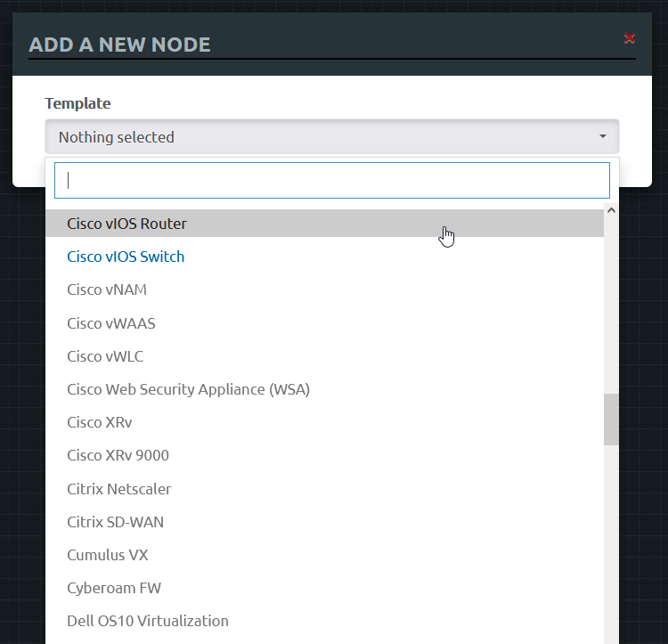
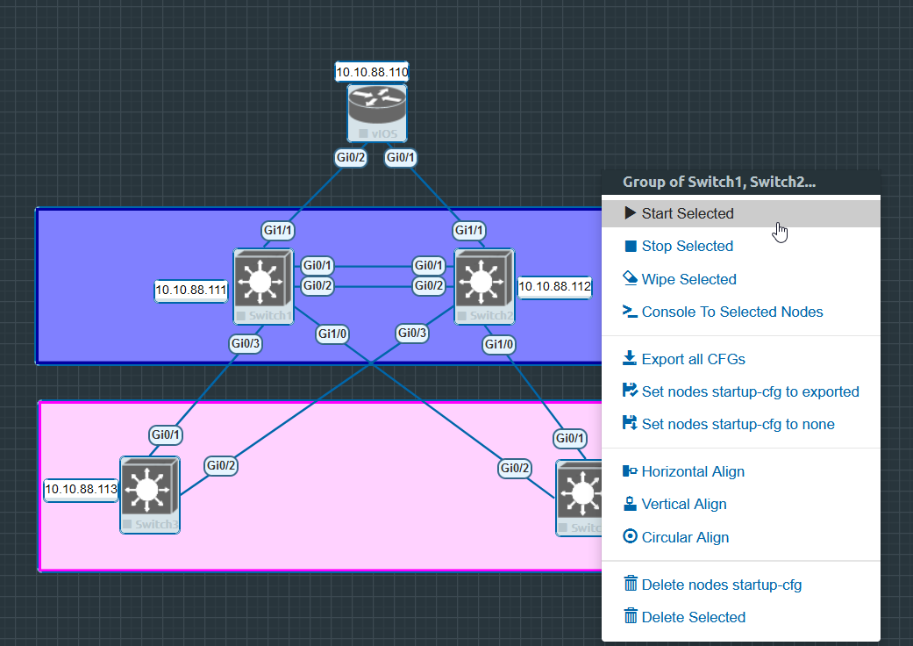

## Laboratuvarımızı Oluşturma

EVE-NG kullanarak sanal ağımızın yapılandırmasına devam edeceğiz ve daha sonra bazı cihazları dağıtıp bu cihazların yapılandırmasını nasıl otomatikleştirebileceğimizi düşünmeye başlayacağız. [Gun 25](day25.md)'te VMware Workstation üzerinde EVE-NG'nin kurulumunu gerçekleştirdik.

### EVE-NG client yazılımının kurulumu

SSH bağlantılarında hangi uygulamanın kullanılacağını seçmemize ve aynı zamanda paket yakalamaları için Wireshark'ın yapılandırılmasına olanak tanıyan bir istemci paketi de bulunmaktadır. İşletim sistemine (Windows, macOS, Linux) uygun olan istemci paketini indirebilirsiniz.

[EVE-NG client yazılımını indirin](https://www.eve-ng.net/index.php/download/)

Hızlı İpucu: Linux'u kullanıyorsanız, bu [client paketi](https://github.com/SmartFinn/eve-ng-integration) bulunmaktadır.

Kurulum doğrudan yapılmaktadır ve başlangıçta varsayılan değerleri kullanmanız önerilir.

### Ağ görüntülerini elde etme

Bu adım oldukça zorlu bir süreç olabilir. İlgili kaynaklar ve indirme bağlantıları için aşağıdaki blog yazısını ve YouTube videolarını takip ettim. Bu kaynaklar, router ve switch görüntülerini nasıl ve nereye yükleyeceğimizi göstermektedir.

Önemli bir nokta, tüm bu işlemleri eğitim amaçlı kullanıyor olmamdır. Resmi ağ sağlayıcılarından lisanslı görüntüleri indirmenizi öneririm.

[Blog ve YouTube Videolarına Bağlantıları](https://loopedback.com/2019/11/15/setting-up-eve-ng-for-ccna-ccnp-ccie-level-studies-includes-multiple-vendor-node-support-an-absolutely-amazing-study-tool-to-check-out-asap/)

[Eve-ng'ye Cisco VIRL vIOS görüntüsü nasıl eklenir](https://networkhunt.com/how-to-add-cisco-virl-vios-image-to-eve-ng/)

Genel olarak, buradaki adımlar biraz karmaşık olabilir ve daha kolay olabilirdi, ancak yukarıdaki blog ve videolar, EVE-NG kutunuza görüntüleri nasıl ekleyeceğinizi adım adım açıklamaktadır.

Görüntüyü EVE-NG sanal makinesine SFTP aracılığıyla aktarmak için FileZilla kullanılmıştır.

Laboratuvarımız için Cisco vIOS L2 (switchler) ve Cisco vIOS (router) görüntülerine ihtiyacımız olacak.

### Bir Laboratuvar Oluşturma

EVE-NG'nin web arayüzü içinde, yeni bir ağ topolojisi oluşturacağız. Dış ağlara yönlendirme görevi görecek dört adet switch ve bir adet routerımız olacak.

| Node    | IP Address   |
| ------- | ------------ |
| Router  | 10.10.88.110 |
| Switch1 | 10.10.88.111 |
| Switch2 | 10.10.88.112 |
| Switch3 | 10.10.88.113 |
| Switch4 | 10.10.88.114 |

#### EVE-NG'ye Node'lar eklemek

EVE-NG'ye ilk kez giriş yaptığınızda aşağıdaki gibi bir ekran göreceksiniz. İlk laboratuvarımızı oluşturmaya başlamak istiyoruz.

Laboratuvarınıza bir ad verin ve diğer alanları isteğe bağlı olarak doldurun.

Boş bir tuval görünecektir. Fare sağ tuşuyla tuval üzerine tıklayın ve "düğüm ekle" seçeneğini seçin.

Buradan, birçok düğüm seçeneği listesiyle karşılaşacaksınız. Yukarıdaki adımları takip ettiyseniz, aşağıda gösterilen mavi renkteki iki seçeneğe sahip olmalısınız ve diğerleri gri renkte ve seçilemez durumda olacaktır.

Laboratuvarımıza aşağıdakileri eklemek istiyoruz:

- 1 x Cisco vIOS Router
- 4 x Cisco vIOS Switch

Bu düğümleri laboratuvarınıza eklemek için basit bir sihirbazı çalıştırın ve sonunda aşağıdaki gibi bir görüntüye sahip olmanız gerekmektedir.

#### Node'ları birbirine bağlama

Şimdi, router ve switch'lerimiz arasında bağlantıları oluşturmamız gerekiyor. Bu işlemi, cihazın üzerine fareyle gelerek aşağıdaki gibi bağlantı simgesini görüntüleyip istediğimiz cihaza bağlamak suretiyle kolayca yapabiliriz.

Ortamınızı bağladıktan sonra, fiziksel sınırları veya konumları tanımlamanız gerekiyorsa, sağ tıklama menüsünde bulunan kutu veya daire gibi öğeleri kullanabilirsiniz. Ayrıca, laboratuvarlarımızda isim veya IP adreslerini tanımlamak istediğimizde faydalı olan metin ekleyebilirsiniz.

Ben de aşağıdaki gibi bir laboratuvar oluşturdum.

Yukarıdaki laboratuvarın tamamen kapalı olduğunu fark edeceksiniz. Laboratuvarı başlatmak için tümünü seçip sağ tıklayarak "seçilenleri başlat" seçeneğini seçebilirsiniz.

Laboratuvarımız çalışmaya başladığında, her cihazın konsoluna erişebileceğiz ve bu aşamada herhangi bir yapılandırmalarının olmadığını göreceğiz. Her düğüme kendi terminalinde bir yapılandırma ekleyerek veya mevcut bir yapılandırmayı kopyalayarak yapılandırma ekleyebilirsiniz.

Referans olarak, kendi yapılandırmamı Networking klasöründe bir dosya olarak paylaşacağım.

| Node    | Configuration         |
| ------- | --------------------- |
| Router  | [R1](Networking/R1)   |
| Switch1 | [SW1](Networking/SW1) |
| Switch2 | [SW2](Networking/SW2) |
| Switch3 | [SW3](Networking/SW3) |
| Switch4 | [SW4](Networking/SW4) |

## Kaynaklar

- [Free Course: Introduction to EVE-NG](https://www.youtube.com/watch?v=g6B0f_E0NMg)
- [EVE-NG - Creating your first lab](https://www.youtube.com/watch?v=9dPWARirtK8)
- [3 Necessary Skills for Network Automation](https://www.youtube.com/watch?v=KhiJ7Fu9kKA&list=WL&index=122&t=89s)
- [Computer Networking full course](https://www.youtube.com/watch?v=IPvYjXCsTg8)
- [Practical Networking](http://www.practicalnetworking.net/)
- [Python Network Automation](https://www.youtube.com/watch?v=xKPzLplPECU&list=WL&index=126)

Çoğu kullanılan örnek bu ücretli kapsamlı kitaptan alınmıştır, ancak Ağ Otomasyonunu anlamaya yardımcı olmak için bazı senaryoları kullanıyorum.

- [Hands-On Enterprise Automation with Python (Book)](https://www.packtpub.com/product/hands-on-enterprise-automation-with-python/9781788998512)

Gorusmek Uzere [Gun 27](day27.md).
