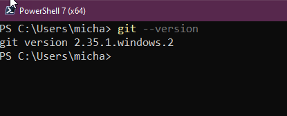
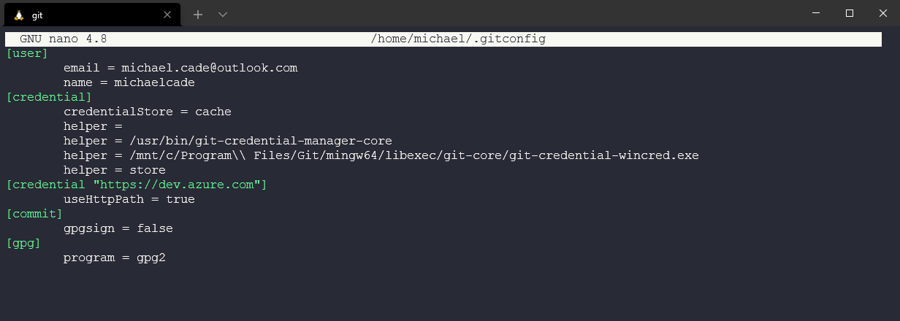
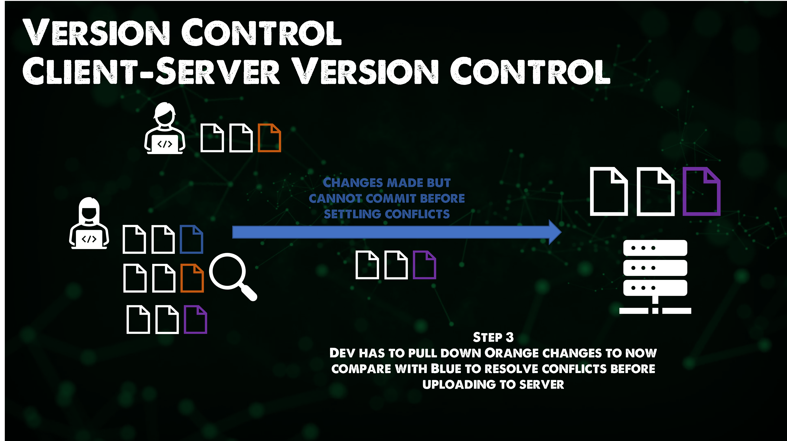

## Git'i Kurma ve Yapılandırma

Git, açık kaynaklı ve platformlar arası bir sürüm kontrol aracıdır. Ubuntu gibi Linux ortamlarını kullanan biriyseniz, zaten git'in yüklü olduğunu görebilirsiniz, ancak yine de kurulum ve yapılandırmayı gözden geçireceğiz.

Eğer sistemde zaten git yüklü ise güncel olduğumuzdan emin olmak da iyi bir fikirdir.

### Git'in Kurulumu

Daha önce de belirtildiği gibi, Git platformlar arası bir araçtır. Windows ve Linux için kurulumu anlatacağız, ancak macOS için de [burada](https://git-scm.com/book/en/v2/Getting-Started-Installing-Git) bulabilirsiniz.

[Windows](https://git-scm.com/download/win) için resmi siteden kurucuyu indirebiliriz.

Ayrıca Windows makinenizde `winget` komutunu da kullanabilirsiniz. Bu, Windows Uygulama Paket Yöneticiniz gibi düşünebilirsiniz.

Herhangi bir şeyi kurmadan önce, Windows Makinemizde hangi sürümü olduğunu görelim. Bir PowerShell penceresi açın ve `git --version` komutunu çalıştırın.


Ayrıca WSL Ubuntu sürümümüzün Git versiyonunuda kontrol edebiliriz.


Yazının yazıldığı sırada en son Windows sürümü `2.35.1` olduğu için güncelleme yapmamız gerekiyor, bunu da göstereceğim. Linux için de benzer bir durum bekliyorum.

En son kurulum programını indirdim ve sihirbazı çalıştırdım, bunu burada belgeleyeceğim. Önemli olan nokta, git'in en son sürümünü kurmadan önce önceki sürümleri kaldırmasıdır.

Yani aşağıda gösterilen süreç, git olmayan bir sisteme kurulum yapacakmışsınız gibi çoğunlukla aynı süreçtir.

Kurulum çok basittir. İndirilen dosyaya çift tıklayarak başlayın. GNU lisans anlaşmasını okuyun. Ancak unutmayın, bu ücretsiz ve açık kaynaklı bir yazılımdır.


Şimdi, git ile ilişkilendirmek istediğimiz ek bileşenleri seçebiliriz. Windows'ta, Git Bash'i her zaman yüklüyorum, çünkü bu bize Windows üzerinde bash komut dosyalarını çalıştırma imkanı sağlar.


Daha sonra kullanmak istediğimiz SSH Yürütülebilirini seçebiliriz. Ben bunu, Linux bölümünde görmüş olabileceğiniz dahili OpenSSH olarak bırakıyorum.


Daha sonra etkinleştirmek isteyebileceğimiz deneysel özelliklerimiz var, ben bunlara ihtiyacım olmadığı için etkinleştirmiyorum, isterseniz kurulum üzerinden geri dönüp daha sonra bunları etkinleştirebilirsiniz.


Kurulum tamamlandı, şimdi Git Bash'i açmayı veya en son sürüm notlarına bakmayı seçebiliriz.


Son kontrol, PowerShell penceresinde şu anda hangi git sürümüne sahip olduğumuza bakmaktır.



Son derece basit bir işlem ve şimdi en son sürümdeyiz. Linux makinede biraz geride olduğumuz görünüyor, bu yüzden güncelleme sürecini de geçebiliriz.

Basitçe `sudo apt-get install git` komutunu çalıştırıyorum.


Ayrıca aşağıdakini çalıştırabilirsiniz, bu git deposunu yazılım yüklemeleri için ekleyecektir.

```
sudo add-apt-repository ppa:git-core/ppa -y
sudo apt-get update
sudo apt-get install git -y
git --version
```

### Git Yapılandırması

Git'i ilk kullandığımızda bazı ayarları tanımlamamız gerekiyor:

- Name(İsim)
- Email(mail)
- Default Editor(Varsayılan editor)
- Line Ending(Satır Sonlandırma)

Bu üç seviyede yapılabilir:

- System = Tum Kullanıcılar
- Global = Kullanıcının Tum Repoları
- Local = Repolar

Ornek:
`git config --global user.name "Michael Cade"`
`git config --global user.email Michael.Cade@90DaysOfDevOPs.com"`
İşletim sisteminize bağlı olarak varsayılan metin düzenleyici belirlenecektir. Ubuntu makinede, aşağıdaki komut kullanılarak bunu visual studio code olarak değiştirebiliriz.

`git config --global core.editor "code --wait"`

Şimdi tüm git yapılandırmalarını görmek istiyorsak aşağıdaki komutu kullanabiliriz.

`git config --global -e`



Bu dosya herhangi bir makinede `.gitconfig` olarak adlandırılacaktır. Windows makinede bu, kullanıcı hesabınızın dizininde bulunur.


### Git Teorisi

Dünkü gönderide farklı versiyon kontrol türleri olduğunu belirtmiştim ve bunları iki farklı tipe ayırabiliriz. Birincisi İstemci-Sunucu ve diğeri Dağıtık versiyon kontrolüdür.

### Client-Server Versiyon Kontrolü

Git ortaya çıkmadan önce, İstemci-Sunucu versiyon kontrolü, varsayılan yöntemdi. Buna örnek olarak, 2000 yılında kurulan açık kaynaklı bir versiyon kontrol sistemi olan [Apache Subversion](https://subversion.apache.org/) gösterilebilir.

Bu Client-Server versiyon kontrol modelinde, geliştirici ilk adımda kaynak kodunu ve gerçek dosyaları sunucudan indirir. Bu, çatışmaları ortadan kaldırmaz, ancak çatışmaların karmaşıklığını ve nasıl çözüleceğini azaltır.


Örneğin, aynı dosyalar üzerinde çalışan iki geliştirici olduğunu düşünelim ve birincisi yarışı kazanır ve yeni değişiklikleriyle dosyayı ilk olarak sunucuya taşır veya yükler. İkinci geliştirici güncelleme yapmaya çalıştığında bir çatışma yaşar.


Şimdi, geliştirici birinci geliştiricinin kod değişikliğini kendi değişikliğiyle birleştirir ve çatışmalar çözüldükten sonra taahhüt eder.



### Dağıtık Versiyon Kontrolü

Git, tek başına dağıtık versiyon kontrol sistemi değildir. Ancak genellikle kullanılan bir sistemdir.

Git'in bazı temel avantajları şunlardır:

- Hızlı
- Akıllı
- Esnek
- Güvenli ve Korunaklı

Client-Server versiyon kontrol modelinin aksine, her geliştirici kaynak deposunu indirir, yani her şeyi indirir. Taahhüt geçmişi, tüm dallar vb.


## Kaynaklar

- [What is Version Control?](https://www.youtube.com/watch?v=Yc8sCSeMhi4)
- [Types of Version Control System](https://www.youtube.com/watch?v=kr62e_n6QuQ)
- [Git Tutorial for Beginners](https://www.youtube.com/watch?v=8JJ101D3knE&t=52s)
- [Git for Professionals Tutorial](https://www.youtube.com/watch?v=Uszj_k0DGsg)
- [Git and GitHub for Beginners - Crash Course](https://www.youtube.com/watch?v=RGOj5yH7evk&t=8s)
- [Complete Git and GitHub Tutorial](https://www.youtube.com/watch?v=apGV9Kg7ics)

Gorusmek Uzere [Gun 37](day37.md)
