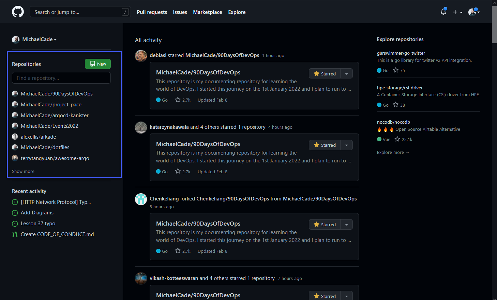
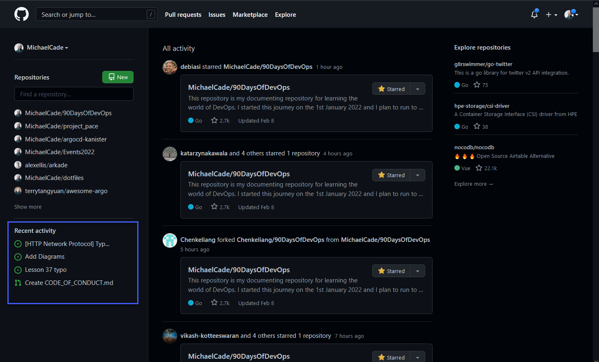
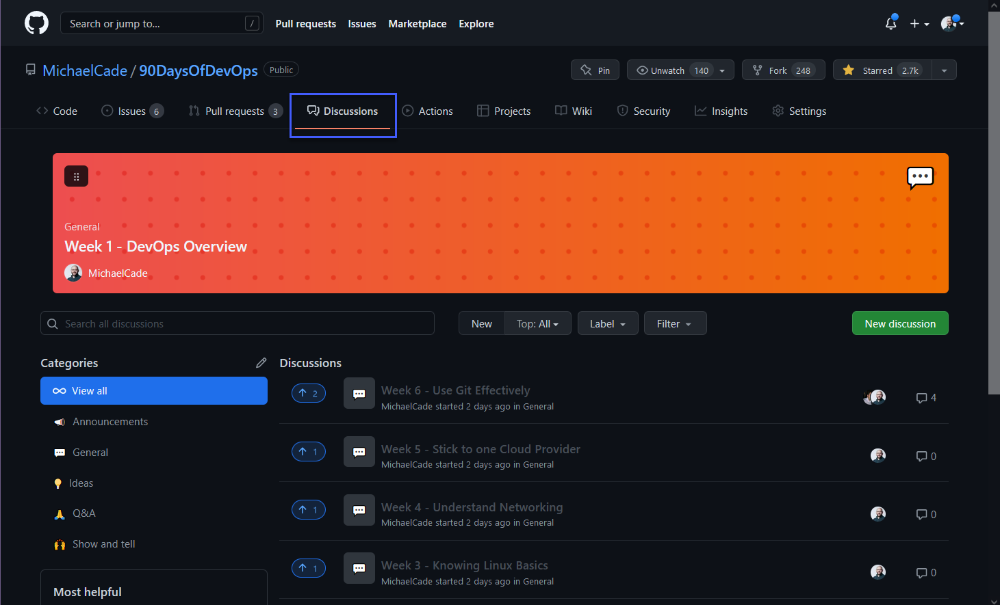
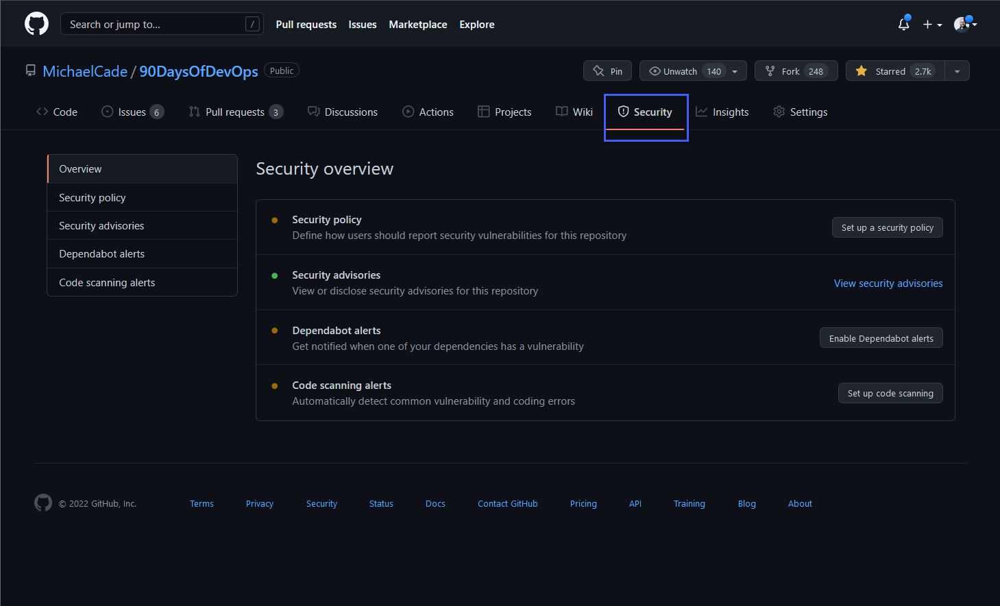
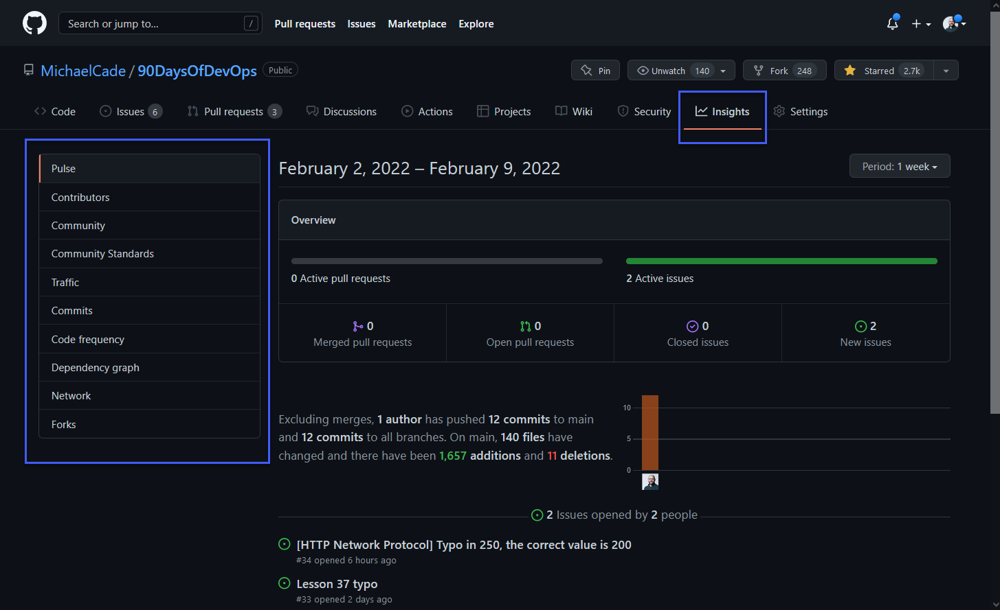
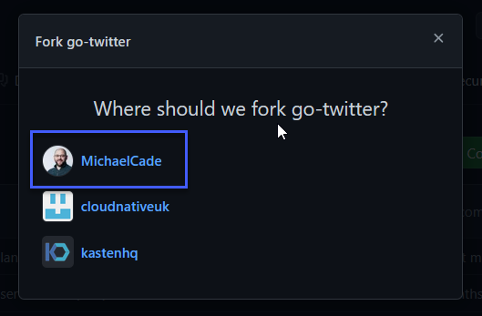
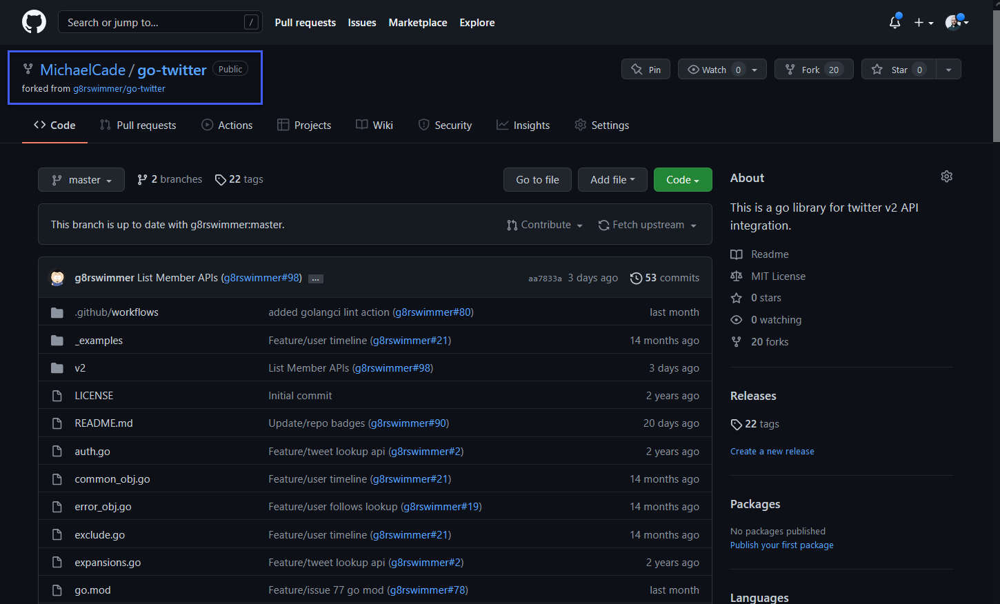
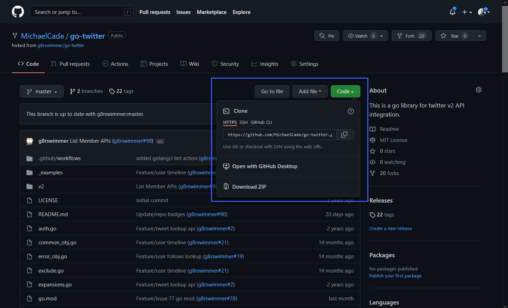
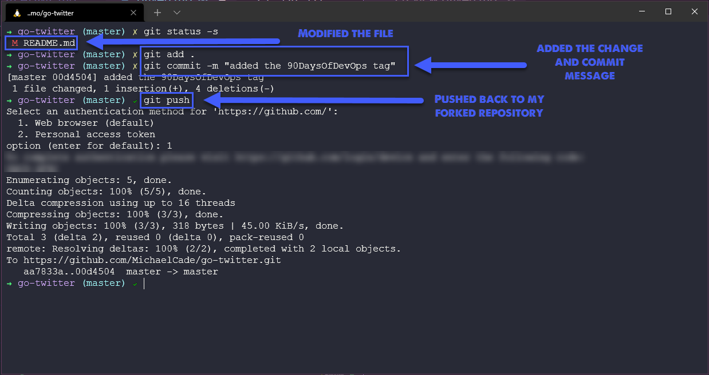
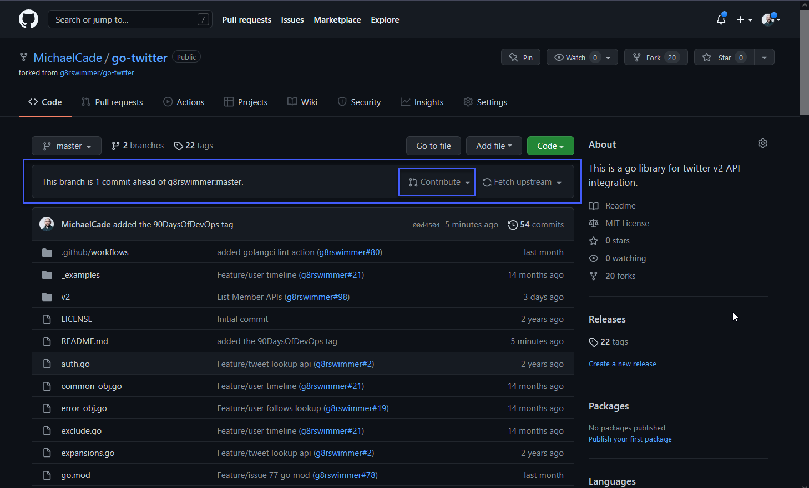

## Sosyal Network Kod için

GitHub | GitLab | BitBucket'i Kesfetmek

Bugün, muhtemelen hepimizin duyduğu ve muhtemelen günlük olarak kullandığımız bazı git tabanlı hizmetleri ele almak istiyorum.

Daha sonra önceki oturum bilgilerimizden bazılarını kullanarak verilerimizin kopyalarını ana hizmetlere taşıyacağız.

Bu bölümü "Sosyal Network Kod için" olarak adlandırdım, nedenini açıklayayım mı?

### GitHub

En yaygın olarak en azından benim için GitHub'tır. GitHub, git için web tabanlı bir barındırma hizmetidir. Genellikle yazılım geliştiricileri tarafından kodlarını saklamak için kullanılır. Git sürüm kontrol özellikleri ile Kaynak Kod Yönetimi ve birçok ek özellik sunar. Takımlara veya açık katkı sağlayanlara kolay iletişim imkanı sağlar ve kodlamaya sosyal bir yön kazandırır. (bu yüzden sosyal ağ başlığı) 2018 yılından bu yana GitHub, Microsoft'un bir parçasıdır.

GitHub uzun bir süredir var ve 2007/2008 yılında kuruldu. Bugün platformda 40 milyondan fazla kullanıcı bulunmaktadır.

GitHub Ana Özellikleri

- Code Repository
- Pull Requests
- Project Management toolset - Issues
- CI / CD Pipeline - GitHub Actions

Fiyatlandırma açısından, GitHub kullanıcıları için farklı fiyatlandırma seviyeleri sunar. Daha fazlası için [fiyatlandırma](https://github.com/pricing)'ya bakılabilir.

Bu kapsamda ücretsiz seviyeyi ele alacağız.

Bu rehberde zaten oluşturulmuş olan GitHub hesabımı kullanacağım, eğer bir hesabınız yoksa, açılış GitHub sayfasında kaydolma seçeneği ve kurulumu yapmak için bazı kolay adımlar bulunmaktadır.

### GitHub Açılış Sayfası

GitHub hesabınıza ilk giriş yaptığınızda, genelde neleri görmek veya ne yapmak istediğinize dair birçok widget içeren bir sayfa görüntülenir. İlk olarak "Tüm Etkinlik"ler kısmı bulunmaktadır, bu, depolarınızla veya hesabınızla ilişkilendirilen genel etkinlikleri gösterir.

Sonra, Kod Depolarımızı görüntüleriz, kendi depolarımızı veya son zamanlarda etkileşimde bulunduğumuz depoları görüntüleyebiliriz. Ayrıca hızlıca yeni depolar oluşturabilir veya depo arayabiliriz.

Daha sonra son zamanlardaki etkinliklerimiz gelir, bunlar genellikle benim tarafımdan oluşturulan veya son zamanlarda katkıda bulunduğum sorunlar ve çekme istekleridir.

Sayfanın sağ tarafında, muhtemelen son etkinlikleriniz veya kendi projeleriniz temel alınarak ilginizi çekebilecek depo önerileri bulunur.

Dürüst olmak gerekirse, şimdi gördüğümüz ve anlattığımız ana sayfada çok nadiren bulunurum, ama artık beslemenin belirli projelerde toplulukla daha iyi etkileşimde bulunmama yardımcı olabileceğini görüyorum.

Şimdi, GitHub Profilimize gitmek istiyorsak, sağ üst köşeye gidip resminizin üzerine tıklamanız gerekiyor, açılan menüde hesabınızı gezinmek için bir seçenek bulunacaktır. Buradan "Profiliniz"i seçerek profiline erişebilirsiniz.

Sonra, profil sayfanız görünecektir. Varsayılan olarak, yapılandırmanızı değiştirmezseniz, benimkinde olduğu gibi görmeyeceksiniz. Ben, son blog yayınlarımı [vZilla](https://vzilla.co.uk) üzerinde ve ayrıca en son [YouTube](https://m.youtube.com/c/MichaelCade1) kanalımdaki videolarımı gösteren bazı işlevselliği ekledim.

Profilinizi çok fazla inceleme yaparak geçirmeyeceksiniz, ancak bu, ağınızla paylaşabileceğiniz iyi bir profil sayfasıdır, böylece üzerinde çalıştığınız harika projeleri görebilirler.

Sonra, GitHub'ın temel yapı taşı olan depolara doğru ilerleyebiliriz. Burada depolarınızı göreceksiniz ve özel depolarınız varsa bunlar da bu uzun listede gösterilecektir.

Depo GitHub için çok önemli olduğu için, son zamanlarda oldukça yoğun olan 90DaysOfDevOps deposunu seçtim ve burada kullanabileceğimiz temel işlevselliğin bazılarını anlatacağım. Zaten yerel sistemimde "kod"umuzu düzenlerken kullandığım her şeyin üstüne.

Öncelikle, önceki pencereden 90DaysOfDevOps deposunu seçtim ve bu görünümü gördük. Bu görünümden, çok sayıda bilgiye sahip olduğumuzu görebilirsiniz. Orta kısımda ana kod yapımızı görüntülüyoruz, depomuzda saklanan dosyalarımızı ve klasörlerimizi gösteriyoruz. Alttan okuma. mdalt kısmına ekran alınmıştır. Sayfanın sağ tarafında, depo bir açıklama ve amaç içeren bir bölüm bulunur. Ardından, projeye kaç kişinin yıldız eklediğini, çatal oluşturduğunu ve izlediğini gösteren birçok bilgi bulunur.

Biraz daha aşağı kaydırırsak, Yayınlananlar bölümünü de göreceksiniz, bunlar meydan okumanın golang kısmından geliyor. Projemizde herhangi bir paket bulunmuyor, katkıda bulunanlarımız burada listeleniyor. (Yazım hataları ve gerçekleri kontrol etme konusunda topluluk yardımı için teşekkür ederim) Ardından yine meydan okumanın farklı bölümlerinden alınan kullanılan dilleri görüyoruz.

Sayfanın üst kısmında sekmelerin bir listesini göreceksiniz. Bunlar değişebilir ve yalnızca ihtiyaç duyduklarınızı göstermek üzere değiştirilebilir. Burada, bunların tümünü kullanmıyorum ve tüm depomun düzenli olduğundan emin olmak için bunları kaldırmalıyım.

Öncelikle, sadece tartıştığımız kod sekmesi vardı, ancak bu sekmeler, bir depo içinde gezinirken her zaman mevcuttur, bu da bölümler arasında hızlı ve kolay geçiş yapmamıza olanak tanır. Sonraki olarak, sorunlar sekmesine sahibiz.

Sorunlar sekmesi, GitHub'daki çalışmanızı takip etmenize olanak tanır. Gelişmenin gerçekleştiği yer. Bu belirli depoda diyagram eklemeye veya yazım hatalarını düzeltmeye odaklanan bazı sorunlarım olduğunu görebilirsiniz, ancak aynı zamanda depoya Çince bir sürümün gerektiğini belirten bir sorunumuz da var.

Bu bir kod deposu olsaydı, bu, sahiplerle ilgili sorunları veya sorunları gündeme getirmek için harika bir yer olurdu, ancak raporladığınız şeyin ne olduğu konusunda dikkatli ve ayrıntılı olmayı unutmayın ve mümkün olduğunca çok ayrıntı verin.

Sonraki sekme pull requestlerdir. Pull requestleri, bir depodaki bir dalda ittiğiniz değişiklikleri başkalarına bildirmenizi sağlar. Bu, birinin depoyu çatallandığı, hataları düzelttiği veya özellikleri geliştirdiği veya bu depoda çoğu durumda sadece yazım hatalarını düzelttiği yerdir.

Sonradan forklamayı ele alacağız.

Sanırım bir sonraki sekme oldukça yeni mi? Ama böyle bir projede, #90DaysOfDevOps gibi, içerik yolculuğunu yönlendirmeye yardımcı olabileceğini düşündüm, ancak aynı zamanda topluluğa öğrenme yolculukları sırasında yardımcı olabilir. Her meydan okuma bölümü için birkaç tartışma grubu oluşturdum, böylece insanlar katılarak tartışabilirler.

Eylemler sekmesi, kodu inşa etmenize, test etmenize, dağıtmanıza ve GitHub içinden çok daha fazlasını yapmanıza olanak tanır. GitHub Eylemleri, meydan okumanın CI/CD bölümünde ele alacağımız bir şeydir, ancak burada bize adımları otomatikleştirmek için yapılandırma ayarlayabileceğimiz yerdir.

Ana GitHub Profilimde, ana ekranı güncel tutmak için en son blog yayınlarını ve YouTube videolarını almak için GitHub Eylemlerini kullanıyorum.

Yukarıda bahsettiğim gibi, GitHub sadece bir kaynak kod deposu değil, aynı zamanda bir proje yönetim aracıdır. Proje sekmesi, projeyi daha iyi işbirliği yapmak ve bu görevlerin görünürlüğünü sağlamak için sorunları ve PR'leri bağlayabileceğimiz kanban tipi panoları oluşturmamıza olanak tanır.

Sorunların bana iyi bir özellik talebi kaydetmek için uygun bir yer gibi görünmesine rağmen ve öyledir ancak wiki sayfası, mevcut durumu ile projenin kapsamlı bir yol haritasını oluşturmak için genelde sorunlarınıza daha iyi çözüm olabilecek belge veya sorun giderme tarzı içeriği oluşturmanıza olanak tanır.

Bu projeye pek uygulanamasa da, Güvenlik sekmesi, katkıda bulunanların belirli görevleri nasıl ele alması gerektiğini bildiğinden emin olmak için burada bir politika tanımlayabiliriz, ancak aynı zamanda kod tarama eklentileriyle kodunuzun örneğin gizli ortam değişkenleri içermediğinden emin olabiliriz.

Benim için Insights sekmesi harika, depo hakkında bu kadar çok bilgi sağlıyor, aktivite ne kadar sürdüğünden, taahhütler ve sorunlar hakkında raporlar da dahil olmak üzere, ayrıca depoya yönelik trafiği raporlar. Solda gördüğünüz bir liste, depo metrikleri hakkında detaylı bilgi almanıza olanak tanır.

Son olarak, Ayarlar sekmesi, depomuzu nasıl işleteceğimize dair ayrıntılara girebileceğimiz yerdir. Şu anda repo sadece benim tarafımdan yönetiliyor, ancak bu sorumluluğu burada paylaşabilirdik. Entegrasyonları ve diğer görevleri burada tanımlayabiliriz.

Bu, GitHub'ın hızlı bir genel bakışıydı. Daha ayrıntılı açıklamaya ihtiyaç duyabileceğimi düşündüğüm bazı diğer alanlar da var. Bahsedildiği gibi, GitHub milyonlarca depoyu barındırıyor, bunların çoğu kaynak kodunu içeriyor ve bunlar genel veya özel olarak erişilebilir.

### Forking(Catallama)

Yarınki oturumda daha fazla şekilde Açık Kaynaklı (Open-Source) konusuna gireceğim, ancak herhangi bir kod reposunun büyük bir parçası toplulukla işbirliği yapma yeteneğidir. Düşünün ki, bir repodan bir kopya istiyorum, çünkü üzerinde bazı değişiklikler yapmak istiyorum, belki bir hatayı düzeltmek istiyorum ya da belki de kodun orijinal bakımını yapan kişi için öngörülmeyen bir kullanım senaryosu için bir şeyi değiştirmek istiyorum. İşte bu duruma bir depoyu "forklamak" diyoruz. Bir fork, bir reposunun bir kopyasıdır. Bir deponun fork'lanması, orijinal projeyi etkilemeden değişikliklerle serbestçe denemenizi sağlar.

Giriş yaptıktan sonra ana sayfaya geri döneyip önerilen repolardan birine bakalım.

Bu depoya tıklarsak, gerade 90DaysOfDevOps deposunda gezindiğimiz görünümü alacağız.

Aşağıya baktığımızda 3 seçeneğimiz var: izleme (watch), fork ve yıldız (star).

- Watch - Depoya bir şeyler olduğunda güncellemeler alırsınız.
- Fork - Bir deponun kopyası.
- Star - "Projeni harika buluyorum"

Bu repoyu kopyalamak istediğimiz senaryomuz göz önünde bulundurulursa, fork seçeneğine tıklıyoruz. Birden fazla organizasyona üyeyseniz, fork'ün nerede gerçekleşeceğini seçmeniz gerekecektir. Ben profilimi seçmeyi tercih ediyorum.

Şimdi, bu repomuzun kopyasına sahibiz ve istediğimiz gibi özgürce üzerinde çalışabilir ve değişiklikler yapabiliriz. Bu, önce kısaca bahsettiğimiz "pull request" (çekme isteği) sürecinin başlangıcı olacak, ancak bunu yarın daha detaylı bir şekilde ele alacağız.

Peki, diyorsunuz, bu depoya ve koda nasıl değişiklik yapabilirim, çünkü bu bir web sitesinde; evet, web sitesi üzerinden düzenlemeler yapabilirsiniz, ancak bunu yerel sistemimizdeki favori IDE'nizle ve favori renk temasınızla yapmak gibi olmayacaktır. Bu depoyu yerel makinenize kopyalamak için deponun bir "clone"unu (kopyasını) oluşturacağız. Bu, yerelde çalışmamıza ve ardından deponun fork'lanmış kopyasına değişikliklerimizi geri itmemize olanak tanır.

Kodun bu kopyasını elde etmek için birkaç seçeneğimiz var, aşağıda gördüğünüz gibi.

GitHub Masaüstü uygulaması ile, yerel ve GitHub arasında değişiklikleri takip etmek ve çekmek (pull) ve göndermek (push) için görsel bir masaüstü uygulaması sunulur.

Bu küçük demoda, üzerinde gördüğümüz HTTPS URL'sini kullanacağım.

Şimdi, yerel makinede, bu deponun indirilmesini kabul edeceğim bir dizine gidip `git clone url` komutunu çalıştıracağım.

Şimdi bunu VScode'a taşıyarak bazı değişiklikler yapalım.

Şimdi bazı değişiklikler yapalım, bu tüm bağlantıları değiştirip başka bir şey ile değiştirmek istiyorum.

Şimdi GitHub'a geri döner ve bu depodaki readme.md dosyasını buluruz, dosyada yaptığımız birkaç değişikliği görebilirsiniz.

Bu aşamada, bu tamamlanmış olabilir ve yeni değişikliğimizi sadece biz kullanacağımız için memnun olabiliriz, ancak belki de bir hata düzeltmesi idi ve eğer durum buysa, o zaman orijinal depo sahiplerine değişikliğimizi bildirmek ve onaylamalarını istemek için bir Pull Talebi (Pull Request) yoluyla katkıda bulunmak isteyeceğiz.

Bunu aşağıda vurgulanan "contribute" düğmesini kullanarak yapabiliriz. Daha fazlasını yarın Açık Kaynaklı iş akışlarını incelediğimizde ele alacağım.

Uzun bir süre boyunca GitHub'ı inceledim ve bazılarınızın "peki diğer seçenekler ne?" dediğini duyuyorum!

Evet, başka seçenekler de var ve bazı temel bilgileri kapsayan kaynaklar bulacağım. GitLab ve BitBucket gibi hizmetlerle karşılaşacaksınız ve bunlar git tabanlı hizmetlerdir, ancak farklılıkları vardır.

Ayrıca barındırılan seçeneklerle de karşılaşacaksınız. En yaygın olarak GitLab'ı barındırılan bir versiyon olarak veya GitHub Enterprise'ı görmüşümdür (Ücretsiz bir barındırılan GitHub mı yoksa?).

## Kaynaklar

- [Learn GitLab in 3 Hours | GitLab Complete Tutorial For Beginners](https://www.youtube.com/watch?v=8aV5AxJrHDg)
- [BitBucket Tutorials Playlist](https://www.youtube.com/watch?v=OMLh-5O6Ub8&list=PLaD4FvsFdarSyyGl3ooAm-ZyAllgw_AM5)
- [What is Version Control?](https://www.youtube.com/watch?v=Yc8sCSeMhi4)
- [Types of Version Control System](https://www.youtube.com/watch?v=kr62e_n6QuQ)
- [Git Tutorial for Beginners](https://www.youtube.com/watch?v=8JJ101D3knE&t=52s)
- [Git for Professionals Tutorial](https://www.youtube.com/watch?v=Uszj_k0DGsg)
- [Git and GitHub for Beginners - Crash Course](https://www.youtube.com/watch?v=RGOj5yH7evk&t=8s)
- [Complete Git and GitHub Tutorial](https://www.youtube.com/watch?v=apGV9Kg7ics)
- [Git cheatsheet](https://www.atlassian.com/git/tutorials/atlassian-git-cheatsheet)

Gorusmek Uzere [Gun 41](day41.md)
