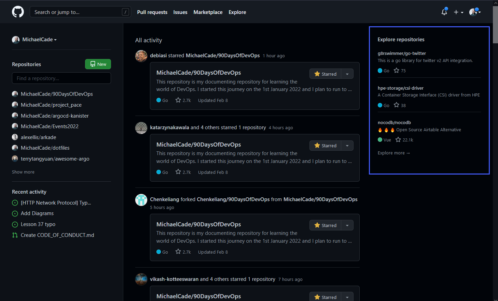
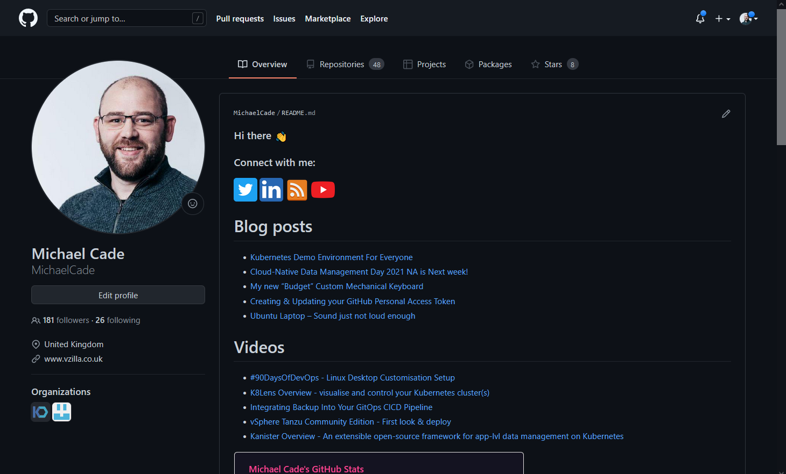
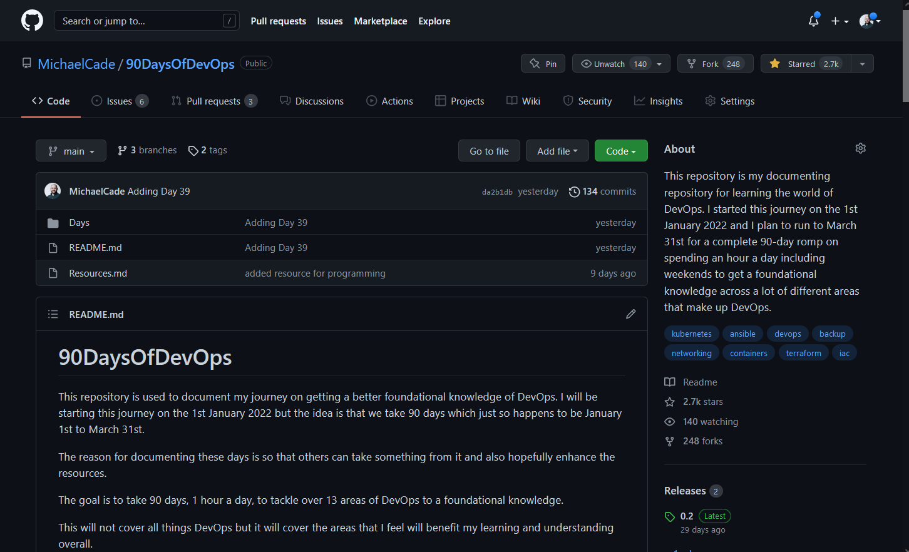
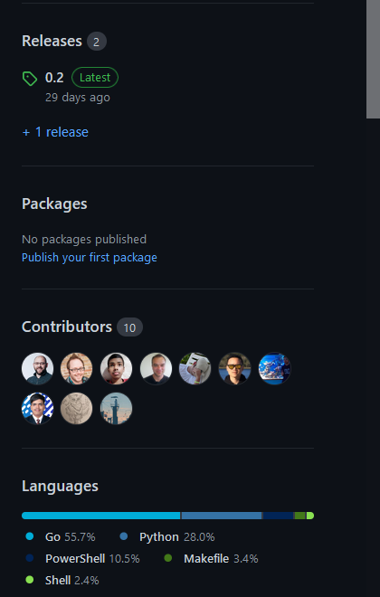
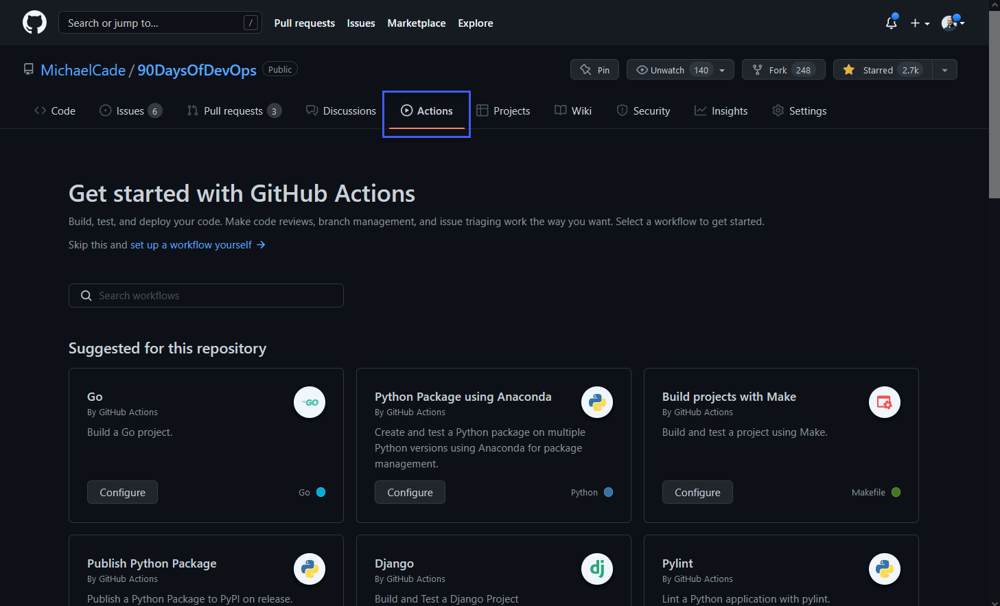
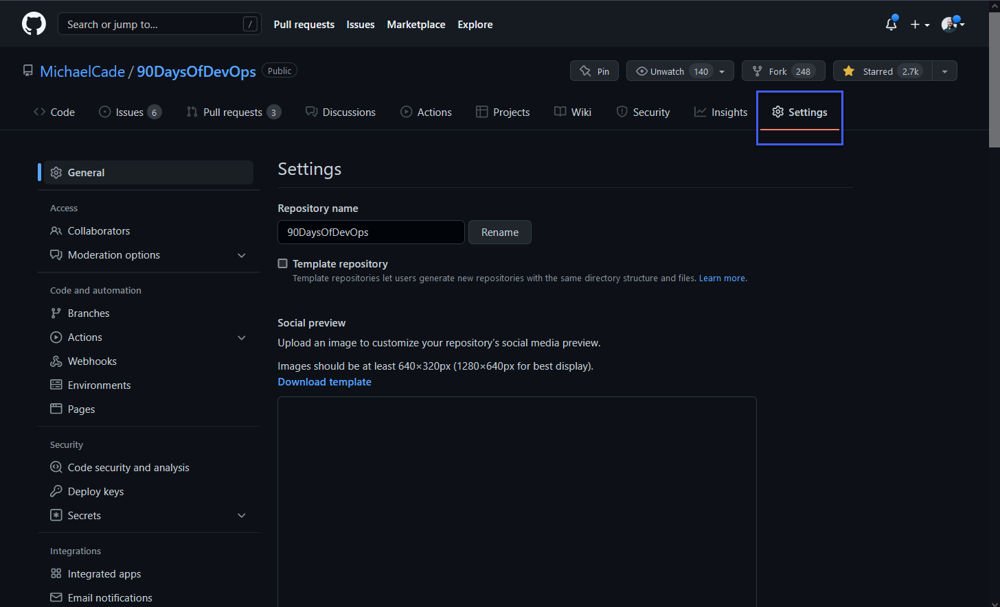
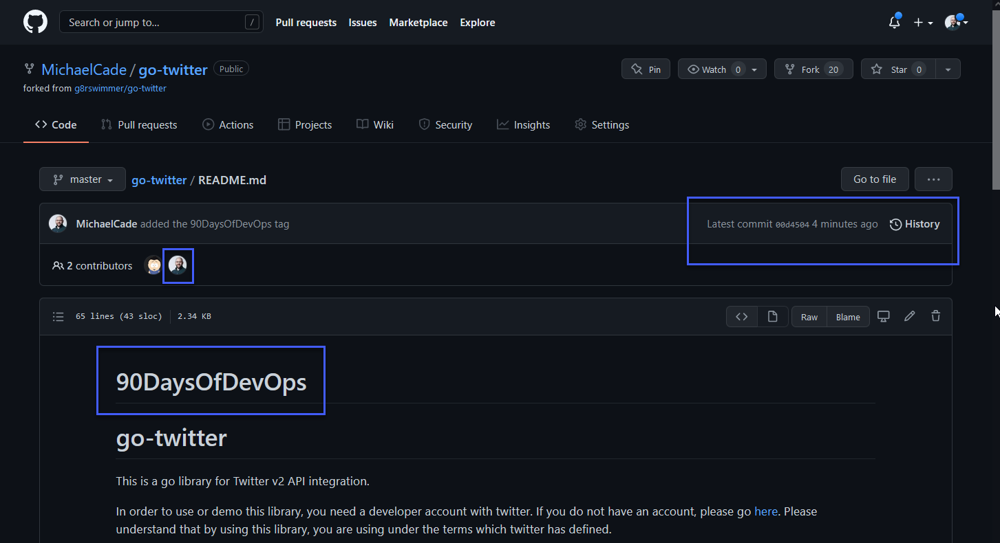

## Mạng xã hội dành cho code

Khám phá GitHub | GitLab | BitBucket

Hôm nay tôi muốn đề cập đến một số dịch vụ dựa trên git mà có lẽ tất cả chúng ta đều đã nghe nói đến và có thể đang sử dụng hàng ngày.

Sau đó, chúng ta sẽ sử dụng một số kiến thức trong buổi trước của mình để.

Tôi gọi phần này là "Mạng xã hội cho mã" và hãy để tôi giải thích tại sao?

### GitHub

Phổ biến nhất ít nhất đối với tôi là GitHub, GitHub là dịch vụ lưu trữ dựa trên web dành cho git. Nó được các nhà phát triển phần mềm sử dụng nhiều nhất để lưu trữ mã của họ. Quản lý mã nguồn với các tính năng quản lý phiên bản git và rất nhiều tính năng bổ sung. Nó cho phép các nhóm hoặc cộng tác viên dễ dàng giao tiếp và xã hội hoá việc viết mã. (do đó có tiêu đề là mạng xã hội) Kể từ năm 2018, GitHub là một phần của Microsoft.

GitHub đã xuất hiện khá lâu và được thành lập vào năm 2007/2008. Với hơn 40 triệu người dùng trên nền tảng ngày nay.

Các tính năng chính của GitHub

- Code Repository
- Pull Requests
- Công cụ quản lý dự án - Issues
- CI / CD Pipeline - GitHub Actions

Về giá cả, GitHub có các mức giá khác nhau cho người dùng. Bạn có thể tìm thêm thông tin về [Pricing](https://github.com/pricing)

Lần này, chúng ta sẽ tìm hiểu với cấp miễn phí.

Tôi sẽ sử dụng tài khoản GitHub đã tạo của mình trong hướng dẫn này, nếu bạn chưa có tài khoản thì trên trang GitHub mở sẽ có tùy chọn đăng ký và các bước dễ dàng để cấu hình.

### Trang đầu tiên của Github

Khi bạn đăng nhập lần đầu vào tài khoản GitHub của mình, bạn sẽ nhận được một trang chứa rất nhiều tiện ích cung cấp cho bạn các tùy chọn về địa điểm và nội dung bạn muốn xem hoặc làm. Đầu tiên, chúng ta có mục "All Activity", điều này sẽ cung cấp cho bạn cái nhìn về những gì đang xảy ra với kho lưu trữ hoặc hoạt động được liên kết với tổ chức hoặc tài khoản của bạn.

Tiếp theo, chúng ta có Kho lưu trữ mã, kho lưu trữ của riêng chúng ta hoặc kho lưu trữ mà chúng ta đã tương tác gần đây. Chúng ta cũng có thể nhanh chóng tạo các kho mới hoặc tìm kiếm các kho mã.

Sau đó, chúng ta có hoạt động gần đây của chúng ta, những điều này đối với tôi là issues và pull requests mà tôi đã tạo hoặc đóng góp gần đây.

Ở phía bên phải của trang, chúng ta có một số giới thiệu về các kho mã mà chúng ta có thể quan tâm, rất có thể dựa trên hoạt động gần đây của bạn hoặc các dự án của riêng bạn.

Thành thật mà nói, tôi rất hiếm khi vào trang chủ của mình, mặc dù bây giờ tôi thấy rằng việc xem qua nó có thể thực sự hữu ích để giúp tương tác với cộng đồng tốt hơn một chút trong một số dự án nhất định.

Tiếp theo, nếu chúng ta muốn truy cập Hồ sơ GitHub của mình, chúng ta có thể điều hướng đến góc trên cùng bên phải và trên hình ảnh của bạn, có một drop-down cho phép bạn qua tài khoản của mình. Từ đây để truy cập Hồ sơ của bạn, chọn "Your Profile"

Tiếp theo, trang hồ sơ của bạn sẽ xuất hiện theo mặc định, trừ khi bạn thay đổi cấu hình của mình, bạn sẽ không thấy những gì tôi có, tôi đã thêm một số chức năng hiển thị các bài đăng blog gần đây của tôi trên [vZilla](https://vzilla.co.uk) và sau đó là các video mới nhất của tôi trên Kênh [YouTube](https://m.youtube.com/c/MichaelCade1) của mình.

Bạn sẽ không mất nhiều thời gian để xem hồ sơ của mình, nhưng đây là một nơi rất tốt để chia sẻ với mạng lưới của bạn để họ có thể thấy các dự án thú vị mà bạn đang thực hiện.

Sau đó, chúng ta có thể đi sâu vào khối xây dựng của GitHub, các kho lưu trữ. Ở đây bạn sẽ thấy các kho lưu trữ của mình và nếu bạn có các kho lưu trữ private thì chúng cũng sẽ được hiển thị trong danh sách dài này.

Vì kho lưu trữ rất quan trọng đối với GitHub, hãy để tôi chọn một kho lưu trữ khá hot trong thời gian gần đây và thực hiện một số chức năng chính có thể sử dụng ở đây khi tôi chỉnh sửa "mã" của chúng ta bằng git trên thống cục bộ của tôi.

Trước hết, từ cửa sổ trước, tôi đã chọn kho lưu trữ 90DaysOfDevOps và chúng ta có thể thấy mành hình này. Bạn có thể thấy từ đây, chúng ta có rất nhiều thông tin, có cấu trúc mã chính ở giữa hiển thị các tệp và thư mục được lưu trữ trong kho lưu trữ, có readme.md hiển thị ở dưới cùng. Ở bên phải của trang, chúng ta có phần giới thiệu, có mô tả và mục đích của kho lưu trữ. Sau đó, chúng ta có rất nhiều thông tin bên dưới điều này cho thấy có bao nhiêu người đã thả sao cho dự án, số lần được fork và số người theo dõi.

Nếu cuộn xuống thêm một chút, bạn cũng sẽ thấy rằng chúng ta có Released, đó là từ phần golang trong thử thách này. Chúng ta không có bất kỳ gói nào trong dự án của mình, và có người đóng góp được liệt kê ở đây. (Cảm ơn cộng đồng đã hỗ trợ tôi kiểm tra chính tả và tính xác thực của thông tin). Sau đó, chúng ta có các ngôn ngữ, đây là những ngôn ngữ được sử dụng trong thử thách.

Ở đầu trang, bạn sẽ thấy một danh sách các tab. Chúng có thể khác nhau và chúng có thể được tuỳ biến để chỉ hiển thị những thứ bạn yêu cầu. Bạn sẽ thấy ở đây tôi không sử dụng tất cả những thứ này và nên loại bỏ chúng để đảm bảo toàn bộ kho lưu trữ gọn gàng.

Đầu tiên, chúng ta có tab code mà chúng ta vừa thảo luận nhưng các tab này sẽ giúp điều hướng qua trong kho lưu trữ, điều này cực kỳ hữu ích để chúng ta có thể chuyển đổi giữa các phần một cách nhanh chóng và dễ dàng. Tiếp theo, chúng ta có tab Issues.

Issues cho phép bạn theo dõi công việc của mình trên GitHub, nơi quá trình phát triển diễn ra. Trong kho lưu trữ cụ thể này, bạn có thể thấy tôi có một số issue tập trung vào việc thêm sơ đồ hoặc lỗi chính tả nhưng chúng ta cũng có yêu cầu có phiên bản tiếng Trung cho kho lưu trữ.

Nếu đây là một kho lưu trữ mã thì đây là nơi tuyệt vời để nêu lên các vấn đề với những người bảo trì, nhưng hãy nhớ chú ý và cụ thể về những gì bạn đang báo cáo và cung cấp càng nhiều thông tin càng tốt.

Tab tiếp theo là Pull Requests, Pull Requests cho phép bạn thông báo cho người khác về những thay đổi mà bạn đã đẩy tới một nhánh trong kho lưu trữ. Đây là nơi ai đó có thể đã phân nhánh kho lưu trữ của bạn, thực hiện các thay đổi như sửa lỗi hoặc cải tiến tính năng hoặc chỉ lỗi đánh máy.

Chúng ta sẽ đề cập đến fork sau.

Tôi tin rằng tab tiếp theo khá mới? Tab Discussion (Thảo luận). Nhưng tôi nghĩ đối với một dự án như #90DaysOfDevOps, điều này có thể giúp hướng dẫn cho các nội dung mới nhưng cũng giúp ích cho cộng đồng và qua hành trình học tập của mình. Tôi đã tạo một số nhóm thảo luận cho từng phần của thử thách để mọi người có thể tham gia và bình luận.

Tab Actions sẽ cho phép bạn build, kiểm thử và triển khai mã,... với GitHub. GitHub Actions sẽ là nội dung chúng ta đề cập trong phần CI/CD của thử thách, đây là nơi chúng ta có thể đặt một số cấu hình để tự động hóa các bước.

Trên Hồ sơ GitHub chính của mình, tôi đang sử dụng GitHub Actions để tìm các bài đăng trên blog và video YouTube mới nhất để cập nhật màn hình chính đó.

Tôi đã đề cập ở trên về cách GitHub không chỉ là kho lưu trữ mã nguồn mà còn là một công cụ quản lý dự án, tab Project cho phép chúng ta xây dựng các bảng kanban cho dự án để chúng ta có thể liên kết các Issues và PR nhằm cộng tác tốt hơn và có thểm theo dõi tiến độ của các tasks.

Tôi biết rằng issues có vẻ là một nơi tốt để ghi lại các yêu cầu tính năng và chúng đúng là để làm như vậy nhưng trang wiki cho phép phác thảo một lộ trình toàn diện cho dự án với trạng thái hiện tại và giúp các tài liệu hoàn thiện hơn cho dự án của bạn, ví dụ như hướng dẫn khắc phục sự cố các nội dụng dạng how-to.

Không có trong dự án này nhưng có tab Security để đảm bảo rằng những contributors biết cách xử lý một số tác vụ nhất định, chúng ta có thể xác định một policy tại đây cũng như các tiện ích quét mã để đảm bảo mã của bạn không chứa các biến môi trường bí mật.

Đối với tôi, tab insights rất tuyệt, nó cung cấp rất nhiều thông tin về kho lưu trữ, từ bao nhiêu hoạt động đang diễn ra cho đến các commits và issues, nhưng nó cũng báo cáo về lượng truy cập vào kho lưu trữ. Bạn có thể thấy một danh sách ở phía bên trái cho phép bạn xem chi tiết về các số liệu trên kho lưu trữ.

Cuối cùng, chúng ta có tab Settings, đây là nơi chúng ta có thể xem chi tiết cách chúng ta chạy kho lưu trữ của mình, tôi hiện là người bảo trì duy nhất của kho lưu trữ nhưng chúng ta có thể chia sẻ trách nhiệm này tại đây. Chúng ta có thể định nghĩa tích hợp và các tác vụ khác tương tự như vậy tại đây.

This was a super quick overview of GitHub, I think there are some other areas that I might have mentioned that need explaining in a little more detail. As mentioned GitHub houses millions of repositories mostly these are holding source code and these can be public or privately accessible.

Đây là tổng quan siêu nhanh về GitHub, tôi nghĩ rằng có một số lĩnh vực khác mà tôi có thể đã đề cập cần được giải thích chi tiết hơn một chút. Như đã đề cập, GitHub chứa hàng triệu kho lưu trữ, hầu hết những kho lưu trữ này đang chứa mã nguồn và chúng có thể được truy cập công khai hoặc riêng tư.

### Forking

Ta sẽ tìm hiểu thêm về Nguồn mở trong buổi ngày mai nhưng một phần quan trọng của bất kỳ kho lưu trữ mã nào là khả năng cộng tác với cộng đồng. Hãy nghĩ về kịch bản sau: tôi muốn có một bản sao của kho lưu trữ vì tôi muốn thực hiện một số thay đổi, có thể tôi muốn sửa lỗi hoặc có thể tôi muốn thay đổi thứ gì đó để sử dụng nó cho trường hợp sử dụng mà tôi có thể không trường hợp sử dụng dự định cho người bảo trì ban đầu của mã. Đây là những gì chúng ta gọi là forking một kho lưu trữ. Một fork là một bản sao của một kho lưu trữ. Forking một kho lưu trữ cho phép bạn tự do thử nghiệm các thay đổi mà không ảnh hưởng đến dự án ban đầu.

Hãy quay lại trang mở đầu sau khi đăng nhập và xem một trong những kho lưu trữ được đề xuất đó.

Nếu chúng ta nhấp vào kho lưu trữ đó, chúng ta sẽ có giao diện giống như kho lưu trữ 90DaysOfDevOps.

Nếu để ý bên dưới, chúng ta có 3 tùy chọn, chúng ta có watch, fork và star.

- Watch - Cập nhật các thay đổi của kho lưu trữ.
- Fork - một bản sao của một kho lưu trữ.
- Star - "Tôi nghĩ dự án của bạn rất tuyệt"

Với kịch bản của chúng ta là muốn một bản sao của kho lưu trữ để làm việc với nó, chúng ta sẽ nhấn tùy chọn fork. Nếu bạn là thành viên của nhiều tổ chức thì bạn sẽ phải chọn nơi để fork, tôi sẽ chọn profile của mình.

Bây giờ chúng ta có bản sao của kho lưu trữ để có thể tự do làm việc và thay đổi phù hợp. Đây sẽ là bước khởi đầu của quy trình pull request mà chúng ta đã đề cập ngắn gọn trước đây, nó sẽ được đề cập chi tiết hơn vào ngày mai.

Ok, nhưng làm cách nào để thay đổi kho lưu trữ và mã này nếu nó ở trên một trang web, bạn có thể xem qua và chỉnh sửa trực tiếp trên đó nhưng bạn không thể sử dụng IDE yêu thích của bạn trên máy cá nhân với theme màu yêu thích của bạn. Để chúng ta có được một bản sao của kho lưu trữ này trên máy của mình, chúng ta sẽ clone kho lưu trữ đó. Điều này sẽ cho phép chúng ta làm việc trên môi trường cục bộ và sau đó đẩy (push) các thay đổi trở lại bản sao được fork từ kho lưu trữ gốc.

Chúng ta có một số tùy chọn khi nhận được một bản sao của mã này như bạn có thể thấy bên dưới.

Có một phiên bản của GitHub Desktop cung cấp cho bạn một ứng dụng máy tính t để theo dõi các thay đổi cũng như push và pull các thay đổi giữa môi trường local và GitHub.

Đối với demo nhỏ này, tôi sẽ sử dụng URL HTTPS mà chúng ta thấy trên đó.

Bây giờ trên máy cục bộ của chúng ta, tôi sẽ điều hướng đến một thư mục mà tôi muốn tải xuống kho lưu trữ này và sau đó chạy `git clone url`

Bây giờ chúng ta có thể mở nó bằng VSCode và thay đổi một số thứ.

Hãy thực hiện một số thay đổi, tôi muốn thay đổi các liên kết đó và thay thế nó bằng thứ gì khác.

Bây giờ, nếu chúng ta kiểm tra lại GitHub và tìm tệp Readme.md trong kho lưu trữ đó, bạn có thể thấy một vài thay đổi mà tôi đã thực hiện đối với tệp đó.

Ở thời điểm này, quá trình này có thể đã hoàn tất và chúng ta có thể hài lòng với thay đổi của mình vì chúng ta là những người duy nhất sẽ sử dụng thay đổi mới đó. Nhưng rất có thể sẽ có lúc thay đổi của chúng ta là để sửa một bug và thông qua một Pull request, chúng ta sẽ thông báo cho những người bảo trì kho lưu trữ đó về thay đổi của chúng ta và xem liệu họ có chấp nhận những thay đổi đó hay không.

Chúng ta có thể làm điều này bằng cách sử dụng nút Contribute được làm rõ ở dưới đây. Tôi sẽ đề cập nhiều hơn về vấn đề này vào ngày mai khi chúng ta xem xét quy trình làm việc với các phần mềm mã nguồn mở.

Tôi đã dành một thời gian dài để hướng dẫn về Github và tôi nghe thấy một số yêu cầu vê những lựa chọn khác.

Và tôi cũng sẽ tìm một số tài nguyên cơ bản cho những vấn đề đó. Bạn sẽ thấy GitLab và BitBucket trong số những lựa chọn khi bạn sử dụng các dịch vụ quản lý phiên bản, tuy chúng là những dịch vụ dựa trên git nhưng chúng cũng có một số khác biệt nhất dịnh.

Bạn cũng sẽ bắt gặp các tuỳ chọn tự host. Phổ biến nhất ở đây tôi có thể thấy là GitLab và GitHub Enterprise (Tôi không nghĩ rằng có dịch vụ tự host miễn phí của Github?)
## Tài liệu tham khảo

- [Learn GitLab in 3 Hours | GitLab Complete Tutorial For Beginners](https://www.youtube.com/watch?v=8aV5AxJrHDg)
- [BitBucket Tutorials Playlist](https://www.youtube.com/watch?v=OMLh-5O6Ub8&list=PLaD4FvsFdarSyyGl3ooAm-ZyAllgw_AM5)
- [What is Version Control?](https://www.youtube.com/watch?v=Yc8sCSeMhi4)
- [Types of Version Control System](https://www.youtube.com/watch?v=kr62e_n6QuQ)
- [Git Tutorial for Beginners](https://www.youtube.com/watch?v=8JJ101D3knE&t=52s)
- [Git for Professionals Tutorial](https://www.youtube.com/watch?v=Uszj_k0DGsg)
- [Git and GitHub for Beginners - Crash Course](https://www.youtube.com/watch?v=RGOj5yH7evk&t=8s)
- [Complete Git and GitHub Tutorial](https://www.youtube.com/watch?v=apGV9Kg7ics)
- [Git cheatsheet](https://www.atlassian.com/git/tutorials/atlassian-git-cheatsheet)

Hẹn gặp lại vào [ngày 41](day41.md)
